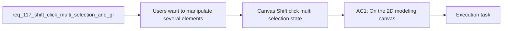

## item_575_canvas_shift_click_multi_selection_state_and_node_only_selection_contract - Canvas Shift click multi selection state and node only selection contract
> From version: 1.4.4
> Schema version: 1.0
> Status: Done
> Understanding: 97% (the feature goal is clear: support canvas-side multi-selection with `Shift+click`, then move the selected set together on the 2D modeling canvas)
> Confidence: 97% (the current canvas already supports single-node selection and single-node drag, and the remaining grouped-selection semantics are now locked to a node-only V1 with explicit group-drag and summary behavior)
> Progress: 100%
> Complexity: High
> Theme: Canvas ergonomics / multi selection / grouped movement
> Reminder: Update status/understanding/confidence/progress and linked task references when you edit this doc.

# Problem
- Users want to manipulate several elements on the 2D modeling canvas in one gesture instead of moving each item individually.
- The current canvas interaction model is centered on single-item selection and single-node drag.
- For layout cleanup and quick spatial adjustments, users need a direct canvas-side way to:
- add several items to the current selection;
- keep that selection visible and understandable;
- move the selected items together while preserving their relative spacing.
- A keyboard-assisted selection gesture is preferred over a persistent special mode for V1.
- The current canvas interaction layer already provides the foundations for this request:
- - clicking a node or segment in select mode activates a single target;

# Scope
- In:
- Out:

# Acceptance criteria
- AC1: On the 2D modeling canvas, users can add or remove selectable nodes from the current selection with `Shift+click`.
- AC2: Clicking a selectable node without `Shift` preserves the current single-selection behavior and clears prior multi-selection state.
- AC3: When several movable nodes are selected, dragging one selected node moves the entire selected node set together.
- AC4: Grouped movement preserves the relative offsets between the selected nodes.
- AC5: Existing `Shift+drag` empty-canvas pan behavior remains non-regressed.
- AC6: Lock-movement and snap-to-grid behavior remain respected during grouped move.
- AC7: Final grouped-move positions persist through the existing node-position persistence mechanism.
- AC8: Regression tests cover representative multi-selection, grouped move, and panning compatibility paths.
- AC9: Segment interactions remain single-selection-only in V1 and do not become grouped-move members.
- AC10: Inspector/context surfaces show a compact current-selection-count summary during canvas multi-selection.

# AC Traceability
- AC1 -> Scope: On the 2D modeling canvas, users can add or remove selectable nodes from the current selection with `Shift+click`.. Proof: Covered by the linked implementation task, targeted validation, and closure evidence.
- AC2 -> Scope: Clicking a selectable node without `Shift` preserves the current single-selection behavior and clears prior multi-selection state.. Proof: Covered by the linked implementation task, targeted validation, and closure evidence.
- AC3 -> Scope: When several movable nodes are selected, dragging one selected node moves the entire selected node set together.. Proof: Covered by the linked implementation task, targeted validation, and closure evidence.
- AC4 -> Scope: Grouped movement preserves the relative offsets between the selected nodes.. Proof: Covered by the linked implementation task, targeted validation, and closure evidence.
- AC5 -> Scope: Existing `Shift+drag` empty-canvas pan behavior remains non-regressed.. Proof: Covered by the linked implementation task, targeted validation, and closure evidence.
- AC6 -> Scope: Lock-movement and snap-to-grid behavior remain respected during grouped move.. Proof: Covered by the linked implementation task, targeted validation, and closure evidence.
- AC7 -> Scope: Final grouped-move positions persist through the existing node-position persistence mechanism.. Proof: Covered by the linked implementation task, targeted validation, and closure evidence.
- AC8 -> Scope: Regression tests cover representative multi-selection, grouped move, and panning compatibility paths.. Proof: Covered by the linked implementation task, targeted validation, and closure evidence.
- AC9 -> Scope: Segment interactions remain single-selection-only in V1 and do not become grouped-move members.. Proof: Covered by the linked implementation task, targeted validation, and closure evidence.
- AC10 -> Scope: Inspector/context surfaces show a compact current-selection-count summary during canvas multi-selection.. Proof: Covered by the linked implementation task, targeted validation, and closure evidence.

# Decision framing
- Product framing: Required
- Product signals: conversion journey, user segmentation, navigation and discoverability
- Product follow-up: Create or link a product brief before implementation moves deeper into delivery.
- Architecture framing: Required
- Architecture signals: data model and persistence, contracts and integration, state and sync
- Architecture follow-up: Create or link an architecture decision before irreversible implementation work starts.

# Links
- Product brief(s): `logics/product/prod_000_modeling_productivity_and_repeated_action_ergonomics.md`
- Architecture decision(s): `logics/architecture/adr_003_modeling_create_flow_reset_and_canvas_group_movement_interaction_contracts.md`
- Request: `req_117_shift_click_multi_selection_and_grouped_move_on_the_2d_modeling_canvas`
- Primary task(s): `logics/tasks/task_092_super_orchestration_delivery_execution_for_req_114_to_req_117_with_validation_gates_and_staged_checkpoints.md`

# AI Context
- Summary: Add Shift+click multi-selection and grouped node movement on the 2D modeling canvas while preserving existing single-selection and empty-canvas...
- Keywords: canvas, shift click, multi selection, grouped move, drag, nodes, connector, splice, layout, pan
- Use when: Use when implementing or validating grouped spatial manipulation directly on the 2D modeling canvas.
- Skip when: Skip when working on table-side batch selection or non-canvas delete flows.

# References
- `src/app/hooks/useCanvasInteractionHandlers.ts`
- `src/app/hooks/useSelectionHandlers.ts`
- `src/app/components/NetworkSummaryPanel.tsx`
- `src/app/AppController.tsx`
- `src/tests/app.ui.navigation-canvas.spec.tsx`
- `src/tests/app.ui.navigation-canvas-selection-gating.spec.tsx`
- `logics/request/req_109_new_and_edit_actions_scroll_to_corresponding_form_panel.md`
- `logics/request/req_116_batch_delete_mode_for_modeling_tables_with_explicit_multi_selection_and_mixed_impact_handling.md`
- `logics/skills/logics-ui-steering/SKILL.md`

# Priority
- Impact:
- Urgency:

# Notes
- Derived from request `req_117_shift_click_multi_selection_and_grouped_move_on_the_2d_modeling_canvas`.
- Source file: `logics/request/req_117_shift_click_multi_selection_and_grouped_move_on_the_2d_modeling_canvas.md`.
- Request context seeded into this backlog item from `logics/request/req_117_shift_click_multi_selection_and_grouped_move_on_the_2d_modeling_canvas.md`.
