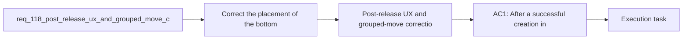

## item_579_post_release_ux_and_grouped_move_corrections_after_req_114_to_req_117 - Post-release UX and grouped-move corrections after req 114 to req 117
> From version: 1.4.4
> Schema version: 1.0
> Status: Ready
> Understanding: 97%
> Confidence: 95%
> Progress: 0%
> Complexity: Medium
> Theme: UI
> Reminder: Update status/understanding/confidence/progress and linked task references when you edit this doc.

# Problem
- Coordinate a coherent post-release correction bundle for the features delivered by `req_114` to `req_117`.
- Keep the corrective work split into focused slices so create-flow UX, Modeling table action-bar UX, canvas grouped drag behavior, and regression closure can move independently while still landing under one delivery wrapper.
- Preserve the original interaction contracts from the shipped bundle while correcting the operator-reported issues.

# Scope
- In:
  - corrective delivery planning for child backlog items `580` to `583`
  - one orchestration task that sequences the waves and validation
  - linked workflow-doc updates across request, backlog, and task levels
- Out:
  - introducing new features beyond the reported corrections
  - redesigning unrelated Modeling or canvas workflows

# Acceptance criteria
- AC1: After a successful creation in Modeling, the bottom `New` action is available from the resulting edit state so the operator can immediately start a fresh creation without scrolling back to the top. The button is not duplicated as a create-mode-only footer action.
- AC2: On the Modeling table screens, `Select multiple` is rendered on the same horizontal action row as the other primary actions, with a dedicated icon and a stable placement consistent across the supported tables. A suggested placement is between `Edit` and `Delete`.
- AC3: Entering multi-selection on the 2D canvas and dragging a selected node only applies the grouped move to the selected nodes. It must not trigger an automatic generate/recompute as part of the drag flow, and it must not materially change unrelated parts of the plan.
- AC4: The post-release corrections preserve the intended behaviors introduced by the original bundle: chained creation remains fast, batch delete still requires explicit entry into selection mode, and `Shift+click` remains the gesture for canvas multi-selection.

# AC Traceability
- AC1 -> `item_580`. Proof: post-create edit-state `New` correction lands without create-mode duplication.
- AC2 -> `item_581`. Proof: `Select multiple` is aligned on the shared action row and gains an explicit icon.
- AC3 -> `item_582`. Proof: grouped drag no longer triggers unrelated generate/recompute side effects.
- AC4 -> `item_583` plus integrated validation in `task_097`. Proof: targeted regression coverage and closure keep the original shipped interaction contracts intact.

# Decision framing
- Product framing: Consider
- Product signals: pricing and packaging
- Product follow-up: Review whether a product brief is needed before scope becomes harder to change.
- Architecture framing: Required
- Architecture signals: data model and persistence, contracts and integration
- Architecture follow-up: Create or link an architecture decision before irreversible implementation work starts.

# Links
- Product brief(s): (none yet)
- Architecture decision(s): (none yet)
- Request: `req_118_post_release_ux_and_grouped_move_corrections_after_req_114_to_req_117`
- Child backlog item(s): `item_580_post_create_edit_state_new_action_correction_for_modeling_forms`, `item_581_select_multiple_action_row_placement_and_icon_alignment_across_modeling_tables`, `item_582_canvas_grouped_drag_generate_isolation_and_localized_move_persistence_correction`, `item_583_regression_coverage_and_closure_for_post_release_ux_and_grouped_move_corrections`
- Primary task(s): `task_097_post_release_ux_and_grouped_move_corrections_after_req_114_to_req_117`

# AI Context
- Summary: Post-release UX and grouped-move corrections after req 114 to req 117
- Keywords: post-release, and, grouped-move, corrections, req
- Use when: Use when framing scope, context, and acceptance checks for Post-release UX and grouped-move corrections after req 114 to req 117.
- Skip when: Skip when the work targets another feature, repository, or workflow stage.

# References
- `logics/skills/logics-ui-steering/SKILL.md`

# Priority
- Impact:
- Urgency:

# Notes
- Derived from request `req_118_post_release_ux_and_grouped_move_corrections_after_req_114_to_req_117`.
- Source file: `logics/request/req_118_post_release_ux_and_grouped_move_corrections_after_req_114_to_req_117.md`.
- Request context seeded into this backlog item from `logics/request/req_118_post_release_ux_and_grouped_move_corrections_after_req_114_to_req_117.md`.
- This backlog item is the umbrella slice for child items `580` to `583`.
