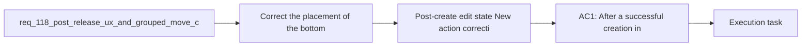

## item_580_post_create_edit_state_new_action_correction_for_modeling_forms - Post-create edit state New action correction for Modeling forms
> From version: 1.4.4
> Schema version: 1.0
> Status: Done
> Understanding: 98%
> Confidence: 97%
> Progress: 100%
> Complexity: Medium
> Theme: UI
> Reminder: Update status/understanding/confidence/progress and linked task references when you edit this doc.

# Problem
- The repeated-creation accelerator was placed in create mode instead of the post-create edit state where the operator actually needs it.
- The correction must restore the intended chained-creation flow without turning `New` into a generic action across every edit scenario.

# Scope
- In:
  - move the bottom `New` action to the post-create edit state across supported Modeling forms
  - keep `New` as a silent reset toward a fresh empty creation form
  - remove the create-mode-only footer placement introduced by the previous delivery
- Out:
  - adding duplication or prefilled-create behavior
  - expanding the action to all pre-existing edit states

# Acceptance criteria
- AC1: After a successful creation in a supported Modeling form, the resulting edit state exposes the bottom `New` action so the operator can immediately start another creation without scrolling back to the top.
- AC2: The bottom `New` action is no longer presented as a create-mode-only footer control.
- AC3: Clicking `New` from the post-create edit state resets toward a fresh empty creation form without duplicating or pre-filling the previously created item.

# AC Traceability
- AC1 -> post-create edit-state action placement. Proof: delivered in Wave 1 and validated in `src/tests/app.ui.creation-flow-ergonomics.spec.tsx`.
- AC2 -> create-mode footer removal. Proof: delivered in Wave 1 and validated in `src/tests/app.ui.creation-flow-ergonomics.spec.tsx`.
- AC3 -> silent reset to fresh create form. Proof: delivered in Wave 1 and validated in `src/tests/app.ui.creation-flow-ergonomics.spec.tsx`.

# Decision framing
- Product framing: Consider
- Product signals: pricing and packaging
- Product follow-up: Review whether a product brief is needed before scope becomes harder to change.
- Architecture framing: Required
- Architecture signals: data model and persistence, contracts and integration
- Architecture follow-up: Create or link an architecture decision before irreversible implementation work starts.

# Links
- Product brief(s): (none yet)
- Architecture decision(s): `adr_004_post_release_modeling_ux_corrections_and_localized_canvas_group_drag_persistence`
- Request: `req_118_post_release_ux_and_grouped_move_corrections_after_req_114_to_req_117`
- Parent backlog item: `item_579_post_release_ux_and_grouped_move_corrections_after_req_114_to_req_117`
- Primary task(s): `task_097_post_release_ux_and_grouped_move_corrections_after_req_114_to_req_117`

# AI Context
- Summary: Post-release UX and grouped-move corrections after req 114 to req 117
- Keywords: post-release, and, grouped-move, corrections, req
- Use when: Use when framing scope, context, and acceptance checks for Post-release UX and grouped-move corrections after req 114 to req 117.
- Skip when: Skip when the work targets another feature, repository, or workflow stage.

# References
- `logics/skills/logics-ui-steering/SKILL.md`

# Priority
- Impact:
- Urgency:

# Notes
- Derived from request `req_118_post_release_ux_and_grouped_move_corrections_after_req_114_to_req_117`.
- Source file: `logics/request/req_118_post_release_ux_and_grouped_move_corrections_after_req_114_to_req_117.md`.
- Request context seeded into this backlog item from `logics/request/req_118_post_release_ux_and_grouped_move_corrections_after_req_114_to_req_117.md`.
- This item maps the create-flow correction slice from the post-release bundle.
