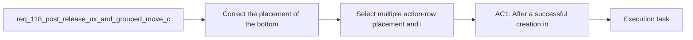

## item_581_select_multiple_action_row_placement_and_icon_alignment_across_modeling_tables - Select multiple action-row placement and icon alignment across Modeling tables
> From version: 1.4.4
> Schema version: 1.0
> Status: Done
> Understanding: 98%
> Confidence: 97%
> Progress: 100%
> Complexity: Medium
> Theme: UI
> Reminder: Update status/understanding/confidence/progress and linked task references when you edit this doc.

# Problem
- The `Select multiple` action is visually detached from the other Modeling table actions and currently lacks the discoverability expected for a mode-switching control.
- The correction must align the control with the existing action bar contract without changing the underlying batch-delete behavior.

# Scope
- In:
  - place `Select multiple` on the same horizontal action row as `New`, `Edit`, and `Delete`
  - keep a stable logical ordering, with target placement between `Edit` and `Delete`
  - add an explicit multi-selection icon to the action
- Out:
  - renaming the action
  - changing batch-delete rules or the explicit-entry requirement

# Acceptance criteria
- AC1: On supported Modeling table screens, `Select multiple` is rendered on the same horizontal action row as the other primary actions rather than as a detached control.
- AC2: The control uses a dedicated multi-selection icon and remains labeled `Select multiple`.
- AC3: The visual order is consistent across supported Modeling screens, with `Select multiple` logically positioned between `Edit` and `Delete` even when small layouts wrap.

# AC Traceability
- AC1 -> action-row alignment. Proof: `src/tests/app.ui.list-ergonomics.spec.tsx` covers the shared Modeling action row placement.
- AC2 -> explicit icon plus unchanged label. Proof: `src/tests/app.ui.list-ergonomics.spec.tsx` checks the dedicated multi-selection icon and stable label.
- AC3 -> stable action ordering across supported screens. Proof: `src/tests/app.ui.list-ergonomics.spec.tsx` verifies the `New -> Edit -> Select multiple -> Delete` ordering on representative Modeling tables.

# Decision framing
- Product framing: Consider
- Product signals: pricing and packaging
- Product follow-up: Review whether a product brief is needed before scope becomes harder to change.
- Architecture framing: Required
- Architecture signals: data model and persistence, contracts and integration
- Architecture follow-up: Create or link an architecture decision before irreversible implementation work starts.

# Links
- Product brief(s): (none yet)
- Architecture decision(s): `adr_004_post_release_modeling_ux_corrections_and_localized_canvas_group_drag_persistence`
- Request: `req_118_post_release_ux_and_grouped_move_corrections_after_req_114_to_req_117`
- Parent backlog item: `item_579_post_release_ux_and_grouped_move_corrections_after_req_114_to_req_117`
- Primary task(s): `task_097_post_release_ux_and_grouped_move_corrections_after_req_114_to_req_117`

# AI Context
- Summary: Post-release UX and grouped-move corrections after req 114 to req 117
- Keywords: post-release, and, grouped-move, corrections, req
- Use when: Use when framing scope, context, and acceptance checks for Post-release UX and grouped-move corrections after req 114 to req 117.
- Skip when: Skip when the work targets another feature, repository, or workflow stage.

# References
- `logics/skills/logics-ui-steering/SKILL.md`

# Priority
- Impact:
- Urgency:

# Notes
- Derived from request `req_118_post_release_ux_and_grouped_move_corrections_after_req_114_to_req_117`.
- Source file: `logics/request/req_118_post_release_ux_and_grouped_move_corrections_after_req_114_to_req_117.md`.
- Request context seeded into this backlog item from `logics/request/req_118_post_release_ux_and_grouped_move_corrections_after_req_114_to_req_117.md`.
- This item maps the Modeling action-bar correction slice from the post-release bundle.
