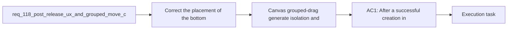

## item_582_canvas_grouped_drag_generate_isolation_and_localized_move_persistence_correction - Canvas grouped-drag generate isolation and localized move persistence correction
> From version: 1.4.4
> Schema version: 1.0
> Status: Ready
> Understanding: 97%
> Confidence: 95%
> Progress: 0%
> Complexity: Medium
> Theme: UI
> Reminder: Update status/understanding/confidence/progress and linked task references when you edit this doc.

# Problem
- Grouped drag on the 2D Modeling canvas appears to trigger a generate or broader recompute after movement, which alters unrelated parts of the plan.
- The correction must restore a strict grouped-move contract where only the selected nodes are updated, or the move is explicitly blocked if a localized update is impossible.

# Scope
- In:
  - isolate grouped drag from automatic generate or broad recompute side effects
  - persist only the intended localized move for the selected nodes
  - preserve the existing `Shift+click` multi-selection gesture and localized move semantics
- Out:
  - adding new selection gestures
  - reworking unrelated generation flows outside this bug fix

# Acceptance criteria
- AC1: Dragging a selected node while canvas multi-selection is active does not trigger an automatic generate or broad recompute as part of the drag flow.
- AC2: The resulting persisted mutation only updates the selected nodes and does not materially change unrelated parts of the plan.
- AC3: If a grouped move cannot remain localized, the interaction is blocked or constrained instead of mutating unrelated elements.

# AC Traceability
- AC1 -> no automatic generate during grouped drag. Proof: capture in Wave 3 validation and report inside `task_097`.
- AC2 -> localized persisted move only. Proof: capture in Wave 3 validation and report inside `task_097`.
- AC3 -> block or constrain if localization is impossible. Proof: capture in Wave 3 validation and report inside `task_097`.

# Decision framing
- Product framing: Consider
- Product signals: pricing and packaging
- Product follow-up: Review whether a product brief is needed before scope becomes harder to change.
- Architecture framing: Required
- Architecture signals: data model and persistence, contracts and integration
- Architecture follow-up: Create or link an architecture decision before irreversible implementation work starts.

# Links
- Product brief(s): (none yet)
- Architecture decision(s): (none yet)
- Request: `req_118_post_release_ux_and_grouped_move_corrections_after_req_114_to_req_117`
- Parent backlog item: `item_579_post_release_ux_and_grouped_move_corrections_after_req_114_to_req_117`
- Primary task(s): `task_097_post_release_ux_and_grouped_move_corrections_after_req_114_to_req_117`

# AI Context
- Summary: Post-release UX and grouped-move corrections after req 114 to req 117
- Keywords: post-release, and, grouped-move, corrections, req
- Use when: Use when framing scope, context, and acceptance checks for Post-release UX and grouped-move corrections after req 114 to req 117.
- Skip when: Skip when the work targets another feature, repository, or workflow stage.

# References
- `logics/skills/logics-ui-steering/SKILL.md`

# Priority
- Impact:
- Urgency:

# Notes
- Derived from request `req_118_post_release_ux_and_grouped_move_corrections_after_req_114_to_req_117`.
- Source file: `logics/request/req_118_post_release_ux_and_grouped_move_corrections_after_req_114_to_req_117.md`.
- Request context seeded into this backlog item from `logics/request/req_118_post_release_ux_and_grouped_move_corrections_after_req_114_to_req_117.md`.
- This item maps the canvas grouped-drag correction slice from the post-release bundle.
