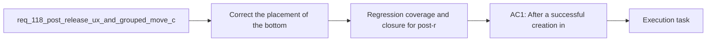

## item_583_regression_coverage_and_closure_for_post_release_ux_and_grouped_move_corrections - Regression coverage and closure for post-release UX and grouped-move corrections
> From version: 1.4.4
> Schema version: 1.0
> Status: Done
> Understanding: 97%
> Confidence: 95%
> Progress: 100%
> Complexity: Medium
> Theme: UI
> Reminder: Update status/understanding/confidence/progress and linked task references when you edit this doc.

# Problem
- The post-release correction bundle needs explicit regression coverage and closure evidence so the repaired interaction contracts stay stable.
- The regression slice must cover the create-flow correction, the Modeling action-bar correction, the grouped-drag canvas fix, and linked workflow-doc synchronization.

# Scope
- In:
  - targeted regression coverage for the corrected `New` placement
  - targeted regression coverage for `Select multiple` row placement and icon affordance
  - targeted regression coverage for grouped-drag no-generate behavior and localized movement
  - linked request/backlog/task closure updates after delivery
- Out:
  - broad new test suites unrelated to the corrected surfaces
  - unrelated workflow-document refactors outside the delivery chain

# Acceptance criteria
- AC1: Automated regression coverage demonstrates that the repaired post-create `New` placement behaves as intended and no longer appears as a create-mode-only footer action.
- AC2: Automated regression coverage demonstrates that `Select multiple` is rendered on the intended action row with the intended icon affordance.
- AC3: Automated regression coverage demonstrates that grouped drag does not trigger automatic generate side effects and does not mutate unrelated plan elements.
- AC4: The linked request, umbrella backlog item, child backlog items, and orchestration task are updated coherently as the corrective bundle is delivered and closed.

# AC Traceability
- AC1 -> create-flow regression coverage. Proof: `src/tests/app.ui.creation-flow-ergonomics.spec.tsx` covers the post-create-only bottom `New` contract.
- AC2 -> Modeling action-row regression coverage. Proof: `src/tests/app.ui.list-ergonomics.spec.tsx` covers the shared action-row placement and icon affordance for `Select multiple`.
- AC3 -> canvas grouped-drag regression coverage. Proof: `src/tests/app.ui.navigation-canvas.spec.tsx` and `src/tests/store.reducer.sync-invariant.spec.ts` cover localized grouped drag persistence without unrelated plan mutation.
- AC4 -> workflow-doc closure evidence. Proof: `req_118`, `item_579`, `item_580`, `item_581`, `item_582`, `item_583`, and `task_097` are all synchronized to `Done` after integrated validation and `Logics lint: OK`.

# Decision framing
- Product framing: Consider
- Product signals: pricing and packaging
- Product follow-up: Review whether a product brief is needed before scope becomes harder to change.
- Architecture framing: Required
- Architecture signals: data model and persistence, contracts and integration
- Architecture follow-up: Create or link an architecture decision before irreversible implementation work starts.

# Links
- Product brief(s): (none yet)
- Architecture decision(s): (none yet)
- Request: `req_118_post_release_ux_and_grouped_move_corrections_after_req_114_to_req_117`
- Parent backlog item: `item_579_post_release_ux_and_grouped_move_corrections_after_req_114_to_req_117`
- Primary task(s): `task_097_post_release_ux_and_grouped_move_corrections_after_req_114_to_req_117`

# AI Context
- Summary: Post-release UX and grouped-move corrections after req 114 to req 117
- Keywords: post-release, and, grouped-move, corrections, req
- Use when: Use when framing scope, context, and acceptance checks for Post-release UX and grouped-move corrections after req 114 to req 117.
- Skip when: Skip when the work targets another feature, repository, or workflow stage.

# References
- `logics/skills/logics-ui-steering/SKILL.md`

# Priority
- Impact:
- Urgency:

# Notes
- Derived from request `req_118_post_release_ux_and_grouped_move_corrections_after_req_114_to_req_117`.
- Source file: `logics/request/req_118_post_release_ux_and_grouped_move_corrections_after_req_114_to_req_117.md`.
- Request context seeded into this backlog item from `logics/request/req_118_post_release_ux_and_grouped_move_corrections_after_req_114_to_req_117.md`.
- This item maps the regression-and-closure slice from the post-release bundle.
