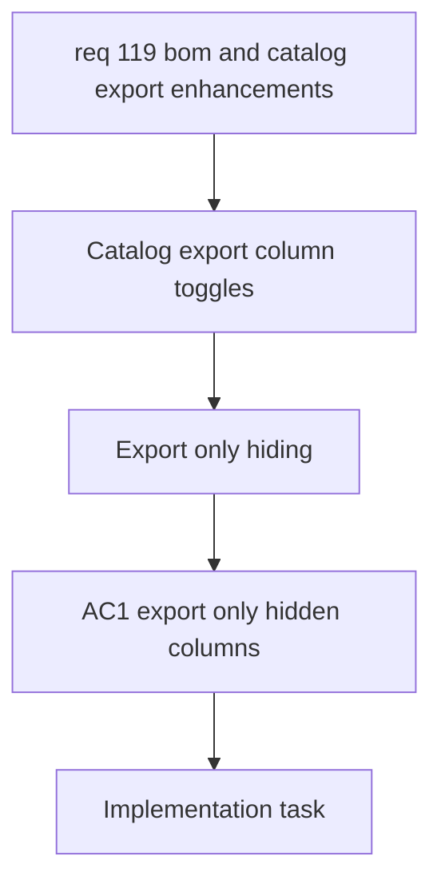

## item_584_catalog_export_column_toggles - Catalog Export Column Toggles
> From version: 1.4.4
> Schema version: 1.0
> Status: Done
> Understanding: 100%
> Confidence: 100%
> Progress: 100%
> Complexity: Medium
> Theme: UI
> Non-semantic edit: linked adr_005_bom_and_export_contracts_for_csv_xlsx_and_reference_naming
> Reminder: Update status/understanding/confidence/progress and linked request/task references when you edit this doc.

# Problem
Users want to hide some catalog columns only in exported files, without changing the catalog table visible in the app.

# Scope
- In:
  - Add an export-time option to omit selected catalog columns.
  - Keep the catalog table and form unchanged on screen.
  - Preserve the current catalog export behavior for columns that are not hidden.
- Out:
  - Adding new catalog fields.
  - Changing the catalog table layout in the UI.
  - BOM or wire export changes.

# Acceptance criteria
- AC1: The export flow can omit selected catalog columns, but the catalog screen still shows the full catalog table.
- AC2: The default catalog export remains compatible with the existing column order and content unless a column toggle is enabled.

# AC Traceability
- AC1 -> Export only hiding of catalog columns.
- AC2 -> Preserve default export compatibility.
- request-AC1 -> This backlog slice. Evidence needed: Users can hide selected catalog columns only when exporting, without affecting the catalog table shown in the UI.
- request-AC2 -> This backlog slice. Evidence needed: Seal and connection references can each store an optional name, and a previously entered name is reused as a fallback when the same reference is typed again.
- request-AC3 -> This backlog slice. Evidence needed: BOM export no longer splits connector, seal, and connection reference data into separate sections; they appear on one common structure with consistent columns.
- request-AC4 -> This backlog slice. Evidence needed: BOM export and wire-by-wire export can be produced as CSV or XLSX in parallel, with XLSX chosen through an explicit option.
- request-AC5 -> This backlog slice. Evidence needed: The BOM XLSX export contains two sheets, one global summary sheet and one connector-grouped sheet with merged connector ID and name cells, correct quantities, and connector-order grouping.
- request-AC1 -> This backlog slice. Proof: Historical delivery is recorded in the linked backlog/task report and validation sections; this corpus repair formalizes strict audit traceability without changing shipped scope. Source: `logics corpus strict audit repair`
- request-AC2 -> This backlog slice. Proof: Historical delivery is recorded in the linked backlog/task report and validation sections; this corpus repair formalizes strict audit traceability without changing shipped scope. Source: `logics corpus strict audit repair`
- request-AC3 -> This backlog slice. Proof: Historical delivery is recorded in the linked backlog/task report and validation sections; this corpus repair formalizes strict audit traceability without changing shipped scope. Source: `logics corpus strict audit repair`
- request-AC4 -> This backlog slice. Proof: Historical delivery is recorded in the linked backlog/task report and validation sections; this corpus repair formalizes strict audit traceability without changing shipped scope. Source: `logics corpus strict audit repair`
- request-AC5 -> This backlog slice. Proof: Historical delivery is recorded in the linked backlog/task report and validation sections; this corpus repair formalizes strict audit traceability without changing shipped scope. Source: `logics corpus strict audit repair`

# Decision framing
- Product framing: Not needed
- Architecture framing: Required
- Architecture signals: export contracts and file schema
- Architecture follow-up: Create or link an architecture decision before implementation if the toggle state needs persistence.

# Links
- Product brief(s): (none yet)
- Architecture decision(s): `adr_005_bom_and_export_contracts_for_csv_xlsx_and_reference_naming`
- Request: `req_119_bom_and_catalog_export_enhancements`
- Primary task(s): `task_101_catalog_export_column_toggles`

# Priority
- Impact: Medium
- Urgency: Medium

# Notes
- Derived from request `req_119_bom_and_catalog_export_enhancements`.
- Source file: `logics/request/req_119_bom_and_catalog_export_enhancements.md`.
- Keep this as the export-only catalog slice.
