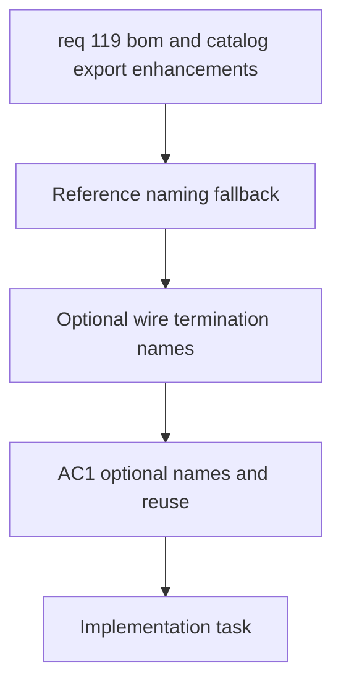

## item_585_reference_naming_fallback_for_wire_terminations - Reference Naming Fallback for Wire Terminations
> From version: 1.4.4
> Schema version: 1.0
> Status: Ready
> Understanding: 95%
> Confidence: 86%
> Progress: 0%
> Complexity: High
> Theme: Data Model
> Non-semantic edit: linked adr_005_bom_and_export_contracts_for_csv_xlsx_and_reference_naming
> Reminder: Update status/understanding/confidence/progress and linked request/task references when you edit this doc.

# Problem
Seal and connection references need an optional friendly name, and the app should remember a previously entered name for a reference when that reference is used again.

# Scope
- In:
  - Add an optional name field for seal references and connection references.
  - Allow the name to be edited later from both the form entry flow and the catalog-linked flow.
  - Reuse the last known name as a fallback when the same reference is entered again.
  - Keep the name field optional and leave it blank when no name is known.
- Out:
  - Automatic renaming of existing references.
  - Changing connector or splice model fields.
  - BOM layout changes.

# Acceptance criteria
- AC1: Seal and connection references can each store an optional name.
- AC2: When the same reference is entered again, the previous name is suggested or reused as a fallback.
- AC3: If the name is still empty, the saved value remains blank.

# AC Traceability
- AC1 -> Optional name fields for wire terminations.
- AC2 -> Reuse last known name for the same reference.
- AC3 -> Blank name stays blank.

# Decision framing
- Product framing: Not needed
- Architecture framing: Required
- Architecture signals: data model, persistence, and form contracts
- Architecture follow-up: Create or link an architecture decision before implementation because this changes the stored shape of wire termination metadata.

# Links
- Product brief(s): (none yet)
- Architecture decision(s): `adr_005_bom_and_export_contracts_for_csv_xlsx_and_reference_naming`
- Request: `req_119_bom_and_catalog_export_enhancements`
- Primary task(s): `task_099_reference_naming_fallback_for_wire_terminations`

# Priority
- Impact: High
- Urgency: High

# Notes
- Derived from request `req_119_bom_and_catalog_export_enhancements`.
- Source file: `logics/request/req_119_bom_and_catalog_export_enhancements.md`.
- Keep this slice focused on naming behavior only.
