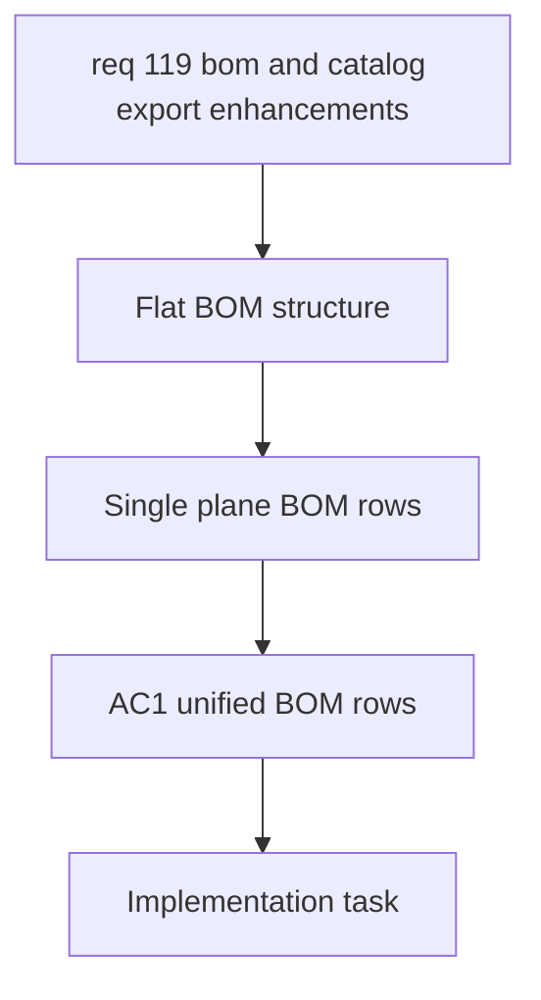

## item_586_flatten_bom_export_into_a_single_plane - Flatten BOM Export Into a Single Plane
> From version: 1.4.4
> Schema version: 1.0
> Status: Ready
> Understanding: 95%
> Confidence: 86%
> Progress: 0%
> Complexity: High
> Theme: Export
> Reminder: Update status/understanding/confidence/progress and linked request/task references when you edit this doc.

# Problem
The current BOM output uses a separate wire termination block. The export needs one flat BOM structure so connectors, seals, and connection references are represented with the same column layout.

# Scope
- In:
  - Replace the separate wire termination block with a single BOM row structure.
  - Keep connector, seal, and connection reference data on the same plane.
  - Preserve deterministic ordering for the unified BOM rows.
- Out:
  - XLSX workbook formatting.
  - Optional CSV/XLSX format selection.
  - Catalog export column toggles.

# Acceptance criteria
- AC1: BOM export uses one common row structure for connector, seal, and connection reference data.
- AC2: The old separate wire termination section no longer appears in the exported BOM.
- AC3: The unified export keeps a stable and readable row order.

# AC Traceability
- AC1 -> Unified BOM rows.
- AC2 -> Remove separate wire termination section.
- AC3 -> Stable export ordering.

# Decision framing
- Product framing: Not needed
- Architecture framing: Required
- Architecture signals: export schema and serialization contract
- Architecture follow-up: Create or link an architecture decision if the unified BOM row model changes the shared export contract.

# Links
- Product brief(s): (none yet)
- Architecture decision(s): (none yet)
- Request: `req_119_bom_and_catalog_export_enhancements`
- Primary task(s): `task_100_flatten_bom_export_into_a_single_plane`

# Priority
- Impact: High
- Urgency: High

# Notes
- Derived from request `req_119_bom_and_catalog_export_enhancements`.
- Source file: `logics/request/req_119_bom_and_catalog_export_enhancements.md`.
- This slice is the BOM row-model normalization.
