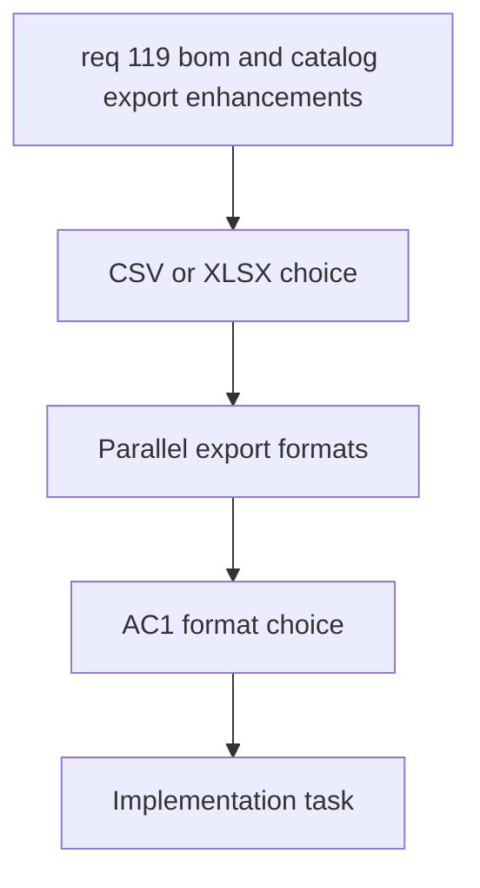

## item_587_parallel_csv_and_xlsx_export_options - Parallel CSV and XLSX Export Options
> From version: 1.4.4
> Schema version: 1.0
> Status: Ready
> Understanding: 95%
> Confidence: 86%
> Progress: 0%
> Complexity: High
> Theme: Export
> Reminder: Update status/understanding/confidence/progress and linked request/task references when you edit this doc.

# Problem
Users want BOM and wire-by-wire exports in Excel format, but the app currently only exposes CSV export paths.

# Scope
- In:
  - Add an explicit export option to choose CSV or XLSX.
  - Apply the format choice to BOM export and wire-by-wire export.
  - Keep CSV behavior unchanged when CSV is selected.
- Out:
  - BOM row-model changes.
  - XLSX workbook formatting details.
  - Catalog export column toggles.

# Acceptance criteria
- AC1: The user can explicitly choose CSV or XLSX for BOM export and wire-by-wire export.
- AC2: CSV export remains available and behaves the same when selected.
- AC3: XLSX export is available without forcing a CSV workflow change.

# AC Traceability
- AC1 -> Explicit CSV or XLSX choice.
- AC2 -> Preserve CSV behavior.
- AC3 -> Add XLSX without removing CSV.

# Decision framing
- Product framing: Not needed
- Architecture framing: Required
- Architecture signals: file export contracts, dependency selection, and integration
- Architecture follow-up: Create or link an architecture decision before implementation because XLSX support introduces a new dependency surface.

# Links
- Product brief(s): (none yet)
- Architecture decision(s): `adr_005_bom_and_export_contracts_for_csv_xlsx_and_reference_naming`
- Request: `req_119_bom_and_catalog_export_enhancements`
- Primary task(s): `task_098_parallel_csv_and_xlsx_export_options`

# Priority
- Impact: High
- Urgency: High

# Notes
- Derived from request `req_119_bom_and_catalog_export_enhancements`.
- Source file: `logics/request/req_119_bom_and_catalog_export_enhancements.md`.
- This slice covers format selection only.
