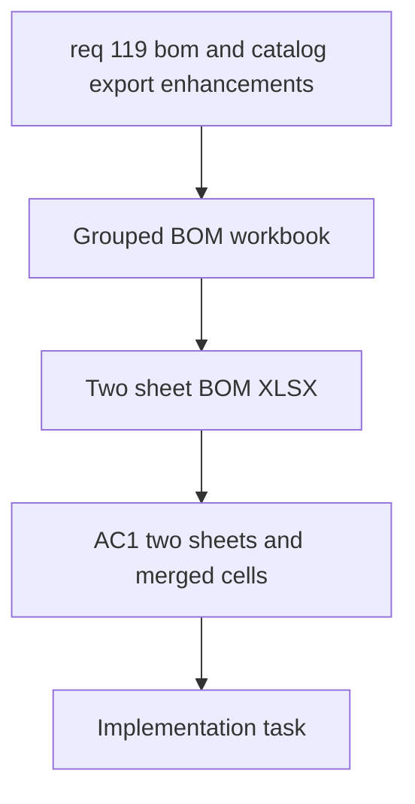

## item_588_grouped_bom_workbook_with_merged_connector_rows - Grouped BOM Workbook With Merged Connector Rows
> From version: 1.4.4
> Schema version: 1.0
> Status: Done
> Understanding: 100%
> Confidence: 100%
> Progress: 100%
> Complexity: High
> Theme: Export
> Non-semantic edit: linked adr_005_bom_and_export_contracts_for_csv_xlsx_and_reference_naming
> Reminder: Update status/understanding/confidence/progress and linked request/task references when you edit this doc.

# Problem
The BOM XLSX export needs a second sheet grouped by connector, with merged connector identity cells and correct connector-level quantities.

# Scope
- In:
  - Build a two-sheet BOM workbook.
  - Keep the first sheet as the global summary view.
  - Add a second sheet grouped by connector.
  - Merge the connector ID and name cells across each connector group.
  - Order grouped rows so each connector is followed by its related rows in a stable sequence.
- Out:
  - CSV export behavior.
  - Catalog export controls.
  - Wire-by-wire XLSX formatting.

# Acceptance criteria
- AC1: The BOM XLSX export contains a global summary sheet and a connector-grouped sheet.
- AC2: The grouped sheet merges the connector ID and connector name cells across the rows in each connector group.
- AC3: The grouped sheet keeps connector-related rows under the right connector and preserves a stable order.
- AC4: Quantity totals are correct in both sheets.

# AC Traceability
- AC1 -> Two sheet workbook.
- AC2 -> Merged connector identity cells.
- AC3 -> Group rows by connector in a stable order.
- AC4 -> Correct quantities in both views.
- request-AC1 -> This backlog slice. Evidence needed: Users can hide selected catalog columns only when exporting, without affecting the catalog table shown in the UI.
- request-AC2 -> This backlog slice. Evidence needed: Seal and connection references can each store an optional name, and a previously entered name is reused as a fallback when the same reference is typed again.
- request-AC3 -> This backlog slice. Evidence needed: BOM export no longer splits connector, seal, and connection reference data into separate sections; they appear on one common structure with consistent columns.
- request-AC4 -> This backlog slice. Evidence needed: BOM export and wire-by-wire export can be produced as CSV or XLSX in parallel, with XLSX chosen through an explicit option.
- request-AC5 -> This backlog slice. Evidence needed: The BOM XLSX export contains two sheets, one global summary sheet and one connector-grouped sheet with merged connector ID and name cells, correct quantities, and connector-order grouping.
- request-AC1 -> This backlog slice. Proof: Historical delivery is recorded in the linked backlog/task report and validation sections; this corpus repair formalizes strict audit traceability without changing shipped scope. Source: `logics corpus strict audit repair`
- request-AC2 -> This backlog slice. Proof: Historical delivery is recorded in the linked backlog/task report and validation sections; this corpus repair formalizes strict audit traceability without changing shipped scope. Source: `logics corpus strict audit repair`
- request-AC3 -> This backlog slice. Proof: Historical delivery is recorded in the linked backlog/task report and validation sections; this corpus repair formalizes strict audit traceability without changing shipped scope. Source: `logics corpus strict audit repair`
- request-AC4 -> This backlog slice. Proof: Historical delivery is recorded in the linked backlog/task report and validation sections; this corpus repair formalizes strict audit traceability without changing shipped scope. Source: `logics corpus strict audit repair`
- request-AC5 -> This backlog slice. Proof: Historical delivery is recorded in the linked backlog/task report and validation sections; this corpus repair formalizes strict audit traceability without changing shipped scope. Source: `logics corpus strict audit repair`

# Decision framing
- Product framing: Not needed
- Architecture framing: Required
- Architecture signals: workbook layout, merged-cell rules, and export integration
- Architecture follow-up: Create or link an architecture decision before implementation because the workbook structure is a new export contract.

# Links
- Product brief(s): (none yet)
- Architecture decision(s): `adr_005_bom_and_export_contracts_for_csv_xlsx_and_reference_naming`
- Request: `req_119_bom_and_catalog_export_enhancements`
- Primary task(s): `task_102_grouped_bom_workbook_with_merged_connector_rows`

# Priority
- Impact: High
- Urgency: High

# Notes
- Derived from request `req_119_bom_and_catalog_export_enhancements`.
- Source file: `logics/request/req_119_bom_and_catalog_export_enhancements.md`.
- This slice covers the workbook layout and formatting layer.
