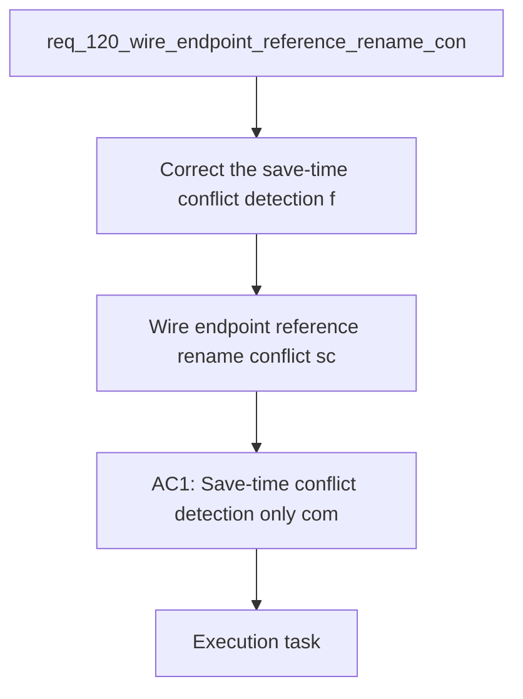

## item_589_wire_endpoint_reference_rename_conflict_scoping_and_cross_reference_contamination_fixes - Wire endpoint reference rename conflict scoping and cross-reference contamination fixes
> From version: 1.4.4
> Schema version: 1.0
> Status: Done
> Understanding: 97%
> Confidence: 95%
> Progress: 100%
> Complexity: High
> Theme: UI
> Reminder: Update status/understanding/confidence/progress and linked request/task references when you edit this doc.

# Problem
- Correct the save-time conflict detection for `connection` and `seal` reference naming so a wire endpoint only compares names that belong to the same normalized reference and same reference kind.
- Stop cross-endpoint contamination where the name of one wire endpoint can trigger a conflict dialog for the other endpoint even when the references are different.
- Stop cross-reference contamination where saving one wire can copy a chosen or existing name onto unrelated references, including endpoints that have no corresponding reference at all.
- Preserve the intended fallback behavior: identical references should share the same optional name, but only within the same reference kind and normalized reference key.
- The wire endpoint reference naming flow introduced for `connection` and `seal` references is currently over-applying its synchronization and conflict-resolution logic.
- Two concrete bug families have been observed:

# Scope
- In: one coherent delivery slice from the source request.
- Out: unrelated sibling slices that should stay in separate backlog items instead of widening this doc.

# Acceptance criteria
- AC1: Save-time conflict detection only compares candidate names within the exact same normalized reference and exact same reference kind (`connection` vs `seal`). Different references on the opposite endpoint of the same wire do not participate in the same conflict.
- AC2: When multiple wires share the same normalized reference and all effective names normalize to a single value, saving a wire with that same value does not trigger an overwrite dialog.
- AC3: Resolving or confirming a name for one normalized reference only updates endpoints that carry that exact normalized reference and matching reference kind. No other reference receives that name.
- AC4: Endpoints without a corresponding reference never receive a propagated name during save, including cases where another wire sharing a different reference is updated in the same operation.
- AC5: If the operator cancels or discards a conflict choice, no partial rename is applied anywhere in the dataset.

# AC Traceability
- AC1 -> Scope: Save-time conflict detection only compares candidate names within the exact same normalized reference and exact same reference kind (`connection` vs `seal`). Different references on the opposite endpoint of the same wire do not participate in the same conflict.. Proof: capture validation evidence in this doc.
- AC2 -> Scope: When multiple wires share the same normalized reference and all effective names normalize to a single value, saving a wire with that same value does not trigger an overwrite dialog.. Proof: capture validation evidence in this doc.
- AC3 -> Scope: Resolving or confirming a name for one normalized reference only updates endpoints that carry that exact normalized reference and matching reference kind. No other reference receives that name.. Proof: capture validation evidence in this doc.
- AC4 -> Scope: Endpoints without a corresponding reference never receive a propagated name during save, including cases where another wire sharing a different reference is updated in the same operation.. Proof: capture validation evidence in this doc.
- AC5 -> Scope: If the operator cancels or discards a conflict choice, no partial rename is applied anywhere in the dataset.. Proof: capture validation evidence in this doc.

# Decision framing
- Product framing: Consider
- Product signals: engagement loop
- Product follow-up: Review whether a product brief is needed before scope becomes harder to change.
- Architecture framing: Consider
- Architecture signals: data model and persistence
- Architecture follow-up: Review whether an architecture decision is needed before implementation becomes harder to reverse.

# Links
- Product brief(s): (none yet)
- Architecture decision(s): (none yet)
- Request: `req_120_wire_endpoint_reference_rename_conflict_scoping_and_cross_reference_contamination_fixes`
- Primary task(s): `task_103_wire_endpoint_reference_rename_conflict_scoping_and_cross_reference_contamination_fixes`
<!-- When creating a task from this item, add: Derived from `this file path` in the task # Links section -->

# AI Context
- Summary: Fix save-time wire endpoint reference rename conflict scoping and stop unrelated name propagation.
- Keywords: wire, endpoint, connection, seal, reference, rename, conflict, overwrite, propagation, atomicity
- Use when: Use when grooming or implementing bug fixes around wire endpoint reference naming and conflict resolution.
- Skip when: Skip when the work targets BOM layout, XLSX export, or unrelated modeling workflows.
# References
- `logics/skills/logics-ui-steering/SKILL.md`

# Priority
- Impact:
- Urgency:

# Notes
- Derived from request `req_120_wire_endpoint_reference_rename_conflict_scoping_and_cross_reference_contamination_fixes`.
- Source file: `logics\request\req_120_wire_endpoint_reference_rename_conflict_scoping_and_cross_reference_contamination_fixes.md`.
- Keep this backlog item as one bounded delivery slice; create sibling backlog items for the remaining request coverage instead of widening this doc.
- Request context seeded into this backlog item from `logics\request\req_120_wire_endpoint_reference_rename_conflict_scoping_and_cross_reference_contamination_fixes.md`.
- Delivery completed through `task_103_wire_endpoint_reference_rename_conflict_scoping_and_cross_reference_contamination_fixes`.
