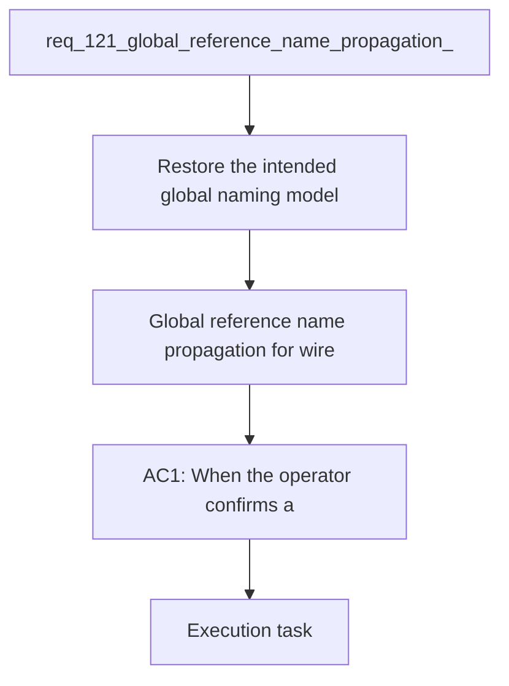

## item_590_global_reference_name_propagation_for_wire_endpoint_renames - Global reference name propagation for wire endpoint renames
> From version: 1.4.4
> Schema version: 1.0
> Status: Done
> Understanding: 98%
> Confidence: 96%
> Progress: 100%
> Complexity: Medium
> Theme: UI
> Reminder: Update status/understanding/confidence/progress and linked request/task references when you edit this doc.

# Problem
- Restore the intended global naming model for wire endpoint references: one normalized `connection` reference or one normalized `seal` reference must map to one shared name across all wires that carry that same reference.
- When the operator chooses to overwrite a reference name after a detected conflict, apply that chosen name to every wire endpoint that carries the same normalized reference and same reference kind, not only to the endpoint currently being edited.
- Preserve the safeguards introduced by the previous bug fix: no cross-kind contamination, no cross-reference contamination, and no propagation to endpoints that have no corresponding reference.
- Keep the save flow atomic: if the operator cancels or discards the conflict choice, no rename should be applied anywhere.
- The previous correction tightened the rename flow so it no longer mixes names from unrelated references or writes names onto empty-reference endpoints. That safety fix resolved the random-name contamination bug, but it also narrowed propagation too far.
- Current observed regression:

# Scope
- In: one coherent delivery slice from the source request.
- Out: unrelated sibling slices that should stay in separate backlog items instead of widening this doc.

# Acceptance criteria
- AC1: When the operator confirms a name choice for a given normalized `connection` reference, every wire endpoint carrying that same normalized `connection` reference is updated to the chosen name across the dataset.
- AC2: When the operator confirms a name choice for a given normalized `seal` reference, every wire endpoint carrying that same normalized `seal` reference is updated to the chosen name across the dataset.
- AC3: Confirming a name choice for one `(kind, normalized reference)` never updates another reference, another kind, or an endpoint whose corresponding reference is empty or undefined.
- AC4: If all known names for a given `(kind, normalized reference)` already normalize to the same value, saving that same value does not trigger an unnecessary overwrite dialog.
- AC5: If the operator cancels or discards the overwrite choice, no rename is applied anywhere in the dataset.

# AC Traceability
- AC1 -> Scope: When the operator confirms a name choice for a given normalized `connection` reference, every wire endpoint carrying that same normalized `connection` reference is updated to the chosen name across the dataset.. Proof: capture validation evidence in this doc.
- AC2 -> Scope: When the operator confirms a name choice for a given normalized `seal` reference, every wire endpoint carrying that same normalized `seal` reference is updated to the chosen name across the dataset.. Proof: capture validation evidence in this doc.
- AC3 -> Scope: Confirming a name choice for one `(kind, normalized reference)` never updates another reference, another kind, or an endpoint whose corresponding reference is empty or undefined.. Proof: capture validation evidence in this doc.
- AC4 -> Scope: If all known names for a given `(kind, normalized reference)` already normalize to the same value, saving that same value does not trigger an unnecessary overwrite dialog.. Proof: capture validation evidence in this doc.
- AC5 -> Scope: If the operator cancels or discards the overwrite choice, no rename is applied anywhere in the dataset.. Proof: capture validation evidence in this doc.

# Decision framing
- Product framing: Not needed
- Product signals: (none detected)
- Product follow-up: No product brief follow-up is expected based on current signals.
- Architecture framing: Required
- Architecture signals: data model and persistence, state and sync
- Architecture follow-up: Create or link an architecture decision before irreversible implementation work starts.

# Links
- Product brief(s): (none yet)
- Architecture decision(s): (none yet)
- Request: `req_121_global_reference_name_propagation_for_wire_endpoint_renames`
- Primary task(s): `task_104_global_reference_name_propagation_for_wire_endpoint_renames`
<!-- When creating a task from this item, add: Derived from `this file path` in the task # Links section -->

# AI Context
- Summary: Restore dataset-wide shared-name propagation for identical wire endpoint references after a confirmed overwrite choice.
- Keywords: wire, endpoint, connection, seal, reference, shared name, overwrite, propagation, global sync, atomicity
- Use when: Use when grooming or implementing the follow-up correction that restores global rename propagation for identical references.
- Skip when: Skip when the work targets unrelated contamination bugs that are already fixed, or non-rename features.
# References
- `logics/skills/logics-ui-steering/SKILL.md`

# Priority
- Impact:
- Urgency:

# Notes
- Derived from request `req_121_global_reference_name_propagation_for_wire_endpoint_renames`.
- Source file: `logics\request\req_121_global_reference_name_propagation_for_wire_endpoint_renames.md`.
- Keep this backlog item as one bounded delivery slice; create sibling backlog items for the remaining request coverage instead of widening this doc.
- Request context seeded into this backlog item from `logics\request\req_121_global_reference_name_propagation_for_wire_endpoint_renames.md`.
- Delivery completed through `task_104_global_reference_name_propagation_for_wire_endpoint_renames`.
