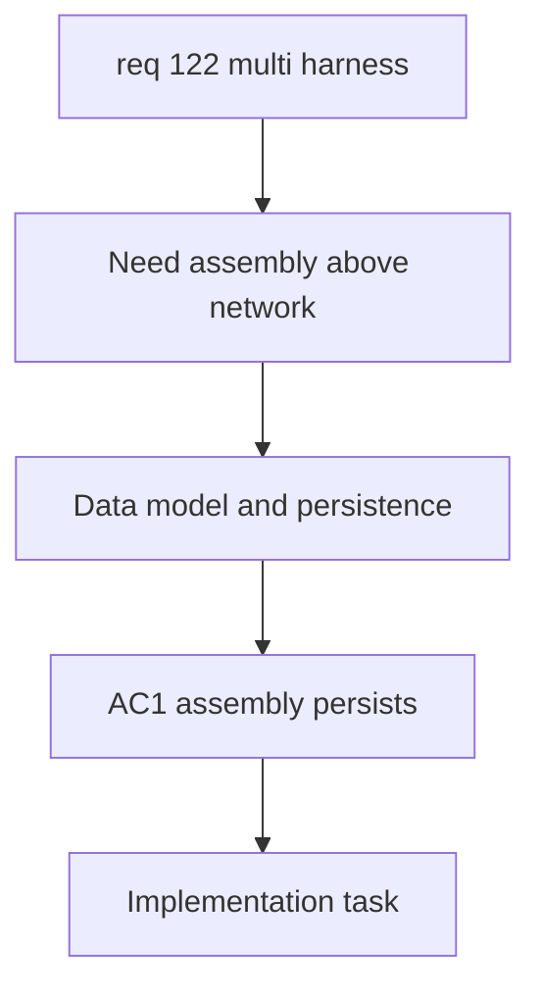

## item_591_harness_assembly_data_model_persistence_and_migration - Harness Assembly Data Model Persistence and Migration
> From version: 1.6.4
> Schema version: 1.0
> Status: Done
> Understanding: 99%
> Confidence: 96%
> Progress: 100%
> Complexity: High
> Theme: Multi-Harness Modeling
> Reminder: Update status/understanding/confidence/progress and linked request/task references when you edit this doc.
> Non-semantic edit: refreshed Mermaid signatures

# Problem
The application needs a first-class `Harness assembly` level above the existing `Network` model so several harnesses can be grouped without changing the meaning of an individual network. Existing saved data must continue to load unchanged, while new assembly data must persist through local storage and import/export.

# Scope
- In:
  - Add the `Harness assembly` domain model with user-visible name, stable technical ID, linked harness/network references, and per-harness display colors.
  - Treat the existing `Network` entity as one harness inside an assembly.
  - Generate default harness colors automatically and allow manual overrides in assembly properties.
  - Add migration-safe persistence and import/export support for assemblies.
  - Preserve existing single-network behavior when no assembly exists.
- Out:
  - Inter-harness connector link editing.
  - Functional schematic traversal across connector links.
  - Detailed aggregated schematic rendering.

# Acceptance criteria
- AC1: The application can create and persist a `Harness assembly` with name, technical ID, and linked network/harness references.
- AC2: Each existing `Network` can be referenced as one harness inside a `Harness assembly`.
- AC3: Harness display colors are generated automatically and can be manually overridden per assembly.
- AC4: Existing saved data without assemblies loads unchanged and behaves as a single-harness workflow.
- AC5: Import/export preserves assemblies, linked harness references, and harness color settings.

# AC Traceability
- AC1 -> Request AC1.
- AC2 -> Request clarified behavior: a `Network` is a harness.
- AC3 -> Request AC11.
- AC4 -> Request AC6.
- AC5 -> Request AC7.
- request-AC1 -> This backlog slice. Evidence needed: The application can create and persist a higher-level harness assembly that references multiple existing harnesses/networks.
- request-AC2 -> This backlog slice. Evidence needed: The operator can define a valid inter-harness connector link between two connectors from different harnesses.
- request-AC3 -> This backlog slice. Evidence needed: The connector link supports deterministic way continuity, including automatic same-way mapping and explicit mapping overrides where needed.
- request-AC4 -> This backlog slice. Evidence needed: Functional schematic traversal can cross a valid connector link and continue through wires in another harness.
- request-AC5 -> This backlog slice. Evidence needed: The aggregated functional schematic clearly indicates harness boundaries and connector-link crossing points.
- request-AC6 -> This backlog slice. Evidence needed: Existing single-harness functional schematic behavior remains unchanged when no harness assembly or connector link is used.
- request-AC7 -> This backlog slice. Evidence needed: Import/export and persistence preserve harness assemblies, linked harness references, connector links, and way mappings.
- request-AC8 -> This backlog slice. Evidence needed: Validation reports broken or ambiguous cross-harness links without corrupting existing harness data.
- request-AC9 -> This backlog slice. Evidence needed: The aggregated functional schematic can be generated from one or more selected master connectors within a harness assembly.
- request-AC10 -> This backlog slice. Evidence needed: The trace stops at natural continuity boundaries or at connectors explicitly marked as terminal.
- request-AC11 -> This backlog slice. Evidence needed: Each harness in the aggregated functional trace has an automatic display color that can be manually overridden in assembly properties.
- request-AC12 -> This backlog slice. Evidence needed: Linked connectors with mismatched pin/way counts are allowed with validation warnings, and tracing only crosses symmetric pin pairs valid on both sides.
- request-AC13 -> This backlog slice. Evidence needed: Clicking an interconnector block opens a detail/navigation surface for both linked connectors and their harnesses.
- request-AC1 -> This backlog slice. Proof: Historical delivery is recorded in the linked backlog/task report and validation sections; this corpus repair formalizes strict audit traceability without changing shipped scope. Source: `logics corpus strict audit repair`
- request-AC2 -> This backlog slice. Proof: Historical delivery is recorded in the linked backlog/task report and validation sections; this corpus repair formalizes strict audit traceability without changing shipped scope. Source: `logics corpus strict audit repair`
- request-AC3 -> This backlog slice. Proof: Historical delivery is recorded in the linked backlog/task report and validation sections; this corpus repair formalizes strict audit traceability without changing shipped scope. Source: `logics corpus strict audit repair`
- request-AC4 -> This backlog slice. Proof: Historical delivery is recorded in the linked backlog/task report and validation sections; this corpus repair formalizes strict audit traceability without changing shipped scope. Source: `logics corpus strict audit repair`
- request-AC5 -> This backlog slice. Proof: Historical delivery is recorded in the linked backlog/task report and validation sections; this corpus repair formalizes strict audit traceability without changing shipped scope. Source: `logics corpus strict audit repair`
- request-AC6 -> This backlog slice. Proof: Historical delivery is recorded in the linked backlog/task report and validation sections; this corpus repair formalizes strict audit traceability without changing shipped scope. Source: `logics corpus strict audit repair`
- request-AC7 -> This backlog slice. Proof: Historical delivery is recorded in the linked backlog/task report and validation sections; this corpus repair formalizes strict audit traceability without changing shipped scope. Source: `logics corpus strict audit repair`
- request-AC8 -> This backlog slice. Proof: Historical delivery is recorded in the linked backlog/task report and validation sections; this corpus repair formalizes strict audit traceability without changing shipped scope. Source: `logics corpus strict audit repair`
- request-AC9 -> This backlog slice. Proof: Historical delivery is recorded in the linked backlog/task report and validation sections; this corpus repair formalizes strict audit traceability without changing shipped scope. Source: `logics corpus strict audit repair`
- request-AC10 -> This backlog slice. Proof: Historical delivery is recorded in the linked backlog/task report and validation sections; this corpus repair formalizes strict audit traceability without changing shipped scope. Source: `logics corpus strict audit repair`
- request-AC11 -> This backlog slice. Proof: Historical delivery is recorded in the linked backlog/task report and validation sections; this corpus repair formalizes strict audit traceability without changing shipped scope. Source: `logics corpus strict audit repair`
- request-AC12 -> This backlog slice. Proof: Historical delivery is recorded in the linked backlog/task report and validation sections; this corpus repair formalizes strict audit traceability without changing shipped scope. Source: `logics corpus strict audit repair`
- request-AC13 -> This backlog slice. Proof: Historical delivery is recorded in the linked backlog/task report and validation sections; this corpus repair formalizes strict audit traceability without changing shipped scope. Source: `logics corpus strict audit repair`

# Decision framing
- Product framing: Required
- Product signals: new user-facing modeling level and workflow navigation
- Product follow-up: Create or link a product brief before implementation if naming, entry points, or assembly lifecycle UX expands.
- Architecture framing: Required
- Architecture signals: data model, persistence migration, import/export schema
- Architecture follow-up: Create or link an ADR before irreversible schema changes.

# Links
- Product brief(s): `logics/product/prod_001_multi_harness_assembly_traceability.md`
- Architecture decision(s): `logics/architecture/adr_007_harness_assembly_and_physical_interconnector_contract.md`
- Request: `req_122_multi_harness_super_category_and_cross_harness_functional_schematic`
- Primary task(s): `task_105_multi_harness_assembly_and_cross_harness_functional_schematic_orchestration`
<!-- When creating a task from this item, add: Derived from `logics/backlog/item_591_harness_assembly_data_model_persistence_and_migration.md` in the task # Links section -->

# Priority
- Impact: High
- Urgency: High

# Notes
- Derived from request `req_122_multi_harness_super_category_and_cross_harness_functional_schematic`.
- Source file: `logics/request/req_122_multi_harness_super_category_and_cross_harness_functional_schematic.md`.
- This slice establishes the assembly-level data foundation required by the connector-link and schematic slices.

# AI Context
- Summary: Add the persisted `Harness assembly` model that groups existing networks as harnesses and owns per-harness display colors.
- Keywords: harness assembly, network as harness, persistence, migration, import export, harness colors
- Use when: Use when implementing the assembly data model, storage migration, or import/export schema.
- Skip when: Skip when implementing connector links or functional schematic traversal.

# Validation evidence
- Implemented `HarnessAssembly` domain entities, reducer actions, persistence migration normalization, and network-file import/export preservation.
- Validated with `npm run -s typecheck`, `npm run -s lint`, targeted Vitest suite, and `npm run -s build`.

# Report
- Delivered: assembly grouping above `Network`, network-as-harness references, per-harness colors, legacy-data compatibility, and import/export round trip support.
