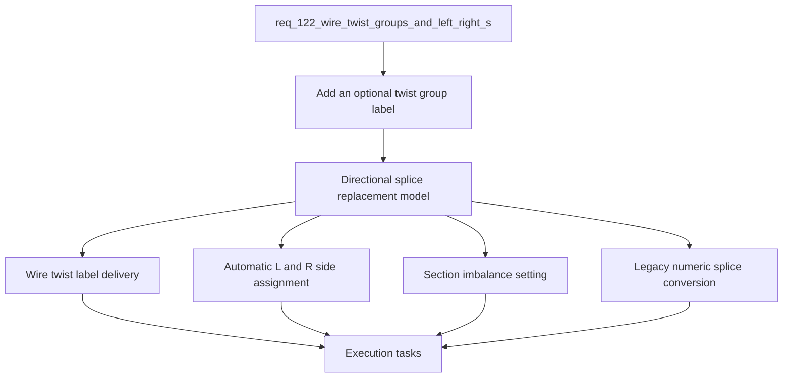

## item_591_wire_twist_groups_and_left_right_splice_pin_mode - Wire twist groups and left right splice pin mode
> From version: 1.6.2
> Schema version: 1.0
> Status: Done
> Understanding: 96%
> Confidence: 96%
> Progress: 100%
> Complexity: High
> Theme: Modeling
> Reminder: Update status/understanding/confidence/progress and linked request/task references when you edit this doc.

# Problem
- Add an optional twist group label on each wire so operators can mark wires that must be twisted together, for example CAN pairs or other twisted harness groups.
- Keep the default wire twist value empty/null so existing projects and simple wires are not affected.
- Replace the splice behavior so a splice no longer behaves like a connector with numbered ports, but like a physical fusion point that records whether each connected wire arrives from the left or from the right.
- Preserve compatibility with existing splice-based projects by proposing a conversion path for old numeric-port networks.
- Two modeling gaps are becoming visible in harness-oriented workflows.
- First, some wires belong to a twist group. The application currently models wires as independent routed entities, but it has no explicit field to express that wires should be twisted together. A nullable twist label would let the operator assign the same value, such as `CAN 1`, to wires that must be treated as one twisted group without forcing every wire to carry a value.
- Directional splice side assignment should be automatic from routing and visible node/segment layout, with operator controls to invert all sides or force and lock side assignment when needed.
- Ambiguous side assignment should use a deterministic arbitrary fallback where `R` is assigned to the side with fewer connectors in the harness.
- Forced and locked side overrides should be stored per wire endpoint near the existing way/port index data.
- Section imbalance validation should compare total wire section per side as a percentage ratio, expose the threshold in Settings, and default to `300%`.
- Legacy numeric splice conversion should be prompted at import/load time with an option to keep the old design.

# Scope
- In: wire twist group labels, directional splice replacement behavior, automatic `L` / `R` assignment, invert and lock controls, multiple wires per side, configurable section imbalance warnings, legacy conversion, persistence, and import/export compatibility.
- Out: automatic twisted-pair routing, automatic physical bundle layout, CAN-specific electrical validation, and BOM pricing changes unless later tasks explicitly add them.

# Acceptance criteria
- AC1: A wire can store an optional twist group label; the default value for existing and newly created wires is empty/null.
- AC2: The wire create/edit UI lets the operator enter labels such as `CAN 1`, clear them, and later modify them without affecting routing or endpoint assignment.
- AC3: The wire list, wire analysis, and relevant exports expose the twist group label where wire identification data is already shown.
- AC4: Newly created splices use the directional model and no longer ask the operator to choose bounded or unbounded numeric port behavior.
- AC5: Wire endpoints connected to a directional splice are assigned to `L` or `R` automatically from routing and from the visible disposition of nodes and segments.
- AC6: Wires arriving from the same side of the splice node receive the same automatic side assignment.
- AC7: If routing or visual geometry is ambiguous, the fallback side assignment remains deterministic and assigns `R` to the side where fewer connectors in the harness stand.
- AC8: The operator can invert all side assignments on a splice so every `L` becomes `R` and every `R` becomes `L`.
- AC9: The operator can force and lock a side assignment per wire endpoint when the automatic routing-based side must be overridden, with the control placed near the existing way/port index area.
- AC10: Directional splice mode allows multiple wires on `L` and multiple wires on `R`, with no maximum count per side.
- AC11: Validation and occupancy logic remain coherent for multiple wires per side and do not reject valid physical fusion cases.
- AC12: Settings expose a configurable section imbalance threshold expressed as a percentage ratio, with a default value of `300%`.
- AC13: The section imbalance warning compares total section per side; for example, with a `200%` threshold, `2 mm2` on one side and `4 mm2` on the other reaches the warning threshold.
- AC14: Section imbalance warnings are visible validation issues but do not block save.
- AC15: Existing saved projects with bounded or unbounded numeric splice ports trigger an import/load conversion prompt that offers conversion to directional splices or keeping the old design.
- AC16: Import/export and persistence schemas document the new wire twist label, directional splice side assignment, fallback rule, inversion state, per-endpoint locked overrides, and section imbalance setting so future migrations remain explicit.

# AC Traceability
- AC1 -> Scope: A wire can store an optional twist group label; the default value for existing and newly created wires is empty/null.. Proof: capture validation evidence in this doc.
- AC2 -> Scope: The wire create/edit UI lets the operator enter labels such as `CAN 1`, clear them, and later modify them without affecting routing or endpoint assignment.. Proof: capture validation evidence in this doc.
- AC3 -> Scope: The wire list, wire analysis, and relevant exports expose the twist group label where wire identification data is already shown.. Proof: capture validation evidence in this doc.
- AC4 -> Scope: New splices use the directional model instead of bounded or unbounded numeric port creation.. Proof: capture validation evidence in this doc.
- AC5 -> Scope: Directional splice side assignment is inferred from routing and visual node or segment disposition.. Proof: capture validation evidence in this doc.
- AC6 -> Scope: Wires arriving from the same side of a splice node share the same automatic side assignment.. Proof: capture validation evidence in this doc.
- AC7 -> Scope: Ambiguous routing or geometry uses the deterministic fallback for `R` assignment.. Proof: capture validation evidence in this doc.
- AC8 -> Scope: Operators can invert every side assignment on a splice.. Proof: capture validation evidence in this doc.
- AC9 -> Scope: Operators can force and lock side assignment overrides per wire endpoint near way or port index controls.. Proof: capture validation evidence in this doc.
- AC10 -> Scope: Multiple wires are allowed on both `L` and `R` without a maximum count.. Proof: capture validation evidence in this doc.
- AC11 -> Scope: Validation and occupancy remain coherent for physical fusion cases.. Proof: capture validation evidence in this doc.
- AC12 -> Scope: Settings expose a configurable section imbalance threshold with `300%` default.. Proof: capture validation evidence in this doc.
- AC13 -> Scope: Section imbalance compares total section per side as a ratio percentage.. Proof: capture validation evidence in this doc.
- AC14 -> Scope: Section imbalance warnings do not block save.. Proof: capture validation evidence in this doc.
- AC15 -> Scope: Legacy numeric splice projects prompt conversion at import/load and can keep the old design.. Proof: capture validation evidence in this doc.
- AC16 -> Scope: Persistence and import/export schemas document twist labels, directional assignment, fallback, inversion, per-endpoint locks, and imbalance settings.. Proof: capture validation evidence in this doc.

# Decision framing
- Product framing: Consider
- Product signals: pricing and packaging
- Product follow-up: Review whether a product brief is needed before scope becomes harder to change.
- Architecture framing: Consider
- Architecture signals: data model and persistence
- Architecture follow-up: Review whether an architecture decision is needed before implementation becomes harder to reverse.

# Links
- Product brief(s): (none yet)
- Architecture decision(s): (none yet)
- Request: `req_122_wire_twist_groups_and_left_right_splice_pin_mode`
- Primary task(s): `task_105_wire_twist_groups_and_left_right_splice_pin_mode`
<!-- When creating a task from this item, add: Derived from `this file path` in the task # Links section -->

# AI Context
- Summary: Add nullable wire twist group labels and replace numeric splice ports with automatic directional left/right splice modeling.
- Keywords: wire, twist group, twisted pair, CAN, splice, left, right, automatic side, invert, lock, section warning, settings, migration, persistence
- Use when: Use when grooming or implementing harness modeling improvements for twisted wires and directional splice endpoints.
- Skip when: Skip when the work only targets connector cavities, BOM pricing, or unrelated wire reference naming behavior.
# References
- `logics/skills/logics-ui-steering/SKILL.md`

# Priority
- Impact:
- Urgency:

# Notes
- Derived from request `req_122_wire_twist_groups_and_left_right_splice_pin_mode`.
- Source file: `logics\request\req_122_wire_twist_groups_and_left_right_splice_pin_mode.md`.
- Keep this backlog item as one bounded delivery slice; create sibling backlog items for the remaining request coverage instead of widening this doc.
- Request context seeded into this backlog item from `logics\request\req_122_wire_twist_groups_and_left_right_splice_pin_mode.md`.
