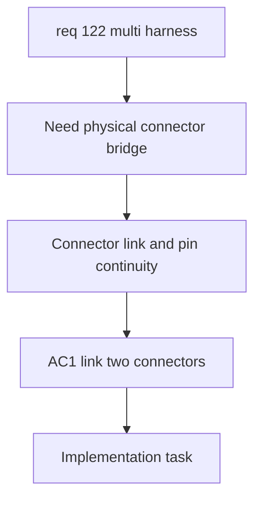

## item_592_inter_harness_connector_links_and_symmetric_pin_continuity - Inter-Harness Connector Links and Symmetric Pin Continuity
> From version: 1.6.4
> Schema version: 1.0
> Status: Done
> Understanding: 99%
> Confidence: 96%
> Progress: 100%
> Complexity: High
> Theme: Multi-Harness Modeling
> Reminder: Update status/understanding/confidence/progress and linked request/task references when you edit this doc.

# Problem
Operators need to connect two harnesses by declaring that one connector from one harness is physically paired with one connector from another harness. Continuity must be deterministic and physical-only: pin `1` maps to pin `1`, pin `2` to pin `2`, and so on. A connector can participate in only one inter-harness link in the first version.

# Scope
- In:
  - Add an inter-harness connector link model scoped to a `Harness assembly`.
  - Allow one connector from one harness to be linked to one connector from another harness.
  - Enforce first-version cardinality: one connector can belong to only one inter-harness connector link.
  - Use symmetric pin continuity by default: `1 -> 1`, `2 -> 2`, and so on.
  - Allow links with mismatched pin counts but surface validation warnings.
  - Ensure tracing only crosses symmetric pin pairs that exist on both linked connectors.
- Out:
  - Logical signal declarations directly on connector links.
  - Multi-mate connector topologies.
  - Automatic connector-link discovery.

# Acceptance criteria
- AC1: The operator can define one valid inter-harness connector link between two connectors from different harnesses in the same assembly.
- AC2: A connector cannot participate in more than one inter-harness connector link in the first version.
- AC3: Connector-link continuity is physical-only and derived from symmetric pin mapping.
- AC4: Symmetric mapping connects pin `1` to pin `1`, pin `2` to pin `2`, and continues for all valid shared pins.
- AC5: Mismatched pin counts produce a validation warning without blocking the link.
- AC6: Functional tracing can only cross pin pairs that exist on both linked connectors.

# AC Traceability
- AC1 -> Request AC2.
- AC2 -> Request clarified behavior: one paired interconnector relation per connector.
- AC3 -> Request Q7 decision.
- AC4 -> Request AC3.
- AC5 -> Request AC12.
- AC6 -> Request AC12.
- request-AC1 -> This backlog slice. Evidence needed: The application can create and persist a higher-level harness assembly that references multiple existing harnesses/networks.
- request-AC2 -> This backlog slice. Evidence needed: The operator can define a valid inter-harness connector link between two connectors from different harnesses.
- request-AC3 -> This backlog slice. Evidence needed: The connector link supports deterministic way continuity, including automatic same-way mapping and explicit mapping overrides where needed.
- request-AC4 -> This backlog slice. Evidence needed: Functional schematic traversal can cross a valid connector link and continue through wires in another harness.
- request-AC5 -> This backlog slice. Evidence needed: The aggregated functional schematic clearly indicates harness boundaries and connector-link crossing points.
- request-AC6 -> This backlog slice. Evidence needed: Existing single-harness functional schematic behavior remains unchanged when no harness assembly or connector link is used.
- request-AC7 -> This backlog slice. Evidence needed: Import/export and persistence preserve harness assemblies, linked harness references, connector links, and way mappings.
- request-AC8 -> This backlog slice. Evidence needed: Validation reports broken or ambiguous cross-harness links without corrupting existing harness data.
- request-AC9 -> This backlog slice. Evidence needed: The aggregated functional schematic can be generated from one or more selected master connectors within a harness assembly.
- request-AC10 -> This backlog slice. Evidence needed: The trace stops at natural continuity boundaries or at connectors explicitly marked as terminal.
- request-AC11 -> This backlog slice. Evidence needed: Each harness in the aggregated functional trace has an automatic display color that can be manually overridden in assembly properties.
- request-AC12 -> This backlog slice. Evidence needed: Linked connectors with mismatched pin/way counts are allowed with validation warnings, and tracing only crosses symmetric pin pairs valid on both sides.
- request-AC13 -> This backlog slice. Evidence needed: Clicking an interconnector block opens a detail/navigation surface for both linked connectors and their harnesses.
- request-AC1 -> This backlog slice. Proof: Historical delivery is recorded in the linked backlog/task report and validation sections; this corpus repair formalizes strict audit traceability without changing shipped scope. Source: `logics corpus strict audit repair`
- request-AC2 -> This backlog slice. Proof: Historical delivery is recorded in the linked backlog/task report and validation sections; this corpus repair formalizes strict audit traceability without changing shipped scope. Source: `logics corpus strict audit repair`
- request-AC3 -> This backlog slice. Proof: Historical delivery is recorded in the linked backlog/task report and validation sections; this corpus repair formalizes strict audit traceability without changing shipped scope. Source: `logics corpus strict audit repair`
- request-AC4 -> This backlog slice. Proof: Historical delivery is recorded in the linked backlog/task report and validation sections; this corpus repair formalizes strict audit traceability without changing shipped scope. Source: `logics corpus strict audit repair`
- request-AC5 -> This backlog slice. Proof: Historical delivery is recorded in the linked backlog/task report and validation sections; this corpus repair formalizes strict audit traceability without changing shipped scope. Source: `logics corpus strict audit repair`
- request-AC6 -> This backlog slice. Proof: Historical delivery is recorded in the linked backlog/task report and validation sections; this corpus repair formalizes strict audit traceability without changing shipped scope. Source: `logics corpus strict audit repair`
- request-AC7 -> This backlog slice. Proof: Historical delivery is recorded in the linked backlog/task report and validation sections; this corpus repair formalizes strict audit traceability without changing shipped scope. Source: `logics corpus strict audit repair`
- request-AC8 -> This backlog slice. Proof: Historical delivery is recorded in the linked backlog/task report and validation sections; this corpus repair formalizes strict audit traceability without changing shipped scope. Source: `logics corpus strict audit repair`
- request-AC9 -> This backlog slice. Proof: Historical delivery is recorded in the linked backlog/task report and validation sections; this corpus repair formalizes strict audit traceability without changing shipped scope. Source: `logics corpus strict audit repair`
- request-AC10 -> This backlog slice. Proof: Historical delivery is recorded in the linked backlog/task report and validation sections; this corpus repair formalizes strict audit traceability without changing shipped scope. Source: `logics corpus strict audit repair`
- request-AC11 -> This backlog slice. Proof: Historical delivery is recorded in the linked backlog/task report and validation sections; this corpus repair formalizes strict audit traceability without changing shipped scope. Source: `logics corpus strict audit repair`
- request-AC12 -> This backlog slice. Proof: Historical delivery is recorded in the linked backlog/task report and validation sections; this corpus repair formalizes strict audit traceability without changing shipped scope. Source: `logics corpus strict audit repair`
- request-AC13 -> This backlog slice. Proof: Historical delivery is recorded in the linked backlog/task report and validation sections; this corpus repair formalizes strict audit traceability without changing shipped scope. Source: `logics corpus strict audit repair`

# Decision framing
- Product framing: Not needed
- Product signals: existing request clarifies physical-only behavior
- Product follow-up: No separate product brief expected for this slice.
- Architecture framing: Required
- Architecture signals: cross-entity references, validation, continuity contract
- Architecture follow-up: Link to the assembly data-model ADR or create a focused ADR for connector-link semantics.

# Links
- Product brief(s): (none yet)
- Architecture decision(s): `logics/architecture/adr_007_harness_assembly_and_physical_interconnector_contract.md`
- Request: `req_122_multi_harness_super_category_and_cross_harness_functional_schematic`
- Primary task(s): `task_105_multi_harness_assembly_and_cross_harness_functional_schematic_orchestration`
<!-- When creating a task from this item, add: Derived from `logics/backlog/item_592_inter_harness_connector_links_and_symmetric_pin_continuity.md` in the task # Links section -->

# Priority
- Impact: High
- Urgency: High

# Notes
- Derived from request `req_122_multi_harness_super_category_and_cross_harness_functional_schematic`.
- Source file: `logics/request/req_122_multi_harness_super_category_and_cross_harness_functional_schematic.md`.
- This slice provides the physical continuity bridge required by cross-harness functional tracing.

# AI Context
- Summary: Add physical-only connector links between harnesses with one-to-one connector cardinality and symmetric pin continuity.
- Keywords: inter-harness connector link, physical-only, symmetric pins, one connector one link, validation warning
- Use when: Use when implementing connector-link storage, editing, validation, or pin continuity.
- Skip when: Skip when rendering the aggregated functional schematic UI.

# Validation evidence
- Implemented persisted inter-harness connector links, one-link-per-connector validation, connector-to-self validation, missing reference validation, symmetric shared-pin continuity, mismatched pin-count warnings, and an operator UI to add/remove links.
- Validated with `npm run -s typecheck`, `npm run -s lint`, targeted Vitest suite, and `npm run -s build`.

# Report
- Delivered: model, validation, import/export, trace consumption, and direct operator creation/removal for physical-only connector links.
