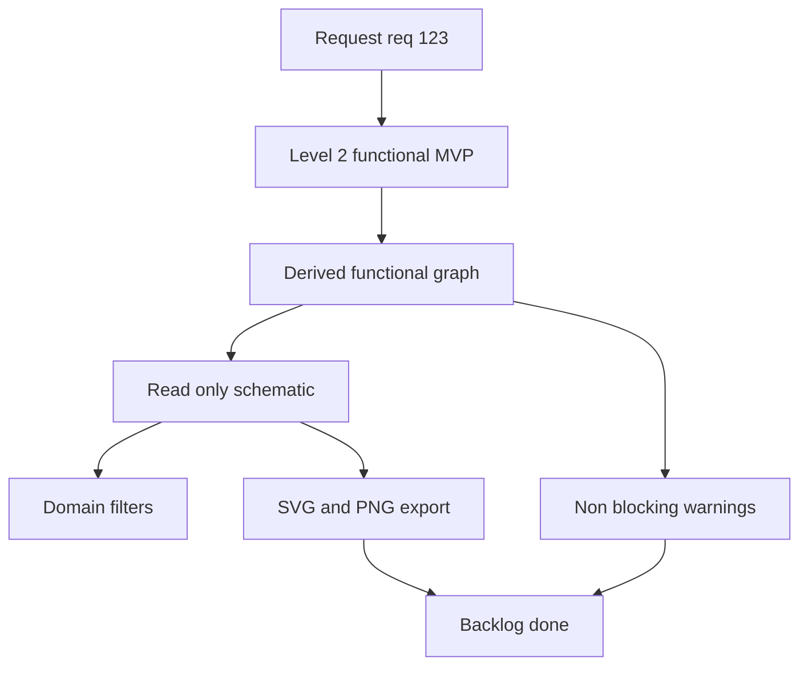

## item_592_mvp_read_only_functional_derived_views - MVP read-only functional derived views
> From version: 1.6.3
> Schema version: 1.0
> Status: Done
> Understanding: 94%
> Confidence: 88%
> Progress: 100%
> Complexity: High
> Theme: Visualization
> Reminder: Update status/understanding/confidence/progress and linked request/task references when you edit this doc.

# Problem
Add a read-only MVP view that generates a simplified functional schematic from the existing detailed harness model.
Keep the detailed modeling view as the only source of truth; generated views must not be edited independently or persisted as separate authoritative data.
Let an operator generate a functional trace from an existing wire, splice, connector, or component-like endpoint and follow the electrical chain without physical routing noise.
Reuse the existing network summary/export foundations where possible so the MVP remains bounded.

# Scope
- In: derived level 2 functional graph builder, read-only schematic UI, trace entry from wire/connector/splice where data exists, significant electrical node preservation, physical routing suppression, simple filters, non-blocking warnings, SVG/PNG export, and focused automated tests.
- Out: level 1 architecture synopsis, editable generated diagrams, new semantic component taxonomy, new relay/sensor/actuator entity modeling, heavyweight PDF export, and manual layout authoring for generated views.

# Acceptance criteria
- AC1: The application provides a read-only derived functional schematic view generated from the existing detailed model.
- AC2: The generated view cannot be edited independently; any correction must be made in the detailed model and then regenerated.
- AC3: The MVP supports generating a trace from at least one selected wire.
- AC4: The MVP supports generating a trace from connector and splice selections when enough endpoint data is available.
- AC5: The functional trace keeps significant elements: connector, pin/cavity, splice, inline fuse/protection, source endpoint, destination endpoint, ground-like endpoint, and power-like endpoint when those can be inferred from existing data.
- AC6: The functional trace hides physical-only elements: routing nodes, path segments, branch geometry, wire lengths, and intermediate passage points.
- AC7: The generated view preserves source IDs for wires, connectors, pins/cavities, splices, fuses/protections, and inferred endpoints so the operator can relate the schematic back to the detailed model.
- AC8: The MVP exposes simple filters for `12 V`, `48 V`, `CAN`, and existing subnetwork/domain tags when those values are available in the current data.
- AC9: If classification data is missing, the view still generates the trace and reports a non-blocking warning instead of failing silently.
- AC10: Warnings cover at minimum missing endpoint references, unresolved connector or splice references, missing fuse/protection labels, ambiguous domain classification, and disconnected trace paths.
- AC11: The MVP can export the generated functional view to SVG and PNG through the existing export pipeline or a compatible local extension of it.
- AC12: PDF export is out of scope for the MVP unless it is already directly supported by the existing export pipeline without adding a new dependency.
- AC13: The generated view is recomputed from the current network state and is not stored as an independent editable graph in the saved project file.
- AC14: No mandatory save-file schema migration is required for the MVP unless implementation discovers that a small optional UI preference must be persisted.
- AC15: Automated tests cover functional graph derivation, trace generation from a wire, hiding of physical-only nodes, ID preservation, warnings for incomplete data, and export action availability.

# AC Traceability
- request-AC1 -> This backlog slice. Proof: AC1: The application provides a read-only derived functional schematic view generated from the existing detailed model.
- request-AC2 -> This backlog slice. Proof: AC2: The generated view cannot be edited independently; any correction must be made in the detailed model and then regenerated.
- request-AC3 -> This backlog slice. Proof: AC3: The MVP supports generating a trace from at least one selected wire.
- request-AC4 -> This backlog slice. Proof: AC4: The MVP supports generating a trace from connector and splice selections when enough endpoint data is available.
- request-AC5 -> This backlog slice. Proof: AC5: The functional trace keeps significant elements: connector, pin/cavity, splice, inline fuse/protection, source endpoint, destination endpoint, ground-like endpoint, and power-like endpoint when those can be inferred from existing data.
- request-AC6 -> This backlog slice. Proof: AC6: The functional trace hides physical-only elements: routing nodes, path segments, branch geometry, wire lengths, and intermediate passage points.
- request-AC7 -> This backlog slice. Proof: AC7: The generated view preserves source IDs for wires, connectors, pins/cavities, splices, fuses/protections, and inferred endpoints so the operator can relate the schematic back to the detailed model.
- request-AC8 -> This backlog slice. Proof: AC8: The MVP exposes simple filters for `12 V`, `48 V`, `CAN`, and existing subnetwork/domain tags when those values are available in the current data.
- request-AC9 -> This backlog slice. Proof: AC9: If classification data is missing, the view still generates the trace and reports a non-blocking warning instead of failing silently.
- request-AC10 -> This backlog slice. Proof: AC10: Warnings cover at minimum missing endpoint references, unresolved connector or splice references, missing fuse/protection labels, ambiguous domain classification, and disconnected trace paths.
- request-AC11 -> This backlog slice. Proof: AC11: The MVP can export the generated functional view to SVG and PNG through the existing export pipeline or a compatible local extension of it.
- request-AC12 -> This backlog slice. Proof: AC12: PDF export is out of scope for the MVP unless it is already directly supported by the existing export pipeline without adding a new dependency.
- request-AC13 -> This backlog slice. Proof: AC13: The generated view is recomputed from the current network state and is not stored as an independent editable graph in the saved project file.
- request-AC14 -> This backlog slice. Proof: AC14: No mandatory save-file schema migration is required for the MVP unless implementation discovers that a small optional UI preference must be persisted.
- request-AC15 -> This backlog slice. Proof: AC15: Automated tests cover functional graph derivation, trace generation from a wire, hiding of physical-only nodes, ID preservation, warnings for incomplete data, and export action availability.

# Decision framing
- Product framing: Consider
- Product signals: The feature introduces a new read-only analysis workflow and should remain clearly separated from editable modeling.
- Product follow-up: A short product brief may be useful before broadening beyond MVP, especially for level 1 architecture synopsis and semantic domains.
- Architecture framing: Consider
- Architecture signals: The feature needs a derived graph boundary and must avoid creating a second source of truth.
- Architecture follow-up: Create or link an ADR if implementation requires a new persistent model field, a reusable derived graph abstraction, or export pipeline changes beyond the existing network summary behavior.

# Links
- Product brief(s): (none yet)
- Architecture decision(s): (none yet)
- Request: `logics/request/req_123_mvp_read_only_functional_derived_views.md`
- Primary task(s): `logics/tasks/task_106_mvp_read_only_functional_derived_views.md`

# AI Context
- Summary: MVP read-only functional derived views
- Keywords: backlog-groom, request, mvp read-only functional derived views, bounded slice
- Use when: Use when implementing or reviewing the delivery slice for MVP read-only functional derived views.
- Skip when: Skip when the change is unrelated to this delivery slice or its linked request.

# Priority
- Impact: High for harness review and debugging because operators can inspect electrical function without routing noise.
- Urgency: Medium; valuable as an analysis feature, but should remain behind the bounded MVP until the derived graph assumptions are validated.

# Notes
- Hybrid rationale: Derived from request `req_123_mvp_read_only_functional_derived_views` and kept bounded to the level 2 functional schematic MVP.
- The detailed model remains the only source of truth; generated graph nodes and edges are transient view models unless a later ADR explicitly decides otherwise.
- Source file: `logics/request/req_123_mvp_read_only_functional_derived_views.md`.
- Generated locally by logics-manager.
- Task `task_106_mvp_read_only_functional_derived_views` was finished via `logics-manager flow finish task` on 2026-05-05.

# Tasks
- `task_106_mvp_read_only_functional_derived_views`
