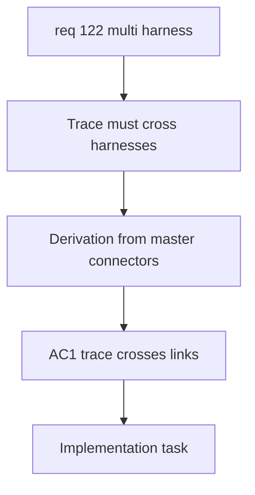

## item_593_cross_harness_functional_trace_derivation_from_master_connectors - Cross-Harness Functional Trace Derivation From Master Connectors
> From version: 1.6.4
> Schema version: 1.0
> Status: Done
> Understanding: 99%
> Confidence: 96%
> Progress: 100%
> Complexity: High
> Theme: Functional Schematic
> Reminder: Update status/understanding/confidence/progress and linked request/task references when you edit this doc.
> Non-semantic edit: refreshed Mermaid signatures

# Problem
The existing functional schematic derivation is limited to one harness/network. The new assembly workflow needs a filtered trace that starts from one or more selected master connectors, follows wires inside a harness, crosses physical interconnectors through symmetric pins, and continues until natural continuity ends or a terminal connector is reached.

# Scope
- In:
  - Extend functional trace derivation to operate at `Harness assembly` scope.
  - Support one or more selected master connectors as trace roots.
  - Traverse wires inside each harness and cross valid inter-harness connector links through symmetric pin continuity.
  - Stop when there is no further wire/interconnector continuity or when a connector is marked terminal.
  - Preserve existing single-harness derivation behavior.
  - Guard against cycles introduced by connector links or repeated paths.
- Out:
  - Aggregated schematic visual layout details.
  - Connector-link editing UI.
  - Logical continuity declarations outside physical wire and pin data.

# Acceptance criteria
- AC1: The trace derivation can start from one or more selected master connectors in a `Harness assembly`.
- AC2: The trace follows valid wires within a harness and crosses valid inter-harness connector links into another harness.
- AC3: Cross-harness traversal uses only physical connector-link continuity and symmetric pin mappings.
- AC4: The trace stops at natural continuity boundaries or at connectors explicitly marked as terminal.
- AC5: Cycle protection prevents infinite traversal and duplicate runaway paths.
- AC6: Existing single-harness functional schematic derivation remains unchanged when no assembly trace is requested.

# AC Traceability
- AC1 -> Request AC9.
- AC2 -> Request AC4.
- AC3 -> Request Q7 decision.
- AC4 -> Request AC10.
- AC5 -> Request functional scope D.
- AC6 -> Request AC6.
- request-AC1 -> This backlog slice. Evidence needed: The application can create and persist a higher-level harness assembly that references multiple existing harnesses/networks.
- request-AC2 -> This backlog slice. Evidence needed: The operator can define a valid inter-harness connector link between two connectors from different harnesses.
- request-AC3 -> This backlog slice. Evidence needed: The connector link supports deterministic way continuity, including automatic same-way mapping and explicit mapping overrides where needed.
- request-AC4 -> This backlog slice. Evidence needed: Functional schematic traversal can cross a valid connector link and continue through wires in another harness.
- request-AC5 -> This backlog slice. Evidence needed: The aggregated functional schematic clearly indicates harness boundaries and connector-link crossing points.
- request-AC6 -> This backlog slice. Evidence needed: Existing single-harness functional schematic behavior remains unchanged when no harness assembly or connector link is used.
- request-AC7 -> This backlog slice. Evidence needed: Import/export and persistence preserve harness assemblies, linked harness references, connector links, and way mappings.
- request-AC8 -> This backlog slice. Evidence needed: Validation reports broken or ambiguous cross-harness links without corrupting existing harness data.
- request-AC9 -> This backlog slice. Evidence needed: The aggregated functional schematic can be generated from one or more selected master connectors within a harness assembly.
- request-AC10 -> This backlog slice. Evidence needed: The trace stops at natural continuity boundaries or at connectors explicitly marked as terminal.
- request-AC11 -> This backlog slice. Evidence needed: Each harness in the aggregated functional trace has an automatic display color that can be manually overridden in assembly properties.
- request-AC12 -> This backlog slice. Evidence needed: Linked connectors with mismatched pin/way counts are allowed with validation warnings, and tracing only crosses symmetric pin pairs valid on both sides.
- request-AC13 -> This backlog slice. Evidence needed: Clicking an interconnector block opens a detail/navigation surface for both linked connectors and their harnesses.
- request-AC1 -> This backlog slice. Proof: Historical delivery is recorded in the linked backlog/task report and validation sections; this corpus repair formalizes strict audit traceability without changing shipped scope. Source: `logics corpus strict audit repair`
- request-AC2 -> This backlog slice. Proof: Historical delivery is recorded in the linked backlog/task report and validation sections; this corpus repair formalizes strict audit traceability without changing shipped scope. Source: `logics corpus strict audit repair`
- request-AC3 -> This backlog slice. Proof: Historical delivery is recorded in the linked backlog/task report and validation sections; this corpus repair formalizes strict audit traceability without changing shipped scope. Source: `logics corpus strict audit repair`
- request-AC4 -> This backlog slice. Proof: Historical delivery is recorded in the linked backlog/task report and validation sections; this corpus repair formalizes strict audit traceability without changing shipped scope. Source: `logics corpus strict audit repair`
- request-AC5 -> This backlog slice. Proof: Historical delivery is recorded in the linked backlog/task report and validation sections; this corpus repair formalizes strict audit traceability without changing shipped scope. Source: `logics corpus strict audit repair`
- request-AC6 -> This backlog slice. Proof: Historical delivery is recorded in the linked backlog/task report and validation sections; this corpus repair formalizes strict audit traceability without changing shipped scope. Source: `logics corpus strict audit repair`
- request-AC7 -> This backlog slice. Proof: Historical delivery is recorded in the linked backlog/task report and validation sections; this corpus repair formalizes strict audit traceability without changing shipped scope. Source: `logics corpus strict audit repair`
- request-AC8 -> This backlog slice. Proof: Historical delivery is recorded in the linked backlog/task report and validation sections; this corpus repair formalizes strict audit traceability without changing shipped scope. Source: `logics corpus strict audit repair`
- request-AC9 -> This backlog slice. Proof: Historical delivery is recorded in the linked backlog/task report and validation sections; this corpus repair formalizes strict audit traceability without changing shipped scope. Source: `logics corpus strict audit repair`
- request-AC10 -> This backlog slice. Proof: Historical delivery is recorded in the linked backlog/task report and validation sections; this corpus repair formalizes strict audit traceability without changing shipped scope. Source: `logics corpus strict audit repair`
- request-AC11 -> This backlog slice. Proof: Historical delivery is recorded in the linked backlog/task report and validation sections; this corpus repair formalizes strict audit traceability without changing shipped scope. Source: `logics corpus strict audit repair`
- request-AC12 -> This backlog slice. Proof: Historical delivery is recorded in the linked backlog/task report and validation sections; this corpus repair formalizes strict audit traceability without changing shipped scope. Source: `logics corpus strict audit repair`
- request-AC13 -> This backlog slice. Proof: Historical delivery is recorded in the linked backlog/task report and validation sections; this corpus repair formalizes strict audit traceability without changing shipped scope. Source: `logics corpus strict audit repair`

# Decision framing
- Product framing: Not needed
- Architecture framing: Required
- Architecture signals: graph traversal, cycle handling, derivation contract
- Architecture follow-up: Create or link an ADR for cross-harness graph traversal if the derivation contract changes shared core behavior.

# Links
- Product brief(s): (none yet)
- Architecture decision(s): `logics/architecture/adr_007_harness_assembly_and_physical_interconnector_contract.md`
- Request: `req_122_multi_harness_super_category_and_cross_harness_functional_schematic`
- Primary task(s): `task_105_multi_harness_assembly_and_cross_harness_functional_schematic_orchestration`
<!-- When creating a task from this item, add: Derived from `logics/backlog/item_593_cross_harness_functional_trace_derivation_from_master_connectors.md` in the task # Links section -->

# Priority
- Impact: High
- Urgency: High

# Notes
- Derived from request `req_122_multi_harness_super_category_and_cross_harness_functional_schematic`.
- Source file: `logics/request/req_122_multi_harness_super_category_and_cross_harness_functional_schematic.md`.
- This slice is core logic and should be implemented before the aggregated UI is considered complete.

# AI Context
- Summary: Extend functional trace derivation across harnesses from selected master connectors through physical connector links.
- Keywords: functional schematic, graph traversal, master connector, terminal connector, cross-harness trace, cycle guard
- Use when: Use when implementing core cross-harness trace derivation.
- Skip when: Skip when only editing assembly metadata or connector-link forms.

# Validation evidence
- Implemented `buildHarnessAssemblyFunctionalSchematicGraph` with root connector traversal, wire/splice traversal, symmetric interconnector crossing, terminal connector stops, cycle guards, and preserved single-network graph behavior.
- Validated with `npm run -s typecheck`, `npm run -s lint`, targeted Vitest suite, and `npm run -s build`.

# Report
- Delivered: core cross-harness functional trace derivation from one or more master connectors.
