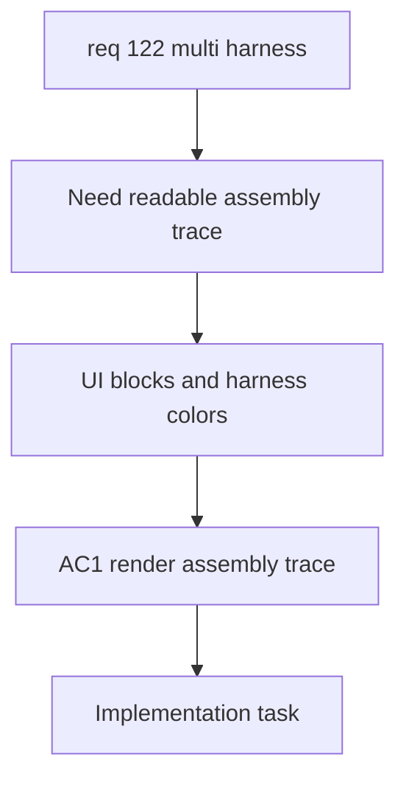

## item_594_aggregated_functional_schematic_ui_interconnector_blocks_and_harness_coloring - Aggregated Functional Schematic UI Interconnector Blocks and Harness Coloring
> From version: 1.6.4
> Schema version: 1.0
> Status: Done
> Understanding: 99%
> Confidence: 96%
> Progress: 100%
> Complexity: High
> Theme: Functional Schematic UI
> Reminder: Update status/understanding/confidence/progress and linked request/task references when you edit this doc.
> Non-semantic edit: refreshed Mermaid signatures

# Problem
Operators need a readable assembly-level functional schematic that shows a filtered trace across several harnesses. The UI must show interconnector crossings as dedicated blocks, color each wire by harness ownership, and allow navigation from an interconnector block to both linked connectors and both harnesses.

# Scope
- In:
  - Add an assembly-level functional schematic entry point.
  - Let the operator choose one or more master connectors before rendering the aggregated trace.
  - Render interconnector crossings as dedicated blocks.
  - Render each wire segment using the display color of its owning harness.
  - Make interconnector blocks interactive with a detail/navigation surface for both linked connectors and both harnesses.
  - Preserve existing export behavior where technically feasible.
- Out:
  - Core cross-harness trace derivation.
  - Assembly and connector-link persistence.
  - 3D or physical packaging views.

# Acceptance criteria
- AC1: The UI exposes an assembly-level functional schematic view.
- AC2: The operator can select one or more master connectors before generating the view.
- AC3: Inter-harness connector crossings render as dedicated interconnector blocks.
- AC4: Wire segments are colored by their owning harness display color.
- AC5: Clicking an interconnector block opens a detail/navigation surface for both linked connectors and their harnesses.
- AC6: Existing single-harness functional schematic UI remains unchanged outside assembly mode.
- AC7: Aggregated schematic export is preserved or explicitly documented if deferred.

# AC Traceability
- AC1 -> Request AC5.
- AC2 -> Request AC9.
- AC3 -> Request clarified behavior.
- AC4 -> Request AC11.
- AC5 -> Request AC13.
- AC6 -> Request AC6.
- AC7 -> Request functional scope E.
- request-AC1 -> This backlog slice. Evidence needed: The application can create and persist a higher-level harness assembly that references multiple existing harnesses/networks.
- request-AC2 -> This backlog slice. Evidence needed: The operator can define a valid inter-harness connector link between two connectors from different harnesses.
- request-AC3 -> This backlog slice. Evidence needed: The connector link supports deterministic way continuity, including automatic same-way mapping and explicit mapping overrides where needed.
- request-AC4 -> This backlog slice. Evidence needed: Functional schematic traversal can cross a valid connector link and continue through wires in another harness.
- request-AC5 -> This backlog slice. Evidence needed: The aggregated functional schematic clearly indicates harness boundaries and connector-link crossing points.
- request-AC6 -> This backlog slice. Evidence needed: Existing single-harness functional schematic behavior remains unchanged when no harness assembly or connector link is used.
- request-AC7 -> This backlog slice. Evidence needed: Import/export and persistence preserve harness assemblies, linked harness references, connector links, and way mappings.
- request-AC8 -> This backlog slice. Evidence needed: Validation reports broken or ambiguous cross-harness links without corrupting existing harness data.
- request-AC9 -> This backlog slice. Evidence needed: The aggregated functional schematic can be generated from one or more selected master connectors within a harness assembly.
- request-AC10 -> This backlog slice. Evidence needed: The trace stops at natural continuity boundaries or at connectors explicitly marked as terminal.
- request-AC11 -> This backlog slice. Evidence needed: Each harness in the aggregated functional trace has an automatic display color that can be manually overridden in assembly properties.
- request-AC12 -> This backlog slice. Evidence needed: Linked connectors with mismatched pin/way counts are allowed with validation warnings, and tracing only crosses symmetric pin pairs valid on both sides.
- request-AC13 -> This backlog slice. Evidence needed: Clicking an interconnector block opens a detail/navigation surface for both linked connectors and their harnesses.
- request-AC1 -> This backlog slice. Proof: Historical delivery is recorded in the linked backlog/task report and validation sections; this corpus repair formalizes strict audit traceability without changing shipped scope. Source: `logics corpus strict audit repair`
- request-AC2 -> This backlog slice. Proof: Historical delivery is recorded in the linked backlog/task report and validation sections; this corpus repair formalizes strict audit traceability without changing shipped scope. Source: `logics corpus strict audit repair`
- request-AC3 -> This backlog slice. Proof: Historical delivery is recorded in the linked backlog/task report and validation sections; this corpus repair formalizes strict audit traceability without changing shipped scope. Source: `logics corpus strict audit repair`
- request-AC4 -> This backlog slice. Proof: Historical delivery is recorded in the linked backlog/task report and validation sections; this corpus repair formalizes strict audit traceability without changing shipped scope. Source: `logics corpus strict audit repair`
- request-AC5 -> This backlog slice. Proof: Historical delivery is recorded in the linked backlog/task report and validation sections; this corpus repair formalizes strict audit traceability without changing shipped scope. Source: `logics corpus strict audit repair`
- request-AC6 -> This backlog slice. Proof: Historical delivery is recorded in the linked backlog/task report and validation sections; this corpus repair formalizes strict audit traceability without changing shipped scope. Source: `logics corpus strict audit repair`
- request-AC7 -> This backlog slice. Proof: Historical delivery is recorded in the linked backlog/task report and validation sections; this corpus repair formalizes strict audit traceability without changing shipped scope. Source: `logics corpus strict audit repair`
- request-AC8 -> This backlog slice. Proof: Historical delivery is recorded in the linked backlog/task report and validation sections; this corpus repair formalizes strict audit traceability without changing shipped scope. Source: `logics corpus strict audit repair`
- request-AC9 -> This backlog slice. Proof: Historical delivery is recorded in the linked backlog/task report and validation sections; this corpus repair formalizes strict audit traceability without changing shipped scope. Source: `logics corpus strict audit repair`
- request-AC10 -> This backlog slice. Proof: Historical delivery is recorded in the linked backlog/task report and validation sections; this corpus repair formalizes strict audit traceability without changing shipped scope. Source: `logics corpus strict audit repair`
- request-AC11 -> This backlog slice. Proof: Historical delivery is recorded in the linked backlog/task report and validation sections; this corpus repair formalizes strict audit traceability without changing shipped scope. Source: `logics corpus strict audit repair`
- request-AC12 -> This backlog slice. Proof: Historical delivery is recorded in the linked backlog/task report and validation sections; this corpus repair formalizes strict audit traceability without changing shipped scope. Source: `logics corpus strict audit repair`
- request-AC13 -> This backlog slice. Proof: Historical delivery is recorded in the linked backlog/task report and validation sections; this corpus repair formalizes strict audit traceability without changing shipped scope. Source: `logics corpus strict audit repair`

# Decision framing
- Product framing: Required
- Product signals: new assembly-level view, operator workflow, navigation behavior
- Product follow-up: Product brief recommended if this introduces a new navigation surface beyond the existing Network scope.
- Architecture framing: Not needed
- Architecture signals: UI composition only if core derivation and data model are already covered by sibling items
- Architecture follow-up: Link the sibling ADRs if created.

# Links
- Product brief(s): `logics/product/prod_001_multi_harness_assembly_traceability.md`
- Architecture decision(s): `logics/architecture/adr_007_harness_assembly_and_physical_interconnector_contract.md`
- Request: `req_122_multi_harness_super_category_and_cross_harness_functional_schematic`
- Primary task(s): `task_105_multi_harness_assembly_and_cross_harness_functional_schematic_orchestration`
<!-- When creating a task from this item, add: Derived from `logics/backlog/item_594_aggregated_functional_schematic_ui_interconnector_blocks_and_harness_coloring.md` in the task # Links section -->

# Priority
- Impact: High
- Urgency: Medium

# Notes
- Derived from request `req_122_multi_harness_super_category_and_cross_harness_functional_schematic`.
- Source file: `logics/request/req_122_multi_harness_super_category_and_cross_harness_functional_schematic.md`.
- This slice depends on the assembly model, connector links, and cross-harness trace derivation.

# AI Context
- Summary: Build the assembly-level functional schematic UI with selectable roots, interconnector blocks, harness-colored wires, and navigation.
- Keywords: aggregated functional schematic, interconnector block, harness color, master connector selector, navigation detail panel
- Use when: Use when implementing the UI for multi-harness functional schematic visualization.
- Skip when: Skip when implementing core graph traversal or persistence.

# Validation evidence
- Functional schematic panel now accepts an assembly graph/factory, preserves existing domain filters, renders interconnector nodes, colors edges by harness color when assembly data is present, and opens interconnector detail/navigation actions.
- Validated with `npm run -s typecheck`, `npm run -s lint`, targeted Vitest suite including network summary workflow coverage, and `npm run -s build`.

# Report
- Delivered: assembly view entry point in Network Scope, master-root selection through assembly properties, interconnector blocks, harness-color visual support, and interconnector detail/navigation actions.
