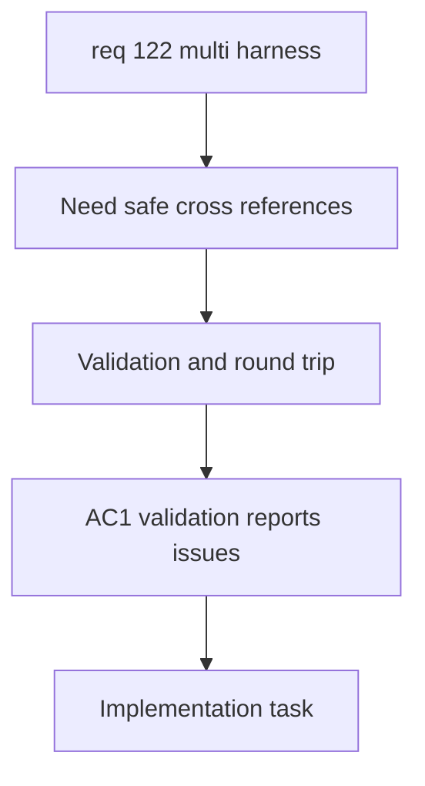

## item_595_multi_harness_validation_import_export_and_regression_coverage - Multi-Harness Validation Import Export and Regression Coverage
> From version: 1.6.4
> Schema version: 1.0
> Status: Done
> Understanding: 99%
> Confidence: 96%
> Progress: 100%
> Complexity: High
> Theme: Validation and Export
> Reminder: Update status/understanding/confidence/progress and linked request/task references when you edit this doc.

# Problem
The multi-harness workflow adds new persisted entities and cross-harness references. The system needs validation, import/export compatibility, and regression coverage so broken links, deleted harnesses, mismatched pins, and legacy data do not corrupt assemblies or functional traces.

# Scope
- In:
  - Validate missing harness references, missing connector references, connector-to-self links, deleted entities, and duplicate connector-link participation.
  - Report mismatched connector pin/way counts as warnings while preserving valid symmetric continuity.
  - Preserve harness assemblies and connector links through import/export round trips.
  - Cover legacy data loading when no assembly exists.
  - Add targeted tests for assembly persistence, connector-link validation, trace derivation, and aggregated UI behavior.
- Out:
  - Implementing the main assembly UI.
  - Implementing core trace traversal from scratch.
  - Broad unrelated validation refactors.

# Acceptance criteria
- AC1: Validation reports broken harness references, missing connector references, connector-to-self links, and duplicate connector-link participation.
- AC2: Mismatched linked connector pin/way counts are warnings and do not block valid symmetric trace pairs.
- AC3: Import/export round trips preserve harness assemblies, linked harness references, connector links, way continuity assumptions, and harness colors.
- AC4: Legacy saved data without assemblies loads unchanged.
- AC5: Regression tests cover assembly persistence, connector-link validation, cross-harness trace derivation, and aggregated schematic UI integration.
- AC6: Validation output helps the operator navigate to the affected assembly, harness, connector, or interconnector link where practical.

# AC Traceability
- AC1 -> Request AC8.
- AC2 -> Request AC12.
- AC3 -> Request AC7.
- AC4 -> Request AC6.
- AC5 -> Request validation and regression safety.
- AC6 -> Request AC13 and validation expectations.
- request-AC1 -> This backlog slice. Evidence needed: The application can create and persist a higher-level harness assembly that references multiple existing harnesses/networks.
- request-AC2 -> This backlog slice. Evidence needed: The operator can define a valid inter-harness connector link between two connectors from different harnesses.
- request-AC3 -> This backlog slice. Evidence needed: The connector link supports deterministic way continuity, including automatic same-way mapping and explicit mapping overrides where needed.
- request-AC4 -> This backlog slice. Evidence needed: Functional schematic traversal can cross a valid connector link and continue through wires in another harness.
- request-AC5 -> This backlog slice. Evidence needed: The aggregated functional schematic clearly indicates harness boundaries and connector-link crossing points.
- request-AC6 -> This backlog slice. Evidence needed: Existing single-harness functional schematic behavior remains unchanged when no harness assembly or connector link is used.
- request-AC7 -> This backlog slice. Evidence needed: Import/export and persistence preserve harness assemblies, linked harness references, connector links, and way mappings.
- request-AC8 -> This backlog slice. Evidence needed: Validation reports broken or ambiguous cross-harness links without corrupting existing harness data.
- request-AC9 -> This backlog slice. Evidence needed: The aggregated functional schematic can be generated from one or more selected master connectors within a harness assembly.
- request-AC10 -> This backlog slice. Evidence needed: The trace stops at natural continuity boundaries or at connectors explicitly marked as terminal.
- request-AC11 -> This backlog slice. Evidence needed: Each harness in the aggregated functional trace has an automatic display color that can be manually overridden in assembly properties.
- request-AC12 -> This backlog slice. Evidence needed: Linked connectors with mismatched pin/way counts are allowed with validation warnings, and tracing only crosses symmetric pin pairs valid on both sides.
- request-AC13 -> This backlog slice. Evidence needed: Clicking an interconnector block opens a detail/navigation surface for both linked connectors and their harnesses.
- request-AC1 -> This backlog slice. Proof: Historical delivery is recorded in the linked backlog/task report and validation sections; this corpus repair formalizes strict audit traceability without changing shipped scope. Source: `logics corpus strict audit repair`
- request-AC2 -> This backlog slice. Proof: Historical delivery is recorded in the linked backlog/task report and validation sections; this corpus repair formalizes strict audit traceability without changing shipped scope. Source: `logics corpus strict audit repair`
- request-AC3 -> This backlog slice. Proof: Historical delivery is recorded in the linked backlog/task report and validation sections; this corpus repair formalizes strict audit traceability without changing shipped scope. Source: `logics corpus strict audit repair`
- request-AC4 -> This backlog slice. Proof: Historical delivery is recorded in the linked backlog/task report and validation sections; this corpus repair formalizes strict audit traceability without changing shipped scope. Source: `logics corpus strict audit repair`
- request-AC5 -> This backlog slice. Proof: Historical delivery is recorded in the linked backlog/task report and validation sections; this corpus repair formalizes strict audit traceability without changing shipped scope. Source: `logics corpus strict audit repair`
- request-AC6 -> This backlog slice. Proof: Historical delivery is recorded in the linked backlog/task report and validation sections; this corpus repair formalizes strict audit traceability without changing shipped scope. Source: `logics corpus strict audit repair`
- request-AC7 -> This backlog slice. Proof: Historical delivery is recorded in the linked backlog/task report and validation sections; this corpus repair formalizes strict audit traceability without changing shipped scope. Source: `logics corpus strict audit repair`
- request-AC8 -> This backlog slice. Proof: Historical delivery is recorded in the linked backlog/task report and validation sections; this corpus repair formalizes strict audit traceability without changing shipped scope. Source: `logics corpus strict audit repair`
- request-AC9 -> This backlog slice. Proof: Historical delivery is recorded in the linked backlog/task report and validation sections; this corpus repair formalizes strict audit traceability without changing shipped scope. Source: `logics corpus strict audit repair`
- request-AC10 -> This backlog slice. Proof: Historical delivery is recorded in the linked backlog/task report and validation sections; this corpus repair formalizes strict audit traceability without changing shipped scope. Source: `logics corpus strict audit repair`
- request-AC11 -> This backlog slice. Proof: Historical delivery is recorded in the linked backlog/task report and validation sections; this corpus repair formalizes strict audit traceability without changing shipped scope. Source: `logics corpus strict audit repair`
- request-AC12 -> This backlog slice. Proof: Historical delivery is recorded in the linked backlog/task report and validation sections; this corpus repair formalizes strict audit traceability without changing shipped scope. Source: `logics corpus strict audit repair`
- request-AC13 -> This backlog slice. Proof: Historical delivery is recorded in the linked backlog/task report and validation sections; this corpus repair formalizes strict audit traceability without changing shipped scope. Source: `logics corpus strict audit repair`

# Decision framing
- Product framing: Not needed
- Architecture framing: Required
- Architecture signals: import/export compatibility, migration safety, validation surface
- Architecture follow-up: Link the assembly schema ADR or create a focused import/export compatibility ADR if the file format changes materially.

# Links
- Product brief(s): (none yet)
- Architecture decision(s): `logics/architecture/adr_007_harness_assembly_and_physical_interconnector_contract.md`
- Request: `req_122_multi_harness_super_category_and_cross_harness_functional_schematic`
- Primary task(s): `task_105_multi_harness_assembly_and_cross_harness_functional_schematic_orchestration`
<!-- When creating a task from this item, add: Derived from `logics/backlog/item_595_multi_harness_validation_import_export_and_regression_coverage.md` in the task # Links section -->

# Priority
- Impact: High
- Urgency: Medium

# Notes
- Derived from request `req_122_multi_harness_super_category_and_cross_harness_functional_schematic`.
- Source file: `logics/request/req_122_multi_harness_super_category_and_cross_harness_functional_schematic.md`.
- This slice should close the delivery by proving compatibility and regression safety across the full multi-harness workflow.

# AI Context
- Summary: Add validation, import/export round-trip safety, and regression coverage for multi-harness assemblies and interconnector links.
- Keywords: validation, import export, migration, regression tests, broken references, mismatched pins, multi-harness
- Use when: Use when hardening multi-harness data compatibility and test coverage.
- Skip when: Skip when only designing the first assembly data model.

# Validation evidence
- Added regression coverage for harness assembly validation, reducer persistence/cleanup, cross-harness functional trace derivation, and network-file import/export remapping.
- Validated with `npm run -s typecheck`, `npm run -s lint`, targeted Vitest suite, and `npm run -s build`.

# Report
- Delivered: validation diagnostics, legacy compatibility normalization, import/export preservation, conflict remapping, and regression coverage for the implemented multi-harness foundation.
