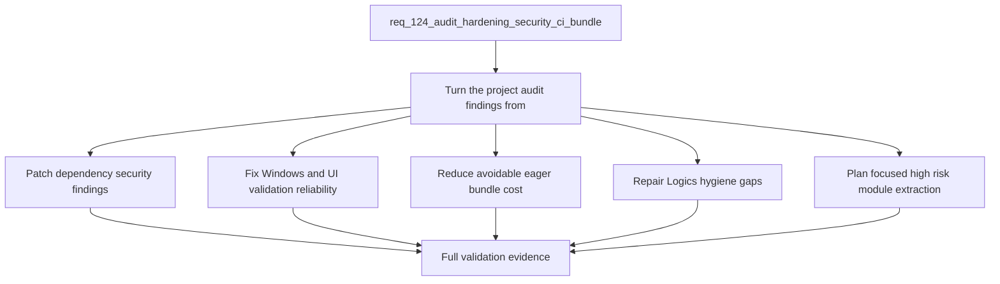

## item_596_audit_hardening_security_ci_bundle_and_maintainability_follow_ups - Audit hardening security ci bundle and maintainability follow ups
> From version: 1.6.5
> Schema version: 1.0
> Status: Done
> Understanding: 96%
> Confidence: 96%
> Progress: 100%
> Complexity: High
> Theme: Quality
> Reminder: Update status/understanding/confidence/progress and linked request/task references when you edit this doc.

# Problem
- Turn the project audit findings from `AUDIT_PROJECT_2026-05-12.md` into a coordinated hardening effort instead of leaving them as disconnected maintenance notes.
- Restore a trustworthy local and CI validation path by fixing the PowerShell-incompatible E2E script and the UI Vitest lane that exits with an unhandled worker timeout after assertions pass.
- Reduce release risk by resolving audited dependency vulnerabilities and refreshing vulnerable or outdated build/test dependencies without regressing the production build, PWA artifacts, or test lanes.
- Reduce user-facing load cost and deploy risk by shrinking the oversized main bundle and keeping bundle metrics visible.
- Reduce future change risk by planning focused decomposition of the largest high-risk modules called out by the audit.
- Bring Logics hygiene back to a coherent state by fixing the workflow audit failure and cleaning the audit-identified placeholder/documentation noise.
- The local project audit in `AUDIT_PROJECT_2026-05-12.md` found that the application code is broadly healthy: lint, typecheck, build, PWA quality checks, fast Vitest lane, and direct Playwright E2E all pass. The risks are concentrated around release safety, dependency security, CI reliability, bundle size, maintainability, and Logics workflow hygiene.

# Scope
- In: dependency security remediation for the audited `npm audit` findings, with validated lockfile updates.
- In: cross-platform validation fixes so `npm run test:e2e` works in PowerShell and Linux CI.
- In: UI Vitest lane reliability fixes or safe segmentation that removes the `onTaskUpdate` unhandled worker timeout from the blocking path.
- In: measurable bundle-size reduction by removing avoidable eager loading from changelog, markdown, and XLSX export paths.
- In: Logics hygiene fixes directly identified by the audit, including the `task_105` missing DoD checklist and placeholder cleanup tracking.
- In: one focused maintainability extraction plan or first implementation slice for the largest risky modules.
- Out: unrelated product features, visual redesign, broad schema rewrites, and cleanup of dirty Logics files not connected to the audit.
- Out: completing every large-module refactor in one pass; additional extraction waves should become sibling backlog items if needed.

# Acceptance criteria
- AC1: Dependency security findings from `npm audit --audit-level=moderate` are resolved or explicitly documented with a justified temporary exception, and the lockfile changes are validated.
- AC2: The E2E script is cross-platform and works from PowerShell using `npm run test:e2e`, while preserving the Linux CI behavior.
- AC3: The UI Vitest lane no longer exits with the unhandled `Timeout calling "onTaskUpdate"` worker error, or the lane is safely segmented so the blocking CI path is reliable.
- AC4: The production build no longer relies on avoidable eager loading for changelog markdown, markdown rendering, or XLSX export dependencies; bundle metrics show a measurable reduction in main chunk size or total JS gzip.
- AC5: PWA build artifacts remain valid after dependency and bundle changes.
- AC6: A focused maintainability slice is defined for the largest risky modules, and any implemented extraction keeps existing behavior covered by targeted tests.
- AC7: `logics/tasks/task_105_wire_twist_groups_and_left_right_splice_pin_mode.md` has the required DoD checklist, and workflow audit no longer fails on that missing checklist.
- AC8: The 15 audit-identified Logics placeholder docs are either cleaned or tracked through explicit follow-up backlog items.
- AC9: Validation evidence includes at minimum lint, typecheck, build, PWA quality, fast tests, UI tests or their segmented replacement, E2E, `npm audit --audit-level=moderate`, and relevant Logics audit/lint commands.

# AC Traceability
- AC1 -> Scope: Dependency security findings from `npm audit --audit-level=moderate` are resolved or explicitly documented with a justified temporary exception, and the lockfile changes are validated.. Proof: capture validation evidence in this doc.
- AC2 -> Scope: The E2E script is cross-platform and works from PowerShell using `npm run test:e2e`, while preserving the Linux CI behavior.. Proof: capture validation evidence in this doc.
- AC3 -> Scope: The UI Vitest lane no longer exits with the unhandled `Timeout calling "onTaskUpdate"` worker error, or the lane is safely segmented so the blocking CI path is reliable.. Proof: capture validation evidence in this doc.
- AC4 -> Scope: The production build no longer relies on avoidable eager loading for changelog markdown, markdown rendering, or XLSX export dependencies; bundle metrics show a measurable reduction in main chunk size or total JS gzip.. Proof: capture validation evidence in this doc.
- AC5 -> Scope: PWA build artifacts remain valid after dependency and bundle changes.. Proof: capture validation evidence in this doc.
- AC6 -> Scope: A focused maintainability slice is defined for the largest risky modules, and any implemented extraction keeps existing behavior covered by targeted tests.. Proof: capture validation evidence in this doc.
- AC7 -> Scope: `logics/tasks/task_105_wire_twist_groups_and_left_right_splice_pin_mode.md` has the required DoD checklist, and workflow audit no longer fails on that missing checklist.. Proof: capture validation evidence in this doc.
- AC8 -> Scope: The 15 audit-identified Logics placeholder docs are either cleaned or tracked through explicit follow-up backlog items.. Proof: capture validation evidence in this doc.
- AC9 -> Scope: Validation evidence includes at minimum lint, typecheck, build, PWA quality, fast tests, UI tests or their segmented replacement, E2E, `npm audit --audit-level=moderate`, and relevant Logics audit/lint commands.. Proof: capture validation evidence in this doc.

# Decision framing
- Product framing: Not needed
- Product signals: (none detected)
- Product follow-up: No product brief follow-up is expected based on current signals.
- Architecture framing: Required
- Architecture signals: data model and persistence, security and identity
- Architecture follow-up: Linked `adr_008_audit_hardening_delivery_strategy_for_security_ci_bundle_and_maintainability`.

# Links
- Product brief(s): (none yet)
- Architecture decision(s): `adr_008_audit_hardening_delivery_strategy_for_security_ci_bundle_and_maintainability`
- Request: `req_124_audit_hardening_security_ci_bundle_and_maintainability_follow_ups`
- Primary task(s): `task_107_audit_hardening_security_ci_bundle_and_maintainability_follow_ups`
<!-- When creating a task from this item, add: Derived from `this file path` in the task # Links section -->

# AI Context
- Summary: Patch all high-signal findings from the May 12 project audit across security dependencies, CI reliability, bundle size, maintainability...
- Keywords: audit, hardening, npm audit, security, PowerShell, E2E, Vitest, onTaskUpdate, bundle, lazy loading, changelog, exceljs, Logics, DoD, placeholders, maintainability
- Use when: Use when grooming, splitting, or implementing the audit follow-up work from `AUDIT_PROJECT_2026-05-12.md`.
- Skip when: Skip when the work targets unrelated product features, visual redesign, or broad rewrites not required by the audit findings.
# Priority
- Impact: High
- Urgency: High

# Report
- Completed by `task_107_audit_hardening_security_ci_bundle_and_maintainability_follow_ups`.
- Security, E2E portability, UI lane reliability, bundle loading boundaries, PWA validation, Logics DoD repair, placeholder cleanup, and focused maintainability loading-boundary work are implemented.
- Validation evidence is recorded in the linked task report.
- Remaining follow-up is not blocking this item: decide a future bundle budget policy for lazy chunks, especially the separate `exceljs` export chunk.

# Notes
- Derived from request `req_124_audit_hardening_security_ci_bundle_and_maintainability_follow_ups`.
- Source file: `logics\request\req_124_audit_hardening_security_ci_bundle_and_maintainability_follow_ups.md`.
- This backlog item is intentionally broad because it tracks the first audit-hardening wave. Split into sibling backlog items if implementation starts to mix unrelated workstreams.
- Request context seeded into this backlog item from `logics\request\req_124_audit_hardening_security_ci_bundle_and_maintainability_follow_ups.md`.
- - Task `task_107_audit_hardening_security_ci_bundle_and_maintainability_follow_ups` was finished via `logics-manager flow finish task` on 2026-05-12.
