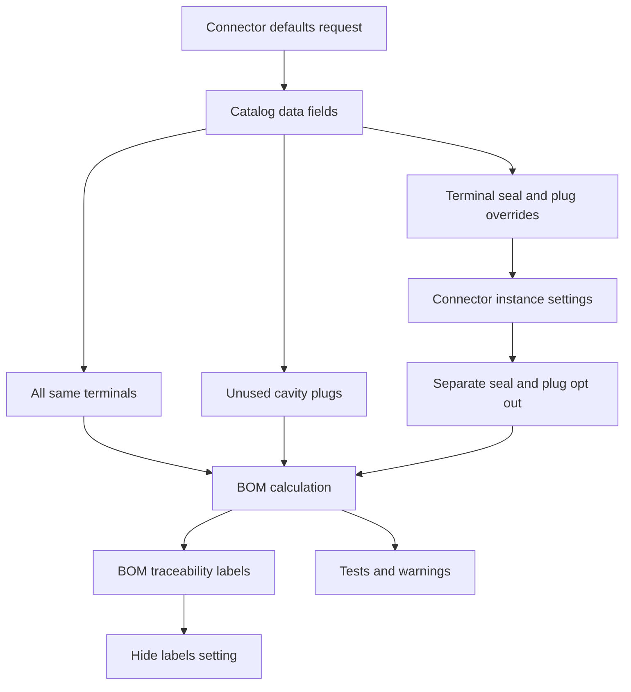

## item_597_connector_catalog_terminal_seal_and_plug_defaults - Connector catalog terminal seal and plug defaults
> From version: 1.6.5
> Schema version: 1.0
> Status: Done
> Understanding: 90%
> Confidence: 85%
> Progress: 100%
> Complexity: High
> Theme: Operator workflow and runtime integration
> Reminder: Update status/understanding/confidence/progress and linked request/task references when you edit this doc.

# Problem
Extend connector catalog data so connector terminal, seal, and cavity plug defaults can be defined once and reused consistently during BOM generation.
Add an `all same terminals` catalog option for connectors whose cavities all use the same terminal reference and seal reference by default.
Add catalog-level plug defaults for connectors so unused cavities can be automatically filled with the configured plug references and included in the BOM.
Support connectors that do not use the same terminal or plug setup for every cavity by allowing explicit overrides of the default terminal, seal, and plug choices.
Let the operator disable plug and seal application for a specific connector instance even when the catalog says that connector can use plugs or seals.

# Scope
- In:
  - one coherent delivery slice from the source request
- Out:
  - unrelated sibling slices that should stay in separate backlog items instead of widening this doc

# Acceptance criteria
- AC1: The connector catalog supports an `all same terminals` option for connector references whose cavities all share the same default terminal reference and default seal reference.
- AC2: When `all same terminals` is enabled, newly placed or refreshed connector instances use the configured default terminal and seal references for every applicable cavity unless overridden.
- AC3: The connector catalog supports one or more plug references for unused cavities, with quantity per plug reference and no required plug-to-cavity assignment.
- AC4: Unused connector cavities are calculated from the instance cavity usage, filled with the catalog-defined plug quantities by default, and included in the BOM.
- AC5: Connectors that do not use the same terminal or seal on every cavity can override the default terminal and seal selection at cavity level or another explicit grouping level.
- AC6: Connectors can define more than one plug type and define how many of each plug type is used when unused cavities are populated, without requiring the operator to assign those plugs to specific cavities.
- AC7: Connector instance settings include an option to disable automatic plug application for that specific instance even when the catalog defines plug defaults.
- AC8: Connector instance settings include an option to disable automatic seal application for that specific instance when the connector is used in a context where seals are not needed.
- AC9: The plug and seal opt-out controls are separate instance-level settings so an operator can disable plugs without disabling terminal seals, or disable seals without disabling plugs.
- AC10: BOM generation respects catalog defaults, per-connector overrides, unused-cavity plug quantities, and instance-level opt-out settings.
- AC11: Existing projects and catalog entries without terminal, seal, or plug defaults continue to load without a mandatory breaking migration.
- AC12: Existing connector instances refresh from updated catalog defaults when the catalog entry gains terminal, seal, or plug defaults, unless an instance has an explicit override or opt-out that must remain authoritative.
- AC13: The BOM UI can show whether a BOM line comes from catalog defaults, an instance override, or a manual operator entry.
- AC14: Application settings include an option to hide BOM traceability labels when the operator wants a cleaner BOM view; hiding labels does not change BOM quantities, exports, defaults, overrides, warnings, or material calculation.
- AC15: Ambiguous plug, seal, or terminal configurations produce non-blocking warnings instead of hard failures.
- AC16: Automated tests cover catalog defaults, mixed-terminal overrides, multiple plug types with quantities, unused-cavity BOM inclusion, existing-instance refresh, BOM traceability visibility settings, non-blocking warnings, and instance-level opt-out behavior.

# AC Traceability
- request-AC1 -> This backlog slice. Proof: AC1: The connector catalog supports an `all same terminals` option for connector references whose cavities all share the same default terminal reference and default seal reference.
- request-AC2 -> This backlog slice. Proof: AC2: When `all same terminals` is enabled, newly placed or refreshed connector instances use the configured default terminal and seal references for every applicable cavity unless overridden.
- request-AC3 -> This backlog slice. Proof: AC3: The connector catalog supports one or more plug references for unused cavities, with quantity per plug reference and no required plug-to-cavity assignment.
- request-AC4 -> This backlog slice. Proof: AC4: Unused connector cavities are calculated from the instance cavity usage, filled with the catalog-defined plug quantities by default, and included in the BOM.
- request-AC5 -> This backlog slice. Proof: AC5: Connectors that do not use the same terminal or seal on every cavity can override the default terminal and seal selection at cavity level or another explicit grouping level.
- request-AC6 -> This backlog slice. Proof: AC6: Connectors can define more than one plug type and define how many of each plug type is used when unused cavities are populated, without requiring the operator to assign those plugs to specific cavities.
- request-AC7 -> This backlog slice. Proof: AC7: Connector instance settings include an option to disable automatic plug application for that specific instance even when the catalog defines plug defaults.
- request-AC8 -> This backlog slice. Proof: AC8: Connector instance settings include an option to disable automatic seal application for that specific instance when the connector is used in a context where seals are not needed.
- request-AC9 -> This backlog slice. Proof: AC9: The plug and seal opt-out controls are separate instance-level settings so an operator can disable plugs without disabling terminal seals, or disable seals without disabling plugs.
- request-AC10 -> This backlog slice. Proof: AC10: BOM generation respects catalog defaults, per-connector overrides, unused-cavity plug quantities, and instance-level opt-out settings.
- request-AC11 -> This backlog slice. Proof: AC11: Existing projects and catalog entries without terminal, seal, or plug defaults continue to load without a mandatory breaking migration.
- request-AC12 -> This backlog slice. Proof: AC12: Existing connector instances refresh from updated catalog defaults when the catalog entry gains terminal, seal, or plug defaults, unless an instance has an explicit override or opt-out that must remain authoritative.
- request-AC13 -> This backlog slice. Proof: AC13: The BOM UI can show whether a BOM line comes from catalog defaults, an instance override, or a manual operator entry.
- request-AC14 -> This backlog slice. Proof: AC14: Application settings include an option to hide BOM traceability labels when the operator wants a cleaner BOM view; hiding labels does not change BOM quantities, exports, defaults, overrides, warnings, or material calculation.
- request-AC15 -> This backlog slice. Proof: AC15: Ambiguous plug, seal, or terminal configurations produce non-blocking warnings instead of hard failures.
- request-AC16 -> This backlog slice. Proof: AC16: Automated tests cover catalog defaults, mixed-terminal overrides, multiple plug types with quantities, unused-cavity BOM inclusion, existing-instance refresh, BOM traceability visibility settings, non-blocking warnings, and instance-level opt-out behavior.

# Decision framing
- Product framing: Not needed
- Product signals: (none detected)
- Product follow-up: No product brief follow-up is expected based on current signals.
- Architecture framing: Not needed
- Architecture signals: (none detected)
- Architecture follow-up: No architecture decision follow-up is expected based on current signals.

# Links
- Product brief(s): (none yet)
- Architecture decision(s): (none yet)
- Request: `logics/request/req_125_connector_catalog_terminal_seal_and_plug_defaults.md`
- Primary task(s): `logics/tasks/task_108_connector_catalog_terminal_seal_and_plug_defaults.md`

# AI Context
- Summary: Connector catalog terminal seal and plug defaults
- Keywords: backlog-groom, request, connector catalog terminal seal and plug defaults, bounded slice
- Use when: Use when implementing or reviewing the delivery slice for Connector catalog terminal seal and plug defaults.
- Skip when: Skip when the change is unrelated to this delivery slice or its linked request.

# Priority
- Impact:
- Urgency:

# Notes
- Hybrid rationale: Derived from request `req_125_connector_catalog_terminal_seal_and_plug_defaults` and kept bounded to one coherent delivery slice.
- Source file: `logics/request/req_125_connector_catalog_terminal_seal_and_plug_defaults.md`.
- Generated locally by logics-manager.
- - Task `task_108_connector_catalog_terminal_seal_and_plug_defaults` was finished via `logics-manager flow finish task` on 2026-05-13.

# Tasks
- `task_108_connector_catalog_terminal_seal_and_plug_defaults`
