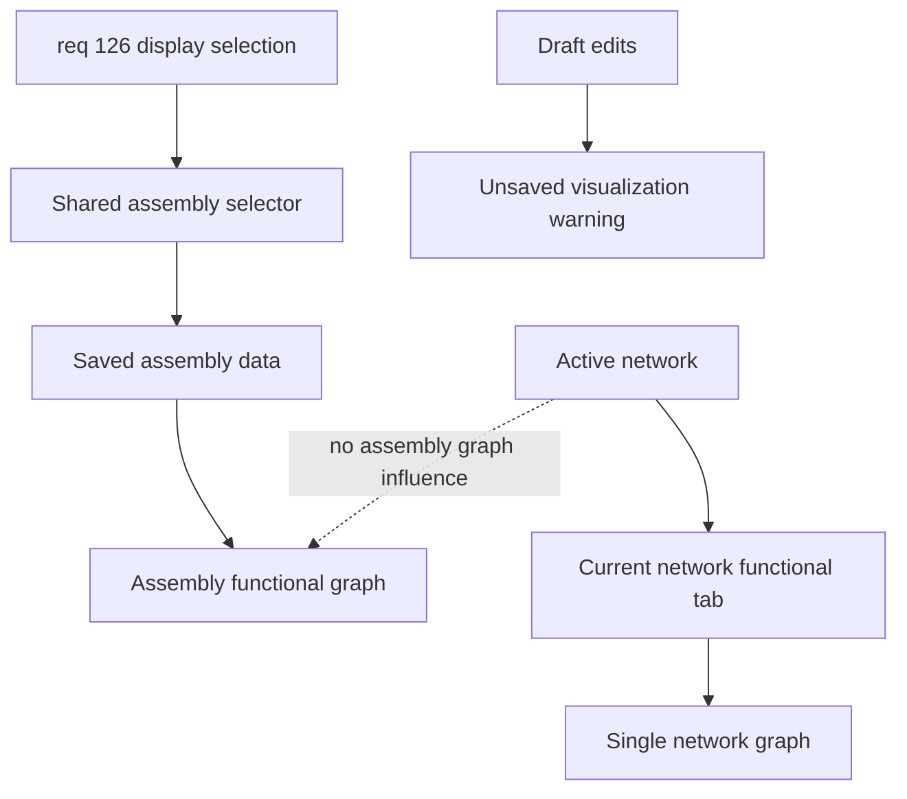

## item_598_explicit_harness_assembly_display_selection_and_current_network_functional_tab - Explicit Harness Assembly Display Selection and Current Network Functional Tab
> From version: 1.6.6
> Schema version: 1.0
> Status: Done
> Understanding: 96%
> Confidence: 94%
> Progress: 100%
> Complexity: Medium
> Theme: UI
> Reminder: Update status/understanding/confidence/progress and linked request/task references when you edit this doc.
> Non-semantic edit: refreshed Mermaid signatures

# Problem
The `Harness assembly` workspace currently lets the active network implicitly choose which assembly graph is displayed. This makes the view unpredictable: selecting an assembly in the manager can still display another assembly, and navigation that changes the active network can unexpectedly change the graph.

Operators need a deterministic assembly workspace where one explicit selector chooses the harness assembly being edited and displayed. They also need a separate place to review the functional graph of the current active network without mixing that single-network view into assembly-level behavior.

# Scope
- In:
  - Add one shared selector for the harness assembly being edited and displayed.
  - Start from an explicit empty state when no displayed assembly selection is persisted.
  - Persist the operator's displayed assembly selection after they choose an assembly.
  - Remove active-network-driven assembly graph selection from the harness assembly workspace.
  - Keep assembly graph derivation based on saved assembly data only.
  - Add a local warning near modified member/root/link/color controls when unsaved draft changes are not reflected in the visualization.
  - Add a `Current network functional` tab for the active network's single-network functional schematic.
  - Use assembly metadata for assembly graph exports and active network metadata for current-network graph exports.
- Out:
  - Changing physical-only interconnector semantics.
  - Changing symmetric pin mapping behavior.
  - Reworking cross-harness trace derivation beyond replacing the graph selection source.
  - Persisting a generated functional graph as source-of-truth data.
  - Multi-assembly comparison or side-by-side views.

# Acceptance criteria
- AC1: The harness assembly functional graph is selected by an explicit displayed assembly state, not by `activeNetworkId`.
- AC2: One shared selector controls both the edited assembly form and the displayed assembly graph.
- AC3: When no displayed assembly selection is persisted, the assembly workspace starts with an empty state that asks the operator to select a harness assembly.
- AC4: After the operator selects an assembly, the displayed assembly selection persists across reloads.
- AC5: Changing the active network does not change the displayed harness assembly graph.
- AC6: The displayed assembly graph is derived from saved assembly data, not unsaved form draft state.
- AC7: Unsaved member/root/link/color changes show a small warning near the modified controls explaining that save is required before the visualization updates.
- AC8: Opening interconnector details or navigating to linked connectors does not replace the displayed assembly graph through active network changes.
- AC9: A separate tab named `Current network functional` displays the functional graph of the current active network only.
- AC10: The `Current network functional` tab changes when the active network changes, while the harness assembly graph remains unchanged.
- AC11: Existing single-network functional graph behavior remains available through the new current-network tab.
- AC12: Assembly graph export metadata uses the selected assembly name and technical ID where available.
- AC13: Current-network graph export metadata continues to use active network metadata.
- AC14: Existing saved harness assemblies load, remain selectable, and keep import/export behavior without data loss.
- AC15: Automated tests cover explicit assembly selection, persisted selection, active-network decoupling, empty state behavior, unsaved warning behavior, current-network tab behavior, and export metadata selection.

# AC Traceability
- request-AC1 -> backlog AC1.
- request-AC2 -> backlog AC5 and AC10.
- request-AC3 -> backlog AC2.
- request-AC4 -> backlog AC3.
- request-AC5 -> backlog AC2 and AC12.
- request-AC6 -> backlog AC2.
- request-AC7 -> backlog AC6 and AC7.
- request-AC8 -> backlog AC9.
- request-AC9 -> backlog AC10.
- request-AC10 -> backlog AC11.
- request-AC11 -> backlog AC12.
- request-AC12 -> backlog AC13.
- request-AC13 -> backlog AC14.
- request-AC14 -> backlog AC15.
- request-AC15 -> backlog AC4.
- request-AC1 -> This backlog slice. Evidence needed: The `Harness assembly` functional graph is selected by an explicit displayed assembly state, not by `activeNetworkId`.
- request-AC2 -> This backlog slice. Evidence needed: Changing the active network does not change the displayed harness assembly graph.
- request-AC3 -> This backlog slice. Evidence needed: The operator can select which saved harness assembly is displayed and edited through one shared selector.
- request-AC4 -> This backlog slice. Evidence needed: If no harness assembly is selected, the assembly workspace shows a clear empty state instead of falling back to the active network graph.
- request-AC5 -> This backlog slice. Evidence needed: The UI clearly shows which harness assembly currently drives the displayed assembly graph.
- request-AC6 -> This backlog slice. Evidence needed: The shared assembly selector controls both the edited assembly form and the displayed assembly graph.
- request-AC7 -> This backlog slice. Evidence needed: Unsaved member/root/link/color changes are visible before save, and a small warning near the modified controls explains that the visualization has not been updated yet.
- request-AC8 -> This backlog slice. Evidence needed: A separate tab lets the operator view the functional graph of the current active network only.
- request-AC9 -> This backlog slice. Evidence needed: The current-network functional tab changes when the active network changes, but the harness assembly graph does not.
- request-AC10 -> This backlog slice. Evidence needed: Existing single-network functional graph behavior remains available through the new current-network tab.
- request-AC11 -> This backlog slice. Evidence needed: Assembly graph export metadata uses selected assembly metadata where available.
- request-AC12 -> This backlog slice. Evidence needed: Current-network graph export metadata continues to use active network metadata.
- request-AC13 -> This backlog slice. Evidence needed: Existing saved harness assemblies load and remain selectable without data loss.
- request-AC14 -> This backlog slice. Evidence needed: Automated tests cover assembly selection, active-network decoupling, empty state behavior, and current-network tab behavior.
- request-AC15 -> This backlog slice. Evidence needed: The displayed assembly selection persists after the operator chooses an assembly and reloads the app.
- request-AC1 -> This backlog slice. Proof: Historical delivery is recorded in the linked backlog/task report and validation sections; this corpus repair formalizes strict audit traceability without changing shipped scope. Source: `logics corpus strict audit repair`
- request-AC2 -> This backlog slice. Proof: Historical delivery is recorded in the linked backlog/task report and validation sections; this corpus repair formalizes strict audit traceability without changing shipped scope. Source: `logics corpus strict audit repair`
- request-AC3 -> This backlog slice. Proof: Historical delivery is recorded in the linked backlog/task report and validation sections; this corpus repair formalizes strict audit traceability without changing shipped scope. Source: `logics corpus strict audit repair`
- request-AC4 -> This backlog slice. Proof: Historical delivery is recorded in the linked backlog/task report and validation sections; this corpus repair formalizes strict audit traceability without changing shipped scope. Source: `logics corpus strict audit repair`
- request-AC5 -> This backlog slice. Proof: Historical delivery is recorded in the linked backlog/task report and validation sections; this corpus repair formalizes strict audit traceability without changing shipped scope. Source: `logics corpus strict audit repair`
- request-AC6 -> This backlog slice. Proof: Historical delivery is recorded in the linked backlog/task report and validation sections; this corpus repair formalizes strict audit traceability without changing shipped scope. Source: `logics corpus strict audit repair`
- request-AC7 -> This backlog slice. Proof: Historical delivery is recorded in the linked backlog/task report and validation sections; this corpus repair formalizes strict audit traceability without changing shipped scope. Source: `logics corpus strict audit repair`
- request-AC8 -> This backlog slice. Proof: Historical delivery is recorded in the linked backlog/task report and validation sections; this corpus repair formalizes strict audit traceability without changing shipped scope. Source: `logics corpus strict audit repair`
- request-AC9 -> This backlog slice. Proof: Historical delivery is recorded in the linked backlog/task report and validation sections; this corpus repair formalizes strict audit traceability without changing shipped scope. Source: `logics corpus strict audit repair`
- request-AC10 -> This backlog slice. Proof: Historical delivery is recorded in the linked backlog/task report and validation sections; this corpus repair formalizes strict audit traceability without changing shipped scope. Source: `logics corpus strict audit repair`
- request-AC11 -> This backlog slice. Proof: Historical delivery is recorded in the linked backlog/task report and validation sections; this corpus repair formalizes strict audit traceability without changing shipped scope. Source: `logics corpus strict audit repair`
- request-AC12 -> This backlog slice. Proof: Historical delivery is recorded in the linked backlog/task report and validation sections; this corpus repair formalizes strict audit traceability without changing shipped scope. Source: `logics corpus strict audit repair`
- request-AC13 -> This backlog slice. Proof: Historical delivery is recorded in the linked backlog/task report and validation sections; this corpus repair formalizes strict audit traceability without changing shipped scope. Source: `logics corpus strict audit repair`
- request-AC14 -> This backlog slice. Proof: Historical delivery is recorded in the linked backlog/task report and validation sections; this corpus repair formalizes strict audit traceability without changing shipped scope. Source: `logics corpus strict audit repair`
- request-AC15 -> This backlog slice. Proof: Historical delivery is recorded in the linked backlog/task report and validation sections; this corpus repair formalizes strict audit traceability without changing shipped scope. Source: `logics corpus strict audit repair`

# Decision framing
- Product framing: Not needed
- Product signals: Clarified directly in the source request.
- Product follow-up: No separate product brief is required for this bounded UX correction.
- Architecture framing: Not needed
- Architecture signals: The change should reuse existing state, graph derivation, and export boundaries.
- Architecture follow-up: Create an ADR only if implementation discovers a broader persisted workspace preference contract is needed.

# Links
- Product brief(s): (none yet)
- Architecture decision(s): (none yet)
- Request: `logics/request/req_126_explicit_harness_assembly_display_selection_and_current_network_functional_tab.md`
- Primary task(s): `logics/tasks/task_109_explicit_harness_assembly_display_selection_and_current_network_functional_tab.md`
<!-- When creating a task from this item, add: Derived from `logics/backlog/item_598_explicit_harness_assembly_display_selection_and_current_network_functional_tab.md` in the task # Links section -->

# Priority
- Impact: High
- Urgency: High

# Dependencies
- Existing harness assembly data model and reducer behavior.
- Existing assembly functional schematic derivation.
- Existing single-network functional schematic panel and export flow.
- Existing network summary or harness assembly tab/navigation surface.

# Risks
- Persisting the displayed assembly selection must not create schema churn that breaks existing projects.
- Sharing one selector for edit and display is simpler, but draft state must be visually separated from saved visualization state.
- Export metadata paths may still assume active network context and may need localized branching for assembly exports.
- Tests should guard against regressions where active network changes start controlling assembly display again.

# Notes
- Derived from request `req_126_explicit_harness_assembly_display_selection_and_current_network_functional_tab`.
- Source file: `logics/request/req_126_explicit_harness_assembly_display_selection_and_current_network_functional_tab.md`.
- The source request was clarified with the operator before promotion.
- Implemented by `logics/tasks/task_109_explicit_harness_assembly_display_selection_and_current_network_functional_tab.md`.

# Validation evidence
- `npm test -- --run src/tests/app.ui.network-summary-workflow-polish.spec.tsx` passed.
- `npm test -- --run src/tests/core.functional-schematic.spec.ts` passed.
- `npm test -- --run src/tests/store.reducer.harness-assemblies.spec.ts` passed.
- `.\\node_modules\\.bin\\tsc.cmd --noEmit` passed.
- `npm run -s lint` passed.
- `npm run -s build` passed with the existing Vite chunk-size warning.

# Report
- Delivered explicit persisted harness assembly display selection.
- Delivered active-network decoupling for the assembly functional graph.
- Delivered the `Current network functional` tab for the active network only.
- Delivered local unsaved visualization warnings for draft assembly edits.
- Delivered assembly versus current-network export metadata routing.

# AI Context
- Summary: Implement explicit harness assembly display selection, persist the selected assembly after user choice, remove active-network influence from assembly graphs, and add a separate current-network functional tab.
- Keywords: harness assembly, displayed assembly, active network, current network functional, shared selector, persisted selection, unsaved warning, export metadata
- Use when: Implementing or reviewing the UI and controller changes that decide which functional graph is displayed.
- Skip when: Work targets connector link semantics, symmetric pin mapping, data import/export unrelated to graph selection, or physical harness modeling.

# Tasks
- `logics/tasks/task_109_explicit_harness_assembly_display_selection_and_current_network_functional_tab.md`
