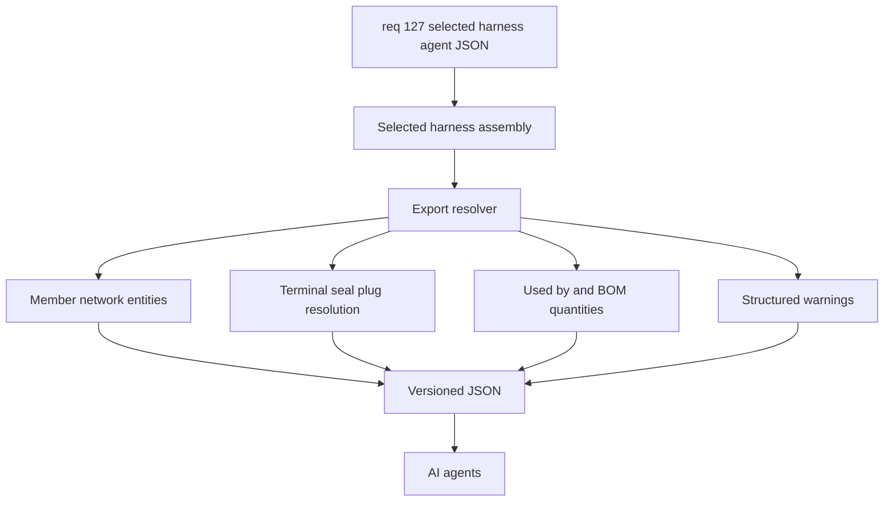

## item_599_selected_harness_agent_json_export - Selected Harness Agent JSON Export
> From version: 1.7.0
> Schema version: 1.0
> Status: Done
> Understanding: 99%
> Confidence: 97%
> Progress: 100%
> Complexity: Medium
> Theme: Export
> Reminder: Update status/understanding/confidence/progress and linked request/task references when you edit this doc.

# Problem
AI agents need a complete, stable, machine-readable view of the currently selected harness assembly. Today the information exists across several app domains: harness assembly metadata, member networks, wires, connectors, splices, connector catalog defaults, wire endpoint references, and BOM helpers. Agents should not have to reverse-engineer those relationships from UI state, labels, or multiple export formats.

The delivery slice is intentionally narrow: one selected harness assembly, one JSON format, and one agent-oriented schema. Human-readable reports, CSV/XLSX exports, and all-harness exports remain out of scope.

# Scope
- In:
  - Add a selected-harness-only agent JSON export action.
  - Emit a versioned JSON envelope with schema metadata, app version, export kind, export time, and selected harness identity.
  - Include selected harness metadata, members, master connector refs, and inter-harness connector links.
  - Include member-network entities needed to understand the selected harness: networks, wires, connectors, splices, segments, connector cavity occupancy, catalog items, and protected-wire catalog references.
  - Resolve terminal, seal, and plug material using existing app precedence and expose origin labels.
  - Compute agent-friendly `usedBy`, relationship records, BOM-like quantities, and validation warnings during export.
  - Keep the export independent from `activeNetworkId` except where member network data explicitly belongs to the selected harness.
- Out:
  - Markdown, CSV, XLSX, or human-readable reports.
  - Exporting every harness assembly at once.
  - Exporting the active network when no harness is selected.
  - Building an import path for the agent JSON.
  - Adding required new catalog fields before V1 can ship.
  - Guaranteeing exact plug-to-cavity assignment where current data only stores plug quantities for unused cavities.

# Acceptance criteria
- AC1: A selected harness assembly can be exported as a single JSON payload or downloaded JSON file.
- AC2: The export action is scoped only to the selected harness assembly and never falls back to `activeNetworkId`.
- AC3: If no harness assembly is selected, the export action is disabled or reports a clear non-exporting error state.
- AC4: The JSON envelope includes `schemaVersion`, `exportKind`, `exportedAt`, app version, and selected harness identity.
- AC5: The JSON includes selected harness fields, including ID, technical ID, name, members, master connector refs, connector links, created date, and updated date.
- AC6: The JSON includes all member networks referenced by the selected harness and the relevant wires, connectors, splices, segments, and catalog references from those networks.
- AC7: Wire records include IDs, names, technical IDs, section, material, current, color state, twist group, functional domain, route segment IDs, route lock state, length, protection, and endpoint details.
- AC8: Connector endpoint records include network ID, connector ID, cavity index, connector labels, manual wire-side connection and seal references, and resolved terminal/seal material when available.
- AC9: Splice endpoint records include network ID, splice ID, port index, side override, and side lock state when available.
- AC10: Connector records include ID, name, technical ID, cavity count, catalog item ID, manufacturer reference, material application flags, terminal overrides, and per-cavity occupancy.
- AC11: Terminal and seal resolution reuses existing app precedence and includes an origin label such as manual, connector override, catalog default, or computed when determinable.
- AC12: Unused-cavity plug requirements are exported from connector catalog defaults when configured and applicable.
- AC13: Catalog-backed parts include available metadata and computed `usedBy` references for connectors, splices, wires, cavities, endpoints, protections, terminals, seals, and plugs.
- AC14: The export includes BOM-like quantities for connectors, splices, terminals, seals, plugs, and protected-wire components.
- AC15: The export includes explicit relationship records so agents can traverse joins without inferring them from display labels.
- AC16: The export includes structured warnings with `code`, `severity`, `message`, and related entity references for missing or unresolved harness, network, connector, catalog, terminal, seal, plug, and relationship data.
- AC17: Automated tests cover selected-harness scoping, active-network decoupling, terminal/seal/plug resolution, `usedBy` derivation, BOM-like quantities, relationship records, and warning generation.

# AC Traceability
- request-AC1 -> backlog AC1.
- request-AC2 -> backlog AC2.
- request-AC3 -> backlog AC4.
- request-AC4 -> backlog AC5.
- request-AC5 -> backlog AC6.
- request-AC6 -> backlog AC7, AC8, and AC9.
- request-AC7 -> backlog AC10.
- request-AC8 -> backlog AC11.
- request-AC9 -> backlog AC12.
- request-AC10 -> backlog AC13.
- request-AC11 -> backlog AC14.
- request-AC12 -> backlog AC15.
- request-AC13 -> backlog AC16.
- request-AC14 -> backlog AC3.
- request-AC15 -> backlog AC17.
- request-AC1 -> This backlog slice. Evidence needed: A selected harness assembly can be exported as a single JSON file or downloaded JSON payload.
- request-AC2 -> This backlog slice. Evidence needed: The export action is scoped only to the selected harness assembly and is not affected by `activeNetworkId`.
- request-AC3 -> This backlog slice. Evidence needed: The JSON includes a versioned envelope with `schemaVersion`, `exportKind`, `exportedAt`, app version, and selected harness identity.
- request-AC4 -> This backlog slice. Evidence needed: The JSON includes selected harness members, master connector refs, and inter-harness connector links.
- request-AC5 -> This backlog slice. Evidence needed: The JSON includes member networks and their relevant wires, connectors, splices, segments, and catalog references.
- request-AC6 -> This backlog slice. Evidence needed: Wire exports include complete endpoint data and preserve wire-side connection and seal references and names.
- request-AC7 -> This backlog slice. Evidence needed: Connector exports include cavity count, cavity occupancy, catalog item reference, manufacturer reference, material flags, terminal overrides, and resolved per-cavity material where available.
- request-AC8 -> This backlog slice. Evidence needed: Terminal and seal resolution follows existing app precedence and exposes an origin label.
- request-AC9 -> This backlog slice. Evidence needed: Plug requirements for unused cavities are included when configured through connector catalog defaults.
- request-AC10 -> This backlog slice. Evidence needed: Catalog-backed parts include available metadata and computed `usedBy` references.
- request-AC11 -> This backlog slice. Evidence needed: The export includes BOM-like quantities for connectors, splices, terminals, seals, plugs, and protected wire components.
- request-AC12 -> This backlog slice. Evidence needed: The export includes explicit relationship rows so agents do not need to infer joins from labels.
- request-AC13 -> This backlog slice. Evidence needed: The export includes structured validation warnings for missing or unresolved harness, network, connector, catalog, terminal, seal, plug, and relationship data.
- request-AC14 -> This backlog slice. Evidence needed: If no harness assembly is selected, the export action does not produce a misleading fallback export.
- request-AC15 -> This backlog slice. Evidence needed: Automated tests cover selected-harness scoping, active-network decoupling, terminal/seal/plug resolution, `usedBy` derivation, and warning generation.
- request-AC1 -> This backlog slice. Proof: Historical delivery is recorded in the linked backlog/task report and validation sections; this corpus repair formalizes strict audit traceability without changing shipped scope. Source: `logics corpus strict audit repair`
- request-AC2 -> This backlog slice. Proof: Historical delivery is recorded in the linked backlog/task report and validation sections; this corpus repair formalizes strict audit traceability without changing shipped scope. Source: `logics corpus strict audit repair`
- request-AC3 -> This backlog slice. Proof: Historical delivery is recorded in the linked backlog/task report and validation sections; this corpus repair formalizes strict audit traceability without changing shipped scope. Source: `logics corpus strict audit repair`
- request-AC4 -> This backlog slice. Proof: Historical delivery is recorded in the linked backlog/task report and validation sections; this corpus repair formalizes strict audit traceability without changing shipped scope. Source: `logics corpus strict audit repair`
- request-AC5 -> This backlog slice. Proof: Historical delivery is recorded in the linked backlog/task report and validation sections; this corpus repair formalizes strict audit traceability without changing shipped scope. Source: `logics corpus strict audit repair`
- request-AC6 -> This backlog slice. Proof: Historical delivery is recorded in the linked backlog/task report and validation sections; this corpus repair formalizes strict audit traceability without changing shipped scope. Source: `logics corpus strict audit repair`
- request-AC7 -> This backlog slice. Proof: Historical delivery is recorded in the linked backlog/task report and validation sections; this corpus repair formalizes strict audit traceability without changing shipped scope. Source: `logics corpus strict audit repair`
- request-AC8 -> This backlog slice. Proof: Historical delivery is recorded in the linked backlog/task report and validation sections; this corpus repair formalizes strict audit traceability without changing shipped scope. Source: `logics corpus strict audit repair`
- request-AC9 -> This backlog slice. Proof: Historical delivery is recorded in the linked backlog/task report and validation sections; this corpus repair formalizes strict audit traceability without changing shipped scope. Source: `logics corpus strict audit repair`
- request-AC10 -> This backlog slice. Proof: Historical delivery is recorded in the linked backlog/task report and validation sections; this corpus repair formalizes strict audit traceability without changing shipped scope. Source: `logics corpus strict audit repair`
- request-AC11 -> This backlog slice. Proof: Historical delivery is recorded in the linked backlog/task report and validation sections; this corpus repair formalizes strict audit traceability without changing shipped scope. Source: `logics corpus strict audit repair`
- request-AC12 -> This backlog slice. Proof: Historical delivery is recorded in the linked backlog/task report and validation sections; this corpus repair formalizes strict audit traceability without changing shipped scope. Source: `logics corpus strict audit repair`
- request-AC13 -> This backlog slice. Proof: Historical delivery is recorded in the linked backlog/task report and validation sections; this corpus repair formalizes strict audit traceability without changing shipped scope. Source: `logics corpus strict audit repair`
- request-AC14 -> This backlog slice. Proof: Historical delivery is recorded in the linked backlog/task report and validation sections; this corpus repair formalizes strict audit traceability without changing shipped scope. Source: `logics corpus strict audit repair`
- request-AC15 -> This backlog slice. Proof: Historical delivery is recorded in the linked backlog/task report and validation sections; this corpus repair formalizes strict audit traceability without changing shipped scope. Source: `logics corpus strict audit repair`

# Decision framing
- Product framing: Not needed
- Product signals: The request explicitly fixes the user, scope, format, and consumer.
- Product follow-up: No separate product brief is required unless later work introduces human-facing export variants.
- Architecture framing: Maybe later
- Architecture signals: The export introduces a stable machine schema and may need a pure builder boundary.
- Architecture follow-up: Create an ADR only if implementation discovers a broader export schema versioning contract or import compatibility strategy is needed.

# Links
- Product brief(s): (none yet)
- Architecture decision(s): (none yet)
- Request: `logics/request/req_127_selected_harness_agent_json_export.md`
<!-- When creating a task from this item, add: Derived from `logics/backlog/item_599_selected_harness_agent_json_export.md` in the task # Links section -->

# Priority
- Impact: High
- Urgency: Medium

# Dependencies
- Existing selected harness assembly state and `req_126` display selection behavior.
- Existing harness assembly data model in `src/core/entities.ts`.
- Existing member network persistence and network-scoped entity state.
- Existing connector terminal, seal, and plug resolution helpers in `src/core/connectorCatalogMaterials.ts`.
- Existing BOM export logic in `src/app/lib/networkSummaryBomCsv.ts`.
- Existing validation issue builders for missing catalog and relationship data.

# Risks
- The JSON schema must be stable enough for agents while still allowing future evolution.
- It is easy to overfit the schema to current UI labels; the export should use domain IDs and explicit relationships instead.
- Some data is currently derived from catalog defaults, so the export must explain origin and missing data instead of presenting assumptions as facts.
- Plug data may be quantity-based rather than cavity-specific in V1; warnings or assumptions should make that limitation explicit.
- Selected-harness scoping must not regress into active-network scoping.

# Notes
- Derived from request `req_127_selected_harness_agent_json_export`.
- Source file: `logics/request/req_127_selected_harness_agent_json_export.md`.
- `manufacturerReference` is the current source-of-truth equivalent of part reference or part number for V1.
- `usedBy`, relationship records, BOM quantities, and validation warnings should be computed at export time rather than stored as source-of-truth fields.
- A likely implementation shape is a pure builder such as `src/app/lib/selectedHarnessAgentJson.ts` or `src/core/harnessAgentExport.ts`.

# Delivery outcome
- Status: Delivered.
- Implemented as `src/app/lib/selectedHarnessAgentJson.ts` plus the selected Harness Assembly manager `Agent JSON` action.
- Automated coverage added in `src/tests/selected-harness-agent-json.spec.ts` and `src/tests/harness-assembly-agent-json-ui.spec.tsx`.
- Validation passed: targeted tests, typecheck, lint, and production build.

# Validation plan
- Add unit tests for the pure export builder.
- Add targeted tests for selected-harness-only scoping and active-network decoupling.
- Add tests for terminal and seal precedence across manual wire-side references, connector overrides, and catalog defaults.
- Add tests for unused-cavity plug export when catalog plug defaults exist.
- Add tests for missing references and structured warning generation.
- Run:
  - `npm test -- --run src/tests/selected-harness-agent-json.spec.ts`
  - `.\\node_modules\\.bin\\tsc.cmd --noEmit`
  - `npm run -s lint`

# AI Context
- Summary: Implement a selected-harness-only JSON export that consolidates harness assembly, member network, wire, connector, terminal, seal, plug, catalog part, BOM usage, relationship, and validation warning data for AI agents.
- Keywords: selected harness, agent JSON, harness export, wires, connectors, terminals, seals, plugs, catalog parts, BOM, usedBy, relationships, validation warnings
- Use when: Implementing or reviewing the selected harness agent JSON export.
- Skip when: Work targets human-readable export formats, all-harness export, import support, or active-network-only export.

# Tasks
- `logics/tasks/task_110_selected_harness_agent_json_export.md`

# Links
- Primary task(s): `task_110_selected_harness_agent_json_export`
