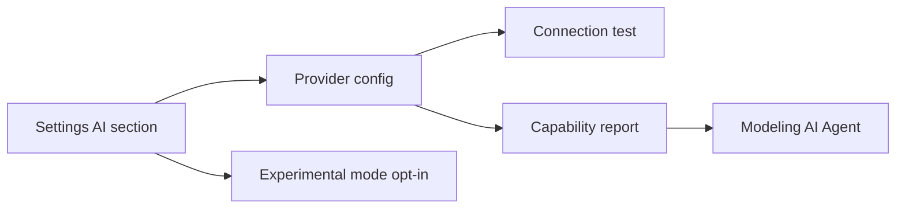

## item_600_ai_provider_settings_and_capability_contract - AI Provider Settings and Capability Contract
> From version: 1.10.3
> Schema version: 1.0
> Status: Done
> Understanding: 99%
> Confidence: 97%
> Progress: 100%
> Complexity: Medium
> Theme: AI
> Reminder: Update status/understanding/confidence/progress and linked request/task references when you edit this doc.

# Problem
The AI Agent workspace needs provider configuration without coupling Modeling to one vendor.
Users need to choose a provider, model, credential strategy, endpoint, and safety defaults before the app can request AI output.
V1 starts with OpenAI and Gemini.
Users enter their own API keys in local app settings, and those keys are persisted in local storage with the app's existing local settings.
Developer workflows may still read `.env` keys when useful for local testing.
Model names remain editable text fields in V1 so implementation is not blocked by changing provider model catalogs.

# Scope
- In:
  - Add an AI section in Settings.
  - Support OpenAI and Gemini provider selection with a provider-neutral configuration shape.
  - Capture editable model name, endpoint, timeout, strict mode, and user-entered local API key where applicable.
  - Persist user-entered API keys in local storage with clear local-only behavior.
  - Allow local development to use `.env` keys as an implementation convenience without making `.env` the end-user path.
  - Add a connection test action.
  - Expose provider capability metadata to the Modeling AI Agent.
  - Add a global opt-in flag for experimental direct execution.
- Out:
  - Implementing providers beyond OpenAI and Gemini in V1.
  - Storing secrets in a cloud account.
  - Provider-specific Modeling screens.
  - Running AI actions without a configured provider.

# Acceptance criteria
- AC1: Settings includes an AI section.
- AC2: The user can choose OpenAI or Gemini from a provider-neutral list.
- AC3: The user can configure editable model name, endpoint, timeout, strictness, and local API key when supported.
- AC4: The app can test provider connectivity and show success or failure without mutating modeling data.
- AC5: Provider configuration, including user-entered API keys, is persisted using the app's existing local settings/preference patterns.
- AC6: The provider boundary exposes capabilities such as structured output, tool calls, maximum context, and local/cloud classification.
- AC7: Experimental direct execution has a separate global opt-in setting and is disabled by default.
- AC8: Modeling AI Agent UI can read provider readiness without depending on provider-specific implementation details.
- AC9: Provider readiness exposes enough state for the Modeling `AI Agent` entry to be visible but disabled when no valid provider is configured.

# AC Traceability
- request-AC1 -> backlog AC1, AC2, AC3, AC4, AC5.
- request-AC8 -> backlog AC7.
- request-AC3 -> backlog AC8 and AC9.
- request-AC4 -> backlog AC6 and AC8.

# Decision framing
- Product framing: Covered by `prod_004_ai_agent_modeling_workspace`.
- Architecture framing: Covered by `adr_009_ai_agent_operation_contract_and_reversible_execution`.

# Links
- Product brief(s): `logics/product/prod_004_ai_agent_modeling_workspace.md`
- Architecture decision(s): `logics/architecture/adr_009_ai_agent_operation_contract_and_reversible_execution.md`
- Request: `logics/request/req_128_ai_agent_modeling_workspace.md`
<!-- When creating a task from this item, add: Derived from `logics/backlog/item_600_ai_provider_settings_and_capability_contract.md` in the task # Links section -->

# Priority
- Impact: High
- Urgency: Medium

# Dependencies
- Existing settings and persisted UI preference patterns.
- Existing environment and local config guidance in README.
- OpenAI and Gemini API adapters or lightweight provider clients.
- Implementation-time choice of default editable model names for both providers.

# Risks
- Credential storage can become unsafe if user-entered keys are persisted without clear local-only behavior and user-facing copy.
- Provider-specific features may leak into Modeling if capabilities are not abstracted.
- Connection tests must not accidentally execute modeling actions.
- Browser-stored API keys are convenient but should be treated as local user secrets, not shared project data or exportable workspace data.

# Validation plan
- Add unit coverage for settings persistence/migration if schema changes.
- Add UI coverage for provider selection, connection test states, and experimental opt-in gating.
- Run `npm run -s typecheck` and `npm run -s lint`.

# Delivery Status
- Delivered in release `1.11.0`.
- Settings includes OpenAI/Gemini provider selection, editable model/endpoint/timeout/strictness, local API key storage, connection testing, readiness reporting, and experimental mode opt-in.
- Covered by `logics/tasks/task_112_ai_agent_modeling_workspace_release_validation.md`.
- Validation evidence: targeted settings/provider tests, lint, typecheck, build, and a local live OpenAI smoke test with `.env.local`.

# AI Context
- Summary: Add provider-neutral AI settings and capability reporting for the Modeling AI Agent.
- Keywords: AI settings, OpenAI, Gemini, provider, editable model name, endpoint, local storage API key, capability contract, experimental opt-in
- Use when: Implementing AI provider configuration.
- Skip when: Implementing Modeling operation validation or rollback behavior.

# Tasks
- `logics/tasks/task_112_ai_agent_modeling_workspace_release_validation.md`
