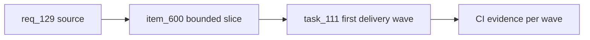

## item_600_appcontroller_decomposition_plan - AppController decomposition plan
> From version: 1.10.4
> Schema version: 1.0
> Status: Ready
> Understanding: 90%
> Confidence: 85%
> Progress: 0%
> Complexity: High
> Theme: Operator workflow and runtime integration
> Reminder: Update status/understanding/confidence/progress and linked request/task references when you edit this doc.

# Problem
Deliver the incremental AppController decomposition roadmap defined in `adr_009_app_controller_decomposition_plan`. The shell `src/app/AppController.tsx` and the largest controller hooks currently allow-listed in `quality:hooks-modularization` must shrink wave by wave.

# Scope
- In:
  - one coherent delivery slice from the source request
- Out:
  - unrelated sibling slices that should stay in separate backlog items instead of widening this doc

# Acceptance criteria
- AC1: The request states the bounded need for appcontroller decomposition plan.
- AC2: Scope boundaries and operator impact are explicit.
- AC3: The request is ready to be promoted into a backlog slice.

# AC Traceability
- request-AC1 -> This backlog slice. Proof: AC1: The request states the bounded need for appcontroller decomposition plan.
- request-AC2 -> This backlog slice. Proof: AC2: Scope boundaries and operator impact are explicit.
- request-AC3 -> This backlog slice. Proof: AC3: The request is ready to be promoted into a backlog slice.
- request-AC4 -> This backlog slice. Evidence needed: After Wave 4, the locked budget for `src/app/AppController.tsx` in `LOCKED_LINE_BUDGETS` is lowered to the new ceiling (rounded up to the next 50-line boundary).
- request-AC5 -> This backlog slice. Evidence needed: The dual-state invariant (`networkStates[activeNetworkId]` synchronized with root slices) remains covered by `store.reducer.sync-invariant.spec.ts` and continues to pass.

# Decision framing
- Product framing: Not needed
- Product signals: (none detected)
- Product follow-up: No product brief follow-up is expected based on current signals.
- Architecture framing: Not needed
- Architecture signals: (none detected)
- Architecture follow-up: No architecture decision follow-up is expected based on current signals.

# Links
- Product brief(s): (none yet)
- Architecture decision(s): (none yet)
- Request: `logics/request/req_129_app_controller_decomposition_plan.md`
- Primary task(s): (none yet)

# AI Context
- Summary: AppController decomposition plan
- Keywords: backlog-groom, request, appcontroller decomposition plan, bounded slice
- Use when: Use when implementing or reviewing the delivery slice for AppController decomposition plan.
- Skip when: Skip when the change is unrelated to this delivery slice or its linked request.

# Priority
- Impact:
- Urgency:

# Notes
- Hybrid rationale: Derived from request `req_129_app_controller_decomposition_plan` and kept bounded to one coherent delivery slice.
- Source file: `logics/request/req_129_app_controller_decomposition_plan.md`.
- Generated locally by logics-manager.

# Tasks
- `task_111_appcontroller_decomposition_plan`
