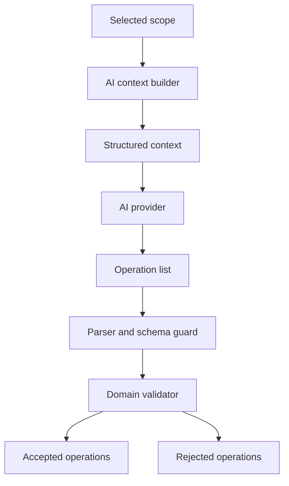

## item_601_ai_agent_context_builder_and_operation_contract - AI Agent Context Builder and Operation Contract
> From version: 1.10.3
> Schema version: 1.0
> Status: Draft
> Understanding: 97%
> Confidence: 90%
> Progress: 0%
> Complexity: High
> Theme: AI
> Reminder: Update status/understanding/confidence/progress and linked request/task references when you edit this doc.

# Problem
The AI Agent needs enough Modeling context to propose useful changes, but the app must not send or accept unbounded raw state.
A stable scoped context format and a validated operation vocabulary are required before assisted or direct execution can be safe.

# Scope
- In:
  - Build scoped AI context for current selection and active network.
  - Defer selected-harness mutation scope to V2 while reusing selected-harness agent JSON concepts later.
  - Define a V1 operation schema for safe add, move, update, and route regeneration.
  - Implement local operation parsing and validation boundaries.
  - Return structured validation results with accepted, rejected, and unsupported operations.
- Out:
  - Direct provider execution.
  - Full visual diff rendering.
  - Selected-harness and global all-harness mutation scope in V1.
  - Endpoint assignment, catalog assignment, and delete in the first operation vocabulary.
  - Raw store patching.

# Acceptance criteria
- AC1: The app can build structured AI context for current selection.
- AC2: The app can build structured AI context for active network.
- AC3: Selected-harness mutation scope is explicitly deferred to V2 and appears as unavailable or unsupported in V1.
- AC4: The V1 operation schema is versioned and documented.
- AC5: Operation parsing rejects malformed, unknown, or unsupported operation types.
- AC6: Validation rejects operations outside the selected scope.
- AC7: Validation rejects invalid entity IDs, route segments, coordinates, and unsupported V1 fields.
- AC8: Validation enforces permission gates for add, move, update, and route regeneration.
- AC9: Validation output separates accepted, rejected, unsupported, and warning states.
- AC10: Unit tests cover context scoping and operation validation without requiring a live AI provider.

# V1 operation vocabulary
Providers should receive a scoped editable plan JSON and return a full `modifiedPlan`.
The application derives the following operation vocabulary from the before/after diff, then validates permissions, scope, identity, and positions locally.

- `add_connector`: Create one connector in the active network with name, technical ID, cavity count, optional catalog item ID, and canvas position.
- `add_splice`: Create one splice in the active network with name, technical ID, port count or directional mode defaults, and canvas position.
- `add_node`: Create one routing node in the active network with name and canvas position.
- `add_segment`: Create one segment between existing nodes in the active network.
- `add_wire`: Create one wire with supported endpoint references only when both endpoints are already valid and unambiguous; otherwise reject with a validation message.
- `move_entity`: Move a connector, splice, node, or selected supported canvas entity to a validated coordinate.
- `place_entity_relative_to_entity`: Place a connector, splice, or node relative to another validated connector, splice, or node (`leftOf`, `rightOf`, `above`, `below`) for instructions that name both a target and an anchor.
- `update_entity`: Update safe scalar fields only: name, technical ID, wire section, material, color, protection, route lock, and display metadata.
- `regenerate_route`: Regenerate routes for selected wires or all active-network wires when route permission is enabled.

# Identity and Position Resolution
- The editable plan includes generated canvas positions when no persisted manual node position exists, so providers can reason over visible layout.
- Provider output should use exact internal IDs from the context when possible.
- Technical IDs are accepted as aliases for connectors, splices, and wires.
- Unique partial aliases may be resolved after removing generic words like `connector`; ambiguous aliases must be rejected.
- Relative placement and relative movement may use generated canvas layout positions when no persisted manual node position exists.

# Deferred operation vocabulary
- `assign_endpoint`: Deferred to V2 because connector cavity and splice port assignment can invalidate occupancy rules.
- `assign_catalog_reference`: Deferred to V2 because catalog material precedence needs richer preview.
- `delete_entity`: Deferred until assisted mode and rollback have proven stable; remains blocked unless explicitly reintroduced.
- `selected_harness_operation`: Deferred to V2 because selected harness means a saved multi-network harness assembly, not just the current network.

# AC Traceability
- request-AC5 -> backlog AC4, AC5, AC6, AC7, AC8, AC9.
- request-AC11 -> backlog AC5, AC6, AC7, AC8.
- request-AC12 -> backlog AC8.
- request-AC14 -> backlog AC9.
- request-AC15 -> backlog AC10.

# Decision framing
- Product framing: Covered by `prod_004_ai_agent_modeling_workspace`.
- Architecture framing: Covered by `adr_009_ai_agent_operation_contract_and_reversible_execution`.

# Links
- Product brief(s): `logics/product/prod_004_ai_agent_modeling_workspace.md`
- Architecture decision(s): `logics/architecture/adr_009_ai_agent_operation_contract_and_reversible_execution.md`
- Request: `logics/request/req_128_ai_agent_modeling_workspace.md`
<!-- When creating a task from this item, add: Derived from `logics/backlog/item_601_ai_agent_context_builder_and_operation_contract.md` in the task # Links section -->

# Priority
- Impact: High
- Urgency: High

# Dependencies
- Existing entity and graph domain model.
- Existing selected-harness agent JSON export for harness-scoped context.
- Existing dependency guards and validation rules.
- Existing routing and catalog resolution helpers.

# Risks
- Sending too much context can be expensive, slow, or expose unnecessary data.
- Sending too little context can cause low-quality operations.
- Operation schema churn can break provider prompts and tests if not versioned.
- Validation must stay aligned with manual Modeling behavior.
- Allowing wire creation in V1 may still be too broad if endpoint ambiguity is common; implementation can narrow `add_wire` to explicitly valid endpoints only.

# Validation plan
- Add pure unit tests for context builders.
- Add pure unit tests for operation schema parsing.
- Add validator tests for permission gates, invalid IDs, invalid coordinates, and out-of-scope operations.
- Run `npm run -s typecheck` and targeted test suites.

# AI Context
- Summary: Define scoped AI context and validated operation schema for AI-assisted Modeling changes.
- Keywords: AI context, operation schema, validation, scope, current selection, active network, selected harness deferred, provider output
- Use when: Implementing the shared foundation for assisted and experimental AI execution.
- Skip when: Work only targets provider settings UI.

# Tasks
- none
