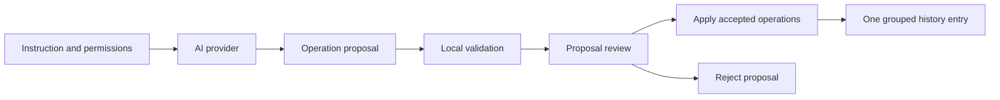

## item_602_modeling_ai_agent_assisted_proposal_workflow - Modeling AI Agent Assisted Proposal Workflow
> From version: 1.10.3
> Schema version: 1.0
> Status: Done
> Understanding: 97%
> Confidence: 96%
> Progress: 100%
> Complexity: High
> Theme: AI
> Reminder: Update status/understanding/confidence/progress and linked request/task references when you edit this doc.

# Problem
Users need a safe first AI workflow where the agent proposes Modeling changes, but nothing mutates until the user reviews and applies the proposal.
This assisted path is the default trust-building experience and the foundation for later direct execution.

# Scope
- In:
  - Add the `AI Agent` section inside Modeling.
  - Place the `AI Agent` entry beside the existing `Wires` Modeling entry.
  - Keep the entry visible but disabled when no valid provider is configured.
  - Let users choose action type, target scope, permissions, and instruction.
  - Run the configured provider in assisted mode.
  - Show proposal summary and operation details after local validation.
  - Let the user apply or reject the proposal.
  - Apply accepted operations as one grouped history transaction.
- Out:
  - Experimental direct execution.
  - Full canvas visual diff in V1.
  - Background autonomous suggestions.
  - Persistent cross-session AI memory.

# Acceptance criteria
- AC1: Modeling includes a visible `AI Agent` section.
- AC2: The `AI Agent` entry is placed beside the existing `Wires` Modeling entry.
- AC3: The `AI Agent` entry is visible but disabled when provider readiness is invalid, missing, or failed.
- AC4: Disabled entry feedback directs the user to Settings AI provider configuration.
- AC5: Assisted mode is selected by default.
- AC6: The user can enter an instruction and select a target scope.
- AC7: The user can review operation permissions before running the agent.
- AC8: Delete permission is disabled by default.
- AC9: Running the agent produces a proposal summary with operation counts by status and type.
- AC10: The proposal detail view lists accepted, rejected, warning, and unsupported operations, including rejected operation messages.
- AC11: Rejecting a proposal leaves modeling state unchanged.
- AC12: Applying a proposal mutates only accepted operations.
- AC13: Applying a proposal creates one grouped history transaction.
- AC14: Undo restores the pre-apply state in one action.
- AC15: UI tests cover disabled provider entry behavior, assisted run, review, reject, apply, and undo behavior with mocked provider output.

# AC Traceability
- request-AC2 -> backlog AC1.
- request-AC3 -> backlog AC2, AC3, and AC4.
- request-AC4 -> backlog AC5, AC6, and AC7.
- request-AC5 -> backlog AC5.
- request-AC7 -> backlog AC11 and AC12.
- request-AC8 -> backlog AC13 and AC14.
- request-AC13 -> backlog AC8.
- request-AC14 -> backlog AC9 and AC10.
- request-AC16 -> backlog AC15.

# Decision framing
- Product framing: Covered by `prod_004_ai_agent_modeling_workspace`.
- Architecture framing: Covered by `adr_009_ai_agent_operation_contract_and_reversible_execution`.

# Links
- Product brief(s): `logics/product/prod_004_ai_agent_modeling_workspace.md`
- Architecture decision(s): `logics/architecture/adr_009_ai_agent_operation_contract_and_reversible_execution.md`
- Request: `logics/request/req_128_ai_agent_modeling_workspace.md`
<!-- When creating a task from this item, add: Derived from `logics/backlog/item_602_modeling_ai_agent_assisted_proposal_workflow.md` in the task # Links section -->

# Priority
- Impact: High
- Urgency: High

# Dependencies
- `item_600_ai_provider_settings_and_capability_contract`.
- `item_601_ai_agent_context_builder_and_operation_contract`.
- Existing Modeling navigation and screen structure.
- Existing undo/redo history transaction behavior.

# Risks
- A chat-like UI would obscure the operational workflow.
- Proposal summaries must be specific enough that users trust apply/reject decisions.
- Applying accepted operations while hiding rejected ones could confuse users unless the result is explicit.
- Spatial instructions that name a target and anchor, such as moving SVC left of OBC, must be represented as validated relative placement rather than guessed free-form movement.
- Provider plan edits must still be diffed and validated locally before any assisted apply action mutates modeling state.

# Validation plan
- Add UI tests with mocked provider output.
- Add UI tests for the disabled `AI Agent` entry when provider readiness is invalid.
- Add plan-diff tests for provider `modifiedPlan` output.
- Add operation contract tests for rejected messages and relative placement operations.
- Add reducer/history tests for grouped transaction application.
- Run targeted Modeling UI tests, `npm run -s typecheck`, and `npm run -s lint`.

# Delivery Status
- Delivered in release `1.11.0`.
- Modeling exposes the `AI Agent` entry beside `Wires`, gated by provider readiness.
- Assisted mode prepares provider-backed or local fallback proposals, validates operations, exposes accepted/rejected/unsupported/warning details, and supports apply/reject.
- Applied proposals create a rollbackable AI session and use the existing history replacement path.
- Covered by `logics/tasks/task_112_ai_agent_modeling_workspace_release_validation.md`.
- Validation evidence: AI proposal, provider client, plan diff, operation contract, apply, settings UI, and home UI targeted tests plus lint/typecheck/build.

# AI Context
- Summary: Add the default assisted AI Agent workflow in Modeling, with proposal review and grouped undoable apply.
- Keywords: Modeling AI Agent, assisted mode, proposal, apply, reject, undo, operation summary
- Use when: Implementing user-facing AI proposal review.
- Skip when: Implementing experimental direct execution.

# Tasks
- `logics/tasks/task_112_ai_agent_modeling_workspace_release_validation.md`
