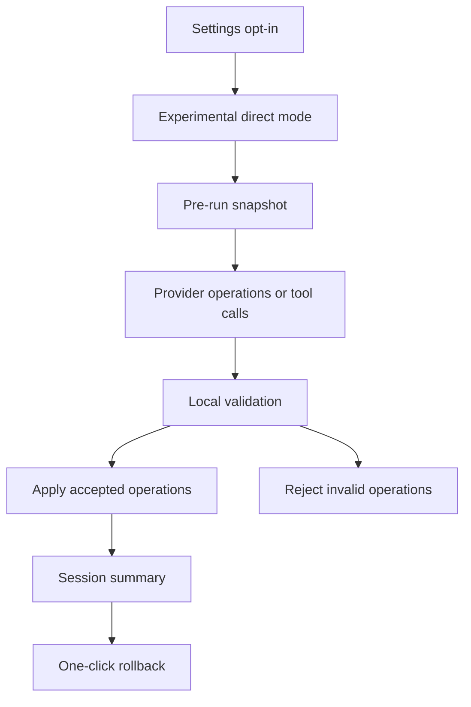

## item_603_ai_agent_experimental_direct_execution_and_rollback - AI Agent Experimental Direct Execution and Rollback
> From version: 1.10.3
> Schema version: 1.0
> Status: In progress
> Understanding: 99%
> Confidence: 91%
> Progress: 70%
> Complexity: High
> Theme: AI
> Reminder: Update status/understanding/confidence/progress and linked request/task references when you edit this doc.

> Maintenance edit: linked follow-up task created to satisfy Logics workflow health without changing product scope.
# Problem
Advanced users want an experimental mode where the AI Agent can apply validated changes directly.
Release 1.11.0 delivers the settings gate, UI affordance, shared local validator/executor path, pre-apply snapshot, and latest-session rollback.
True no-confirmation direct execution remains a follow-up so the first shipped mutation path stays reviewable.

# Scope
- In:
  - Gate direct execution behind the global AI settings opt-in.
  - Show direct execution as experimental in Modeling.
  - Create a pre-run snapshot before AI proposal application.
  - Execute only operations accepted by local validation.
  - Stop, skip, or reject invalid operations with visible result details.
  - Offer one-click rollback for the completed AI session.
  - Keep 1.11.0 mutation behind the same validated proposal/apply controls until direct execution semantics are finalized.
- Out:
  - Unbounded raw store mutation.
  - Deleting entities without explicit delete permission.
  - Autonomous background execution.
  - Provider tools that bypass local validation.

# Acceptance criteria
- AC1: Experimental direct mode is unavailable until the global AI settings opt-in is enabled.
- AC2: The UI clearly marks direct execution as experimental.
- AC3: A pre-run snapshot is created before any AI proposal application.
- AC4: Direct execution uses the same operation validator and executor as assisted mode.
- AC5: Invalid, unsupported, or out-of-permission operations are rejected without mutation.
- AC6: Delete operations remain blocked unless delete permission is explicitly enabled for the run.
- AC7: The session result summarizes applied, rejected, skipped, and failed operations.
- AC8: The user can roll back the whole applied AI session in one action.
- AC9: Rollback restores the exact pre-run modeling state.
- AC10: Tests cover opt-in gating, snapshot creation, rejected operations, delete gating, validated apply, and rollback.

# AC Traceability
- request-AC8 -> backlog AC1 and AC2.
- request-AC9 -> backlog AC1 and AC2.
- request-AC10 -> backlog AC3, AC4, and AC5.
- request-AC11 -> backlog AC8 and AC9.
- request-AC12 -> backlog AC4 and AC5.
- request-AC13 -> backlog AC6.
- request-AC14 -> backlog AC7.
- request-AC16 -> backlog AC10.
- request-AC1 -> This backlog slice. Evidence needed: Settings includes an AI configuration area with OpenAI and Gemini provider choices, editable model name, local-storage API key or endpoint configuration, timeout or strictness options, and a connection test.
- request-AC2 -> This backlog slice. Evidence needed: Modeling includes a visible `AI Agent` section.
- request-AC3 -> This backlog slice. Evidence needed: The `AI Agent` entry is placed beside the existing `Wires` Modeling entry and is disabled when provider readiness is invalid.
- request-AC4 -> This backlog slice. Evidence needed: The AI Agent section lets the user provide an instruction, choose a target scope, choose assisted or experimental mode, and review permissions.
- request-AC5 -> This backlog slice. Evidence needed: Assisted mode is the default mode.
- request-AC6 -> This backlog slice. Evidence needed: Assisted mode receives AI output as structured operations and validates those operations before user review.
- request-AC7 -> This backlog slice. Evidence needed: The user can apply or reject an assisted proposal.
- request-AC8 -> This backlog slice. Evidence needed: Applied assisted proposals are committed as one grouped history transaction.
- request-AC9 -> This backlog slice. Evidence needed: Experimental mode is disabled unless explicitly enabled in AI settings.
- request-AC10 -> This backlog slice. Evidence needed: Experimental-mode application creates a pre-run snapshot and applies only locally validated operations.
- request-AC11 -> This backlog slice. Evidence needed: A completed AI session can be rolled back in one user action.
- request-AC12 -> This backlog slice. Evidence needed: AI operations cannot bypass existing domain validation, dependency guards, or destructive-action permissions.
- request-AC13 -> This backlog slice. Evidence needed: Delete operations are blocked by default and require explicit permission.
- request-AC14 -> This backlog slice. Evidence needed: The result view summarizes added, moved, updated, deleted, routed, accepted, and rejected operations.
- request-AC15 -> This backlog slice. Evidence needed: Validation errors and rejected operations are exposed to the user with actionable context.
- request-AC16 -> This backlog slice. Evidence needed: Tests cover operation validation, assisted apply/reject, experimental rollback, delete permission gating, provider-readiness disabled entry behavior, and grouped undo behavior.
- request-AC1 -> This backlog slice. Proof: Historical delivery is recorded in the linked backlog/task report and validation sections; this corpus repair formalizes strict audit traceability without changing shipped scope. Source: `logics corpus strict audit repair`
- request-AC2 -> This backlog slice. Proof: Historical delivery is recorded in the linked backlog/task report and validation sections; this corpus repair formalizes strict audit traceability without changing shipped scope. Source: `logics corpus strict audit repair`
- request-AC3 -> This backlog slice. Proof: Historical delivery is recorded in the linked backlog/task report and validation sections; this corpus repair formalizes strict audit traceability without changing shipped scope. Source: `logics corpus strict audit repair`
- request-AC4 -> This backlog slice. Proof: Historical delivery is recorded in the linked backlog/task report and validation sections; this corpus repair formalizes strict audit traceability without changing shipped scope. Source: `logics corpus strict audit repair`
- request-AC5 -> This backlog slice. Proof: Historical delivery is recorded in the linked backlog/task report and validation sections; this corpus repair formalizes strict audit traceability without changing shipped scope. Source: `logics corpus strict audit repair`
- request-AC6 -> This backlog slice. Proof: Historical delivery is recorded in the linked backlog/task report and validation sections; this corpus repair formalizes strict audit traceability without changing shipped scope. Source: `logics corpus strict audit repair`
- request-AC7 -> This backlog slice. Proof: Historical delivery is recorded in the linked backlog/task report and validation sections; this corpus repair formalizes strict audit traceability without changing shipped scope. Source: `logics corpus strict audit repair`
- request-AC8 -> This backlog slice. Proof: Historical delivery is recorded in the linked backlog/task report and validation sections; this corpus repair formalizes strict audit traceability without changing shipped scope. Source: `logics corpus strict audit repair`
- request-AC9 -> This backlog slice. Proof: Historical delivery is recorded in the linked backlog/task report and validation sections; this corpus repair formalizes strict audit traceability without changing shipped scope. Source: `logics corpus strict audit repair`
- request-AC10 -> This backlog slice. Proof: Historical delivery is recorded in the linked backlog/task report and validation sections; this corpus repair formalizes strict audit traceability without changing shipped scope. Source: `logics corpus strict audit repair`
- request-AC11 -> This backlog slice. Proof: Historical delivery is recorded in the linked backlog/task report and validation sections; this corpus repair formalizes strict audit traceability without changing shipped scope. Source: `logics corpus strict audit repair`
- request-AC12 -> This backlog slice. Proof: Historical delivery is recorded in the linked backlog/task report and validation sections; this corpus repair formalizes strict audit traceability without changing shipped scope. Source: `logics corpus strict audit repair`
- request-AC13 -> This backlog slice. Proof: Historical delivery is recorded in the linked backlog/task report and validation sections; this corpus repair formalizes strict audit traceability without changing shipped scope. Source: `logics corpus strict audit repair`
- request-AC14 -> This backlog slice. Proof: Historical delivery is recorded in the linked backlog/task report and validation sections; this corpus repair formalizes strict audit traceability without changing shipped scope. Source: `logics corpus strict audit repair`
- request-AC15 -> This backlog slice. Proof: Historical delivery is recorded in the linked backlog/task report and validation sections; this corpus repair formalizes strict audit traceability without changing shipped scope. Source: `logics corpus strict audit repair`
- request-AC16 -> This backlog slice. Proof: Historical delivery is recorded in the linked backlog/task report and validation sections; this corpus repair formalizes strict audit traceability without changing shipped scope. Source: `logics corpus strict audit repair`

# Decision framing
- Product framing: Covered by `prod_004_ai_agent_modeling_workspace`.
- Architecture framing: Covered by `adr_009_ai_agent_operation_contract_and_reversible_execution`.

# Links
- Product brief(s): `logics/product/prod_004_ai_agent_modeling_workspace.md`
- Architecture decision(s): `logics/architecture/adr_009_ai_agent_operation_contract_and_reversible_execution.md`
- Request: `logics/request/req_139_ai_agent_true_direct_execution_follow_up.md`
<!-- When creating a task from this item, add: Derived from `logics/backlog/item_603_ai_agent_experimental_direct_execution_and_rollback.md` in the task # Links section -->

# Priority
- Impact: Medium
- Urgency: Medium

# Dependencies
- `item_600_ai_provider_settings_and_capability_contract`.
- `item_601_ai_agent_context_builder_and_operation_contract`.
- `item_602_modeling_ai_agent_assisted_proposal_workflow`.
- Existing undo/redo and persistence semantics.

# Risks
- Users may over-trust direct execution if warnings are not visible.
- Snapshot rollback must not conflict with unrelated user actions made after the AI session.
- Provider tool-call streaming could complicate transaction boundaries if introduced too early.

# Validation plan
- Add direct execution tests with mocked provider/tool output.
- Add rollback tests that compare pre-run and post-rollback state.
- Add destructive permission tests.
- Run targeted AI Agent and history tests, `npm run -s typecheck`, and `npm run -s lint`.

# Delivery Status
- Partially delivered in release `1.11.0`.
- Delivered: Settings opt-in, experimental mode UI gating, shared local validation/executor path, delete permission gating, impact summary, pre-apply snapshot, and latest-session rollback.
- Not delivered yet: true one-click direct execution that skips the assisted proposal apply step.
- Covered by `logics/tasks/task_112_ai_agent_modeling_workspace_release_validation.md`.
- Validation evidence: AI apply, operation contract, proposal, settings UI, lint, typecheck, build, and Logics lint.

# AI Context
- Summary: Add opt-in experimental AI mode affordance with validated apply, pre-run snapshots, and one-click rollback; true no-confirmation direct execution remains future work.
- Keywords: experimental AI mode, direct execution follow-up, snapshot, rollback, permissions, delete gate
- Use when: Implementing experimental AI mutation behavior after assisted mode exists.
- Skip when: Implementing provider settings or assisted proposal review.

# Tasks
- `logics/tasks/task_112_ai_agent_modeling_workspace_release_validation.md`
- `task_133_ai_agent_experimental_direct_execution_and_rollback`
