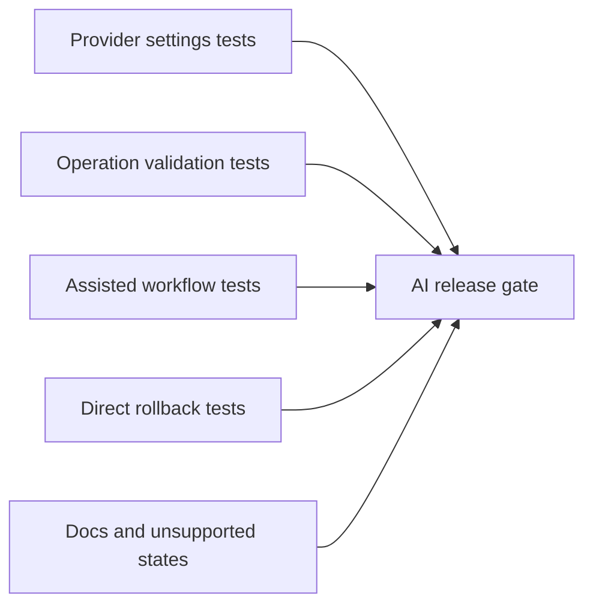

## item_604_ai_agent_validation_regression_and_release_gate - AI Agent Validation Regression and Release Gate
> From version: 1.10.3
> Schema version: 1.0
> Status: Done
> Understanding: 94%
> Confidence: 96%
> Progress: 100%
> Complexity: Medium
> Theme: AI
> Reminder: Update status/understanding/confidence/progress and linked request/task references when you edit this doc.

# Problem
AI-assisted mutation increases release risk because it touches settings, provider calls, Modeling UI, domain validation, history, and rollback.
The feature needs explicit regression coverage and release gates before it can ship.

# Scope
- In:
  - Define the AI Agent validation matrix.
  - Add tests for provider settings and readiness states.
  - Add tests for context building and operation validation.
  - Add UI tests for assisted proposal review and grouped undo.
  - Add tests for experimental mode gating and latest-session rollback.
  - Add documentation for unsupported provider or disabled AI states.
- Out:
  - Replacing the full CI pipeline.
  - Live provider integration tests in blocking CI.
  - Performance benchmarking beyond basic context-size and timeout guardrails.

# Acceptance criteria
- AC1: A validation matrix lists AI settings, context builder, operation validator, assisted workflow, experimental rollback, and release checks.
- AC2: Provider settings tests cover persisted config, readiness, failed connection, and experimental opt-in gating.
- AC3: Context builder tests cover selection, active network, selected harness, all networks, and missing scope.
- AC4: Operation validator tests cover malformed operations, invalid IDs, out-of-scope operations, permission gates, and delete blocking.
- AC5: Assisted workflow tests cover proposal summary, detail review, reject, apply, and single-action undo.
- AC6: Experimental-mode and rollback tests cover snapshot, valid operation application, rejected operations, delete gating, and rollback.
- AC7: Live provider calls are not required in blocking CI; mocked provider behavior is enough for deterministic regression coverage.
- AC8: Documentation explains disabled AI, missing provider, unsupported scope, failed validation, and rollback behavior.
- AC9: The final task for the AI Agent feature records validation evidence before closure.

# AC Traceability
- request-AC15 -> backlog AC1, AC2, AC3, AC4, AC5, AC6, AC7.
- request-AC14 -> backlog AC8.
- request-AC1 through request-AC14 -> backlog AC9.

# Decision framing
- Product framing: Covered by `prod_004_ai_agent_modeling_workspace`.
- Architecture framing: Covered by `adr_009_ai_agent_operation_contract_and_reversible_execution`.

# Links
- Product brief(s): `logics/product/prod_004_ai_agent_modeling_workspace.md`
- Architecture decision(s): `logics/architecture/adr_009_ai_agent_operation_contract_and_reversible_execution.md`
- Request: `logics/request/req_128_ai_agent_modeling_workspace.md`
<!-- When creating a task from this item, add: Derived from `logics/backlog/item_604_ai_agent_validation_regression_and_release_gate.md` in the task # Links section -->

# Priority
- Impact: High
- Urgency: Medium

# Dependencies
- AI provider settings, operation contract, assisted workflow, and experimental mode implementation slices.
- Existing Vitest, UI test, typecheck, lint, and CI gates.

# Risks
- Mocked providers can hide real provider formatting issues if parser tests are weak.
- Live provider tests would make CI flaky or secret-dependent if placed in blocking gates.
- Rollback regressions can be severe if not covered at state-comparison level.

# Validation plan
- Add deterministic mocked-provider tests.
- Add pure validator tests for every operation family shipped in V1.
- Run the relevant targeted suites plus `npm run -s typecheck`, `npm run -s lint`, and `npm run ci:blocking` before release closure.

# Delivery Status
- Delivered in release `1.11.0`.
- Validation evidence is recorded in `logics/tasks/task_112_ai_agent_modeling_workspace_release_validation.md`.
- Release gate evidence includes lint, typecheck, targeted AI/provider/settings/home tests, build, Logics lint, and a local live OpenAI smoke test with `.env.local`.
- Blocking CI does not require live provider calls or GitHub-hosted API keys.

# AI Context
- Summary: Define regression coverage and release gates for AI-assisted Modeling.
- Keywords: AI validation, regression, provider mock, operation validator, assisted workflow, rollback, release gate
- Use when: Closing implementation tasks or adding CI coverage for AI Agent behavior.
- Skip when: Drafting product scope only.

# Tasks
- `logics/tasks/task_112_ai_agent_modeling_workspace_release_validation.md`
