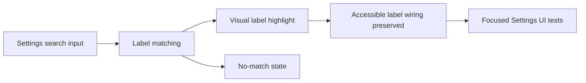

## item_605_settings_search_and_label_highlighting - Settings search and label highlighting
> From version: 1.11.0
> Schema version: 1.0
> Status: Ready
> Understanding: 90%
> Confidence: 85%
> Progress: 0%
> Complexity: Medium
> Theme: UI
> Reminder: Update status/understanding/confidence/progress and linked request/task references when you edit this doc.

# Problem
Users need a quick way to find Settings preferences by typing the word they remember, without first knowing which Settings card or section contains it. This slice adds the search entry point and visual label highlighting while preserving the existing Settings layout.

# Scope
- In:
  - Settings search input above the existing Settings content.
  - Case-insensitive matching against setting labels.
  - Highlighted matching substrings inside labels.
  - Empty-search and no-match states.
  - Accessibility preservation for label/control relationships.
  - Focused UI regression coverage for search, highlight, no-match, and label accessibility.
- Out:
  - Replacing the card-heavy Settings layout.
  - Left-side glossary / section navigation.
  - Match counts per section.
  - Fuzzy search, global command palettes, or cross-screen search.
  - Any change to existing Settings persistence semantics.

# Acceptance criteria
- AC1: A Settings search input is visible above the Settings content.
- AC2: Typing a query highlights matching text in setting labels case-insensitively.
- AC3: Highlighting preserves accessible names and does not break label/control association.
- AC4: Empty search restores the normal Settings display.
- AC5: A no-match search shows a clear empty-results signal without changing persisted settings.
- AC6: Existing Settings cards and controls remain visible and usable while search is active.
- AC7: Tests cover search matching, highlight rendering, no-match behavior, clear-search restoration, and at least one accessibility assertion for label/control wiring.

# AC Traceability
- request-AC1 -> This backlog slice. Proof: AC1: A Settings search input is visible above the Settings content.
- request-AC2 -> This backlog slice. Proof: AC2: Typing a query highlights matching text in setting labels case-insensitively.
- request-AC3 -> This backlog slice. Proof: AC3: Highlighting preserves accessible names and does not break label/control association.
- request-AC4 -> This backlog slice. Proof: AC4: Empty search restores the normal Settings display.
- request-AC5 -> This backlog slice. Proof: AC5: A no-match search shows a clear empty-results signal without changing persisted settings.
- request-AC10 -> This backlog slice. Proof: Covers the search/highlight and label accessibility portion of request AC10.

# Decision framing
- Product framing: Not needed
- Product signals: (none detected)
- Product follow-up: No product brief follow-up is expected based on current signals.
- Architecture framing: Not needed
- Architecture signals: (none detected)
- Architecture follow-up: No architecture decision follow-up is expected based on current signals.

# Links
- Product brief(s): (none yet)
- Architecture decision(s): (none yet)
- Request: `logics/request/req_131_settings_search_and_sectioned_navigation.md`
- Primary task(s): (none yet)

# AI Context
- Summary: Settings search and label highlighting
- Keywords: backlog-groom, request, settings search and label highlighting, bounded slice
- Use when: Use when implementing or reviewing the delivery slice for Settings search and label highlighting.
- Skip when: Skip when the change is unrelated to this delivery slice or its linked request.

# Priority
- Impact: Medium-high; improves Settings discoverability without a disruptive layout migration.
- Urgency: Medium; useful as a low-risk first step before the full Settings layout refactor.

# Notes
- Hybrid rationale: First delivery slice from `req_131_settings_search_and_sectioned_navigation`, intentionally scoped to search/highlight before the larger layout refactor.
- Source file: `logics/request/req_131_settings_search_and_sectioned_navigation.md`.
- Generated locally by logics-manager.

# Tasks
- `task_113_settings_search_and_label_highlighting`
