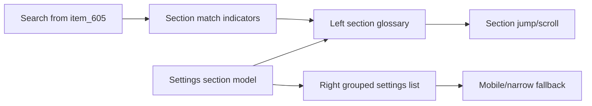

## item_606_settings_section_glossary_and_grouped_preferences_layout - Settings section glossary and grouped preferences layout
> From version: 1.11.0
> Schema version: 1.0
> Status: Done
> Understanding: 91%
> Confidence: 86%
> Progress: 100%
> Complexity: Medium
> Theme: UI
> Reminder: Update status/understanding/confidence/progress and linked request/task references when you edit this doc.

# Problem
The Settings workspace has grown into a dense surface of unrelated preference domains. Users need a clearer information architecture: a left-side section glossary for navigation and a right-side grouped preferences list that is easier to scan than the current card-heavy layout.

# Scope
- In:
  - Desktop/tablet two-column Settings layout with section glossary on the left and grouped settings on the right.
  - Stable section names and anchors for existing Settings domains.
  - Section jump/scroll behavior from the glossary.
  - Responsive narrow/mobile behavior that keeps every setting reachable.
  - Search integration from `item_605`: sections with matches are indicated while label highlights remain visible.
  - Regression coverage for section navigation, responsive layout, and search-section interaction.
- Out:
  - Introducing new Settings preferences.
  - Changing existing Settings persistence semantics.
  - Global app-wide search or command palette behavior.
  - Fuzzy search or advanced ranking beyond the search behavior delivered in `item_605`.
  - Removing existing Settings controls.

# Acceptance criteria
- AC1: Settings are organized into named sections that can be navigated from a left-side glossary on desktop layouts.
- AC2: Selecting a glossary section scrolls or jumps to the corresponding settings group.
- AC3: The right-side settings area presents grouped settings in a scannable list without nested decorative cards.
- AC4: In search mode, the glossary indicates which sections contain matches.
- AC5: Matching labels remain highlighted after jumping to a section.
- AC6: The layout remains usable on narrow/mobile viewports without overlapping controls or hiding required settings.
- AC7: Existing Settings controls preserve their behavior and persisted values after the layout migration.
- AC8: Tests cover section navigation, grouped rendering, search-section match indicators, responsive/narrow behavior, and at least one existing Settings workflow after migration.

# AC Traceability
- request-AC6 -> This backlog slice. Proof: AC1: Settings are organized into named sections that can be navigated from a left-side glossary on desktop layouts.
- request-AC7 -> This backlog slice. Proof: AC2: Selecting a glossary section scrolls or jumps to the corresponding settings group.
- request-AC8 -> This backlog slice. Proof: AC4: In search mode, the glossary indicates which sections contain matches.
- request-AC9 -> This backlog slice. Proof: AC6: The layout remains usable on narrow/mobile viewports without overlapping controls or hiding required settings.
- request-AC10 -> This backlog slice. Proof: Covers section navigation, search-section integration, responsive behavior, and migrated Settings workflow coverage.

# Decision framing
- Product framing: Not needed
- Product signals: (none detected)
- Product follow-up: No product brief follow-up is expected based on current signals.
- Architecture framing: Not needed
- Architecture signals: (none detected)
- Architecture follow-up: No architecture decision follow-up is expected based on current signals.

# Links
- Product brief(s): (none yet)
- Architecture decision(s): (none yet)
- Request: `logics/request/req_131_settings_search_and_sectioned_navigation.md`
- Primary task(s): `task_114_settings_section_glossary_and_grouped_preferences_layout`

# AI Context
- Summary: Settings section glossary and grouped preferences layout
- Keywords: backlog-groom, request, settings section glossary and grouped preferences layout, bounded slice
- Use when: Use when implementing or reviewing the delivery slice for Settings section glossary and grouped preferences layout.
- Skip when: Skip when the change is unrelated to this delivery slice or its linked request.

# Priority
- Impact: High; improves repeated Settings navigation and makes the growing preferences surface easier to scan.
- Urgency: Medium; should follow the lower-risk search/highlight slice so search semantics can be reused in the new layout.

# Notes
- Hybrid rationale: Second delivery slice from `req_131_settings_search_and_sectioned_navigation`, scoped to the Settings information architecture and layout migration after search/highlight exists.
- Source file: `logics/request/req_131_settings_search_and_sectioned_navigation.md`.
- Generated locally by logics-manager.
- Task `task_114_settings_section_glossary_and_grouped_preferences_layout` was finished via `logics-manager flow finish task` on 2026-05-30.
- Post-finish polish on 2026-05-30 aligned new search/section UI with theme colors, constrained the right-side grouped list to one column, offset the sticky section rail below the header, and added active-section feedback in the rail.

# Tasks
- `task_114_settings_section_glossary_and_grouped_preferences_layout`
