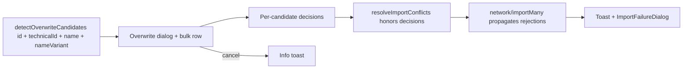

## item_607_network_import_conflict_resolution_and_feedback - Network import conflict resolution and explicit feedback

> From version: 1.12.5
> Schema version: 1.0
> Status: Done
> Understanding: 90%
> Confidence: 85%
> Progress: 100%
> Complexity: Medium
> Theme: Import/Export
> Reminder: Update status/understanding/confidence/progress and linked request/task references when you edit this doc.

# Problem
The network import flow currently lets identity collisions slip through silently. A raw `id` collision is auto-renamed with a `-import` suffix without any prompt, and reducer-level rejections (empty name, payload incomplete, `ID already exists`, `technical ID already exists`) drop entries without telling the user. The only reliable way to overwrite an existing network is to delete it first, which breaks intra-workspace references. Users need a single import flow that detects every collision, asks for an explicit decision, and always surfaces an actionable reason when the import fails.

# Scope
- In:
  - Extend `detectOverwriteCandidates` with raw `id` matching (`matchReason = "id"`).
  - Surface every collision in the overwrite dialog with three per-candidate options (Overwrite existing / Skip / Keep both — rename incoming) and an **Apply to all remaining** bulk row.
  - Replace the silent `-import` / `-IMP` rename path by an explicit user choice on the dialog.
  - Make **Overwrite existing** reuse the existing network's `id` so intra-workspace references survive the replacement.
  - Propagate reducer-level per-network rejection reasons from `network/importMany` back to the controller hook (returned value or accompanying log).
  - Tighten the toast + `ImportFailureDialog` contract so that every terminal outcome (parse error, schema error, resolved-zero, partial, success, reducer rejection, cancellation) is announced.
  - Cover the new behavior with adapter, hook, reducer, and UI dialog tests.
- Out:
  - Persistence schema or `schemaVersion` migrations.
  - Multi-file or remote import.
  - Sub-network merge semantics.
  - AI Agent workflows.
  - Release versioning, changelog, or Logics workflow tooling.

# Acceptance criteria
- AC1: `detectOverwriteCandidates` returns a candidate with `matchReason = "id"` when an imported network's `id` matches an existing network's `id`.
- AC2: Existing `technicalId` / `name` / `nameVariant` match reasons still produce candidates with the corresponding `matchReason`.
- AC3: The overwrite dialog lists every candidate with three per-candidate options (Overwrite existing / Skip / Keep both), all available regardless of match reason, with **Overwrite existing** highlighted by default.
- AC4: The dialog exposes a bulk **Apply to all remaining** row offering the same three actions; per-candidate choices made after the bulk action override it for that candidate only.
- AC5: Choosing **Overwrite existing** reuses the existing network's `id` when the resolver upserts the incoming network, so intra-workspace references (harness assemblies, master connector refs, connector links) still resolve after import.
- AC6: Choosing **Skip** leaves the existing network untouched and lists the candidate in `summary.skippedNetworkIds`.
- AC7: Choosing **Keep both (rename incoming)** inserts the incoming network with the existing `-import` / `-IMP` suffix scheme and lists the rename in `summary.warnings`. The resolver no longer renames silently when the user has not made this choice.
- AC8: Cancelling the dialog clears the file input, leaves state unchanged, and emits an `info` toast "Import cancelled".
- AC9: File read, parse, schema-version, and resolved-zero failures emit an `error` toast and open the `ImportFailureDialog` with the reason list.
- AC10: Partial imports emit a `warning` toast with the existing `{imported}/{skipped}/{warnings}/{errors}` summary; clean successes emit a `success` toast with the imported count.
- AC11: `network/importMany` rejections are surfaced through a `warning` toast announcing the rejected count and through the `ImportFailureDialog` listing each rejected network's identity and reducer-side reason. No rejection is silent.
- AC12: Tests cover the `id` match reason, the three dialog options, the bulk row, the rename-only-on-explicit-choice behavior, the cancel-toast, and the reducer-rejection surfacing.

# AC Traceability
- request-AC1 -> This backlog slice. Proof: AC1 (id match reason).
- request-AC2 -> This backlog slice. Proof: AC2 (technicalId match preserved).
- request-AC3 -> This backlog slice. Proof: AC2 (name match preserved).
- request-AC4 -> This backlog slice. Proof: AC2 (nameVariant match preserved).
- request-AC5 -> This backlog slice. Proof: AC3 (three options per candidate, all reasons).
- request-AC6 -> This backlog slice. Proof: AC4 (bulk apply row with override).
- request-AC7 -> This backlog slice. Proof: AC5 (existing id reused on overwrite).
- request-AC8 -> This backlog slice. Proof: AC6 (skip semantics).
- request-AC9 -> This backlog slice. Proof: AC7 (rename only on explicit choice).
- request-AC10 -> This backlog slice. Proof: AC8 (cancel toast).
- request-AC11 -> This backlog slice. Proof: AC9 (read/parse/schema/zero-resolved feedback).
- request-AC12 -> This backlog slice. Proof: AC9 (resolved-zero failure dialog).
- request-AC13 -> This backlog slice. Proof: AC10 (partial summary toast).
- request-AC14 -> This backlog slice. Proof: AC10 (success toast).
- request-AC15 -> This backlog slice. Proof: AC11 (reducer rejection surfacing).
- request-AC16 -> This backlog slice. Proof: AC12 (test coverage).

# Decision framing
- Product framing: Captured in `docs/network-import-conflict-product-brief.md`.
- Product signals: explicit user choice over silent rename; bulk row UX shortcut; toast + failure-dialog parity for every outcome.
- Product follow-up: No further brief expected unless follow-up UX testing requires sub-network merge or per-entity overrides.
- Architecture framing: Lightweight. Two architectural points:
  - `network/importMany` must return or accompany per-network rejection metadata so the controller hook can render it. Pick the minimally invasive shape (returned descriptor from `dispatchAction` or a sibling `lastImportRejections` selector slice).
  - The resolver must accept a third decision value (`overwrite` / `skip` / `keep-both`) instead of the current binary `overwriteMap`. Choose a typed `ImportDecision` map with discriminated union.
- Architecture follow-up: No formal ADR expected; capture the chosen shape in the task implementation plan.

# Links
- Product brief(s): `docs/network-import-conflict-product-brief.md`
- Architecture decision(s): (none yet)
- Request: `logics/request/req_132_network_import_conflict_resolution_and_feedback.md`
- Primary task(s): `task_115_network_import_conflict_resolution_and_feedback`

# AI Context
- Summary: Single-slice delivery for the network-import overwrite regression and feedback tightening.
- Keywords: backlog-groom, request, network import overwrite, id collision, technical id, dialog, toast, failure dialog, reducer rejection, summary, bulk apply
- Use when: Implementing or reviewing changes to the network-import overwrite dialog, conflict detection, resolver, or feedback surfaces.
- Skip when: The change targets export-only flows, AI Agent operations, or schema migration.

# Priority
- Impact: High; current behavior forces a destructive workaround (delete target before re-import) and breaks intra-workspace references.
- Urgency: High; the regression hides every import collision behind a generic success toast and erodes user trust in import.

# Notes
- Source file: `logics/request/req_132_network_import_conflict_resolution_and_feedback.md`.
- Built on top of `item_027_import_conflict_resolution_and_id_deduplication` (foundation).
- Created by hand because `logics-manager` is not installed in the current environment; regenerate signatures with `python3 -m logics_manager lint --require-status` before commit when the tool becomes available.
- Task `task_115_network_import_conflict_resolution_and_feedback` was finished via `logics-manager flow finish task` on 2026-06-02.

# Tasks
- `task_115_network_import_conflict_resolution_and_feedback`
