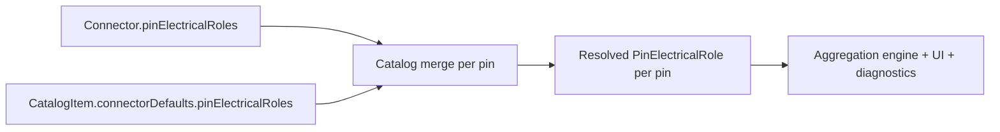

## item_608_pin_electrical_role_data_model_and_catalog_defaults - Pin electrical role data model and catalog defaults

> From version: 1.13.1
> Schema version: 1.0
> Status: Ready
> Understanding: 80%
> Confidence: 80%
> Progress: 0%
> Complexity: Medium
> Theme: Electrical analysis / Diagnostics
> Reminder: Update status/understanding/confidence/progress and linked request/task references when you edit this doc.

# Problem
The app has no representation of which pin of a connector emits versus absorbs current, nor of the expected continuous current value at the pin. Every downstream diagnostic (wire section, fuse rating, supply vs. output balance) depends on this missing primitive. The data model must land first, with catalog defaults so a single calculator definition seeds N connector instances, while staying fully optional so existing networks keep working unchanged.

# Scope
- In:
  - Add optional `Connector.pinElectricalRoles: Record<cavityIndex, PinElectricalRole>`.
  - `PinElectricalRole` fields: `role` (`source` / `consumer` / `passive` / `bidirectional`, default `passive`), `currentA?` (non-negative max continuous), `label?`, `notes?`. No mode / duty / peak fields.
  - Add optional `CatalogItem.connectorDefaults.pinElectricalRoles` and the per-pin merge logic where the per-connector override wins.
  - Persistence: store/reducer hydration, additive schema, no migration step, no `schemaVersion` bump.
  - Export/import: round-trip the new fields through the existing network-file format without format-version change.
  - Unit tests for normalization, merge precedence, hydration, and round-trip.
- Out:
  - Aggregation engine and propagation (`item_610`).
  - Validation diagnostics (`item_611`).
  - Editing UI (`item_612`).
  - Multi-network propagation (`item_614`).
  - Functional schematic overlay (`item_613`).
  - AI Agent integration.
  - Release versioning, changelog, or Logics workflow tooling.

# Acceptance criteria
- AC1: `Connector.pinElectricalRoles` is an optional field; a connector loaded without it round-trips without mutation through save/load and export/import.
- AC2: A `PinElectricalRole` accepts `role`, optional non-negative `currentA`, optional `label`, optional `notes`. Default role on a missing entry is `passive`.
- AC3: Negative or non-finite `currentA` values are rejected at normalization with a typed error; the entry is dropped from persistence.
- AC4: `CatalogItem.connectorDefaults.pinElectricalRoles` is hydrated and round-tripped identically.
- AC5: Per-pin merge precedence — for every cavity index, the per-connector entry wins; absent fields fall back to the catalog default; absent on both sides resolves to `{ role: "passive" }`.
- AC6: Importing a payload with `pinElectricalRoles` declared but the connector's `cavityCount` lower than the highest cavity index produces a normalized payload with the out-of-range entries dropped and a warning surfaced through the existing import warning channel.
- AC7: Tests cover normalization (valid, negative, NaN, out-of-range), merge precedence (override wins, catalog falls back, both absent), hydration, persistence round-trip, and import warning for out-of-range entries.

# AC Traceability
- request-AC1 -> This backlog slice. Proof: AC2 (role + currentA + label + notes; default passive).
- request-AC2 -> This backlog slice. Proof: AC4, AC5 (catalog defaults seed, per-connector override wins).
- request-AC3 -> This backlog slice. Proof: AC1 (no-op load when absent).

# Decision framing
- Product framing: Captured in `docs/pin-level-source-consumer-currents-product-brief.md` (Pin electrical role model section).
- Product signals: Optional fields, default `passive`, no mode/duty/peak fields. Static role per pin.
- Architecture framing:
  - Pure data-model change. No new module yet — types live in `src/core/entities.ts`, normalization helper next to `wireSizing.ts` (`pinElectricalRole.ts` or extension of an existing helper file).
  - Merge logic exposed as a pure function `resolvePinElectricalRole(connector, catalogItem, cavityIndex)` consumed by all downstream slices.
  - Persistence: piggyback on the existing additive-field policy used by recent connector fields (`fusePairRatings`, `cableCalloutPosition`).
- Architecture follow-up: No ADR required; capture the chosen helper location in the task implementation plan.

# Links
- Product brief(s): `docs/pin-level-source-consumer-currents-product-brief.md`
- Architecture decision(s): (none)
- Request: `logics/request/req_133_pin_level_source_consumer_currents_and_harness_dimensioning_diagnostics.md`
- Primary task(s): `task_116_pin_electrical_role_data_model_and_catalog_defaults`

# AI Context
- Summary: Foundation slice — adds the pin electrical role types, catalog defaults, normalization, and merge logic. No diagnostics, no UI, no propagation yet.
- Keywords: pin role, source, consumer, passive, bidirectional, currentA, catalog defaults, merge, normalization, persistence, additive schema
- Use when: Implementing or reviewing the pin-role data model, hydration, or catalog merge logic.
- Skip when: The change targets aggregation, diagnostics, UI surfaces, or multi-network propagation.

# Priority
- Impact: High; every other slice depends on it.
- Urgency: High; blocking for the rest of the release.

# Notes
- Created by hand; regenerate signatures with `python3 -m logics_manager lint --require-status` before commit when the tool becomes available.

# Tasks
- `task_116_pin_electrical_role_data_model_and_catalog_defaults`
