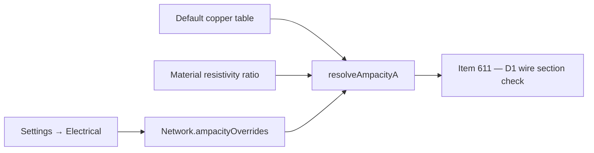

## item_609_automotive_ampacity_reference_table_and_project_override - Automotive ampacity reference table and per-project override

> From version: 1.13.1
> Schema version: 1.0
> Status: Done
> Understanding: 100%
> Confidence: 96%
> Progress: 100%
> Complexity: Small
> Theme: Electrical analysis / Diagnostics
> Reminder: Update status/understanding/confidence/progress and linked request/task references when you edit this doc.

# Problem
`wireSizing.ts` exposes section / material primitives but no ampacity table. D1 (wire section vs. carried current) needs a deterministic table to compare against. The release ships an automotive-copper reference (ISO 6722-style, single conductor, 85 °C ambient) and lets a project override the values without affecting other projects.

# Scope
- In:
  - Ship a default copper ampacity table keyed by `STANDARD_WIRE_SECTION_MM2_VALUES`: `0.5 → 11`, `0.75 → 15`, `1 → 19`, `1.5 → 24`, `2.5 → 32`, `4 → 42`, `6 → 54`, `10 → 73`, `16 → 98`, `25 → 129`, `35 → 158`, `50 → 198`, `70 → 245`, `95 → 292`, `120 → 344`.
  - Aluminum: derive from copper via the existing `MATERIAL_RESISTIVITY_OHM_MM2_PER_M` ratio in `wireSizing.ts`.
  - Add `Network.ampacityOverrides?: Record<sectionMm2, number>` (per-material map optional, copper default) for per-project overrides.
  - New helper `resolveAmpacityA(sectionMm2, material, network)` returning the resolved ampacity in Amps.
  - Settings → Electrical: editable table reflecting current resolved values, with reset-to-defaults and per-row reset.
  - Persistence: additive, no migration.
  - Unit tests for default table, aluminum derivation, override precedence, reset.
- Out:
  - Bundling derating (follow-up).
  - Voltage-drop changes beyond what `wireSizing.ts` already supports.
  - D1 issue emission (`item_611`).
  - UI for setting `Wire.material` or `sectionMm2` (already present).

# Acceptance criteria
- AC1: `resolveAmpacityA(0.5, "copper", network)` returns 11 with no overrides set.
- AC2: `resolveAmpacityA(0.5, "aluminum", network)` returns the copper value scaled by the resistivity ratio (rounded to one decimal).
- AC3: Setting `network.ampacityOverrides[2.5] = 28` makes `resolveAmpacityA(2.5, "copper", network)` return 28; clearing the override restores 32.
- AC4: A negative or non-finite override value is rejected at normalization and never persisted.
- AC5: Settings → Electrical exposes the resolved table (defaults + overrides), with "Reset row" per row and "Reset all" for the whole table.
- AC6: Override values persist across reloads and round-trip through network export/import without `schemaVersion` change.
- AC7: A network without overrides loads with the shipped defaults and emits no warning.
- AC8: Tests cover the default table, aluminum derivation, override precedence, rejection of invalid values, reset actions, and persistence round-trip.

# AC Traceability
- request-AC24 -> This backlog slice. Proof: AC3, AC5, AC6 (override + Settings UI + persistence).
- request-AC9 -> This backlog slice. Evidence needed: A branch with at least one `consumer` pin and no `source` pin emits a single D4 `info` per branch entry; never an `error`.
- request-AC10 -> This backlog slice. Evidence needed: Two `source` pins facing each other on the same branch emit a single D4 `warning`; the network still saves, exports, and renders.
- request-AC11 -> This backlog slice. Evidence needed: The validation center groups all new issues under the **Electrical dimensioning** category. Disabling the category hides every D-issue.
- request-AC12 -> This backlog slice. Evidence needed: The validation center, the connector inspector, the BOM, and the functional schematic overlay all use `scope = "currentNetwork"`. Inter-network bridges are not traversed and a linked consumer in another network contributes nothing to D1/D2/D3/D4.
- request-AC13 -> This backlog slice. Evidence needed: The functional schematic overlay prints declared pin currents and propagated wire currents and is **on by default** once the feature ships. A canvas toggle can disable it.
- request-AC14 -> This backlog slice. Evidence needed: The 2D modeling canvas is unchanged by this release.
- request-AC15 -> This backlog slice. Evidence needed: Bulk "Apply role X to selected pins" on the connector inspector and on the cross-connector mass edit view updates only the selected pins and records a single history entry per bulk operation.
- request-AC16 -> This backlog slice. Evidence needed: The cross-connector mass edit view lists every pin of every connector of the current network with editable role / currentA / label, supports filtering by role and by declared / not declared / over-loaded, and supports CSV-style paste of a `(connector, pin, role, currentA, label)` block.
- request-AC17 -> This backlog slice. Evidence needed: The multi-network functional analysis view lets the user pick a single network or several networks of the active `HarnessAssembly`. The view runs aggregation in `assembly` scope on the selected union, renders inter-network bridges explicitly, and lists D1–D4 + L1 findings for the selected scope.
- request-AC18 -> This backlog slice. Evidence needed: With two networks A and B in the active assembly, linked by an `InterHarnessConnectorLink` between `CA.pin3` and `CB.pin1`, a `consumer` declared on `CB.pin1` at 8 A is folded into the branch aggregate of A in the multi-network view and used by its D1 and D2 on the A-side wire reaching `CA.pin3`.
- request-AC19 -> This backlog slice. Evidence needed: A master connector referenced by two member networks of the same `HarnessAssembly` behaves as a bridge in the multi-network view with the same semantics as `InterHarnessConnectorLink`.
- request-AC20 -> This backlog slice. Evidence needed: In the multi-network view, a branch fed by a `source` in A and consumed in B through a bridge does not emit a D4 issue.
- request-AC21 -> This backlog slice. Evidence needed: Networks outside the active `HarnessAssembly` are never aggregated by the multi-network view, even if they declare a link. When the user picks "single network" or when no assembly is active, the view aggregates only the chosen network.
- request-AC22 -> This backlog slice. Evidence needed: A loop in the linked-networks graph does not crash the multi-network view; the engine emits a single `warning` "Inter-network aggregation did not converge" with the loop participants listed.
- request-AC23 -> This backlog slice. Evidence needed: L1 — two pins of the same `InterHarnessConnectorLink` declaring incompatible roles or currents (e.g. `source 10 A` ↔ `source 8 A`, `source` ↔ `source`, or `source 10 A` ↔ `consumer 8 A`) emit a single L1 `warning` in the multi-network view. Aggregation continues by taking the maximum declared `currentA` for cable / fuse checks.
- request-AC25 -> This backlog slice. Evidence needed: The release ships with no AI Agent integration. No new agent permission, no new agent context section, no new agent operation. Future agent integration is explicitly deferred.
- request-AC26 -> This backlog slice. Evidence needed: Test coverage adds: pin-role normalization unit tests, aggregation engine unit tests for both scopes (linear chain, splice fan-out, fuse-box pair, ECU asymmetric device, two-network link, three-network harness assembly, loop), D1–D4 issue emission tests, L1 mismatch test, multi-network view component tests, cross-connector mass edit view test (including CSV paste), schematic overlay snapshot test (on by default), and ampacity-override persistence test.

# Decision framing
- Product framing: Captured in `docs/pin-level-source-consumer-currents-product-brief.md` (Current model section).
- Product signals: Default table shipped, project-level override, no per-wire override.
- Architecture framing: Pure data + a helper. Table lives next to `wireSizing.ts` (or as a sibling `wireAmpacity.ts`). Settings UI follows the existing Settings → Electrical patterns.
- Architecture follow-up: No ADR required.

# Links
- Product brief(s): `docs/pin-level-source-consumer-currents-product-brief.md`
- Architecture decision(s): (none)
- Request: `logics/request/req_133_pin_level_source_consumer_currents_and_harness_dimensioning_diagnostics.md`
- Primary task(s): `task_117_automotive_ampacity_reference_table_and_project_override`

# Delivery Status
- Delivered in 1.14.0 through `task_117_automotive_ampacity_reference_table_and_project_override`.
- Implementation evidence: `src/core/wireAmpacity.ts`, `Network.ampacityOverrides`, and Settings -> Electrical support the default table, aluminum derivation, project overrides, and reset actions.
- Validation evidence: `src/tests/core.wire-ampacity.spec.ts`; recorded in `changelogs/CHANGELOGS_1_14_0.md` under `item_609` / `task_117`.

# AI Context
- Summary: Ships the automotive copper ampacity table, aluminum derivation, and per-project override in Settings → Electrical.
- Keywords: ampacity, ISO 6722, copper, aluminum, resistivity, override, settings, wireSizing
- Use when: Implementing or reviewing ampacity-related code or the Settings → Electrical table.
- Skip when: The change targets pin roles, aggregation, or validation surfaces.

# Priority
- Impact: High; blocking for D1 emission.
- Urgency: Medium; can be implemented in parallel with `item_608`.

# Notes
- Created by hand; regenerate signatures with `python3 -m logics_manager lint --require-status` before commit when the tool becomes available.

# Tasks
- `task_117_automotive_ampacity_reference_table_and_project_override`
