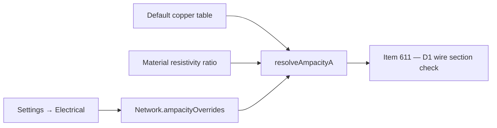

## item_609_automotive_ampacity_reference_table_and_project_override - Automotive ampacity reference table and per-project override

> From version: 1.13.1
> Schema version: 1.0
> Status: Ready
> Understanding: 80%
> Confidence: 80%
> Progress: 0%
> Complexity: Small
> Theme: Electrical analysis / Diagnostics
> Reminder: Update status/understanding/confidence/progress and linked request/task references when you edit this doc.

# Problem
`wireSizing.ts` exposes section / material primitives but no ampacity table. D1 (wire section vs. carried current) needs a deterministic table to compare against. The release ships an automotive-copper reference (ISO 6722-style, single conductor, 85 °C ambient) and lets a project override the values without affecting other projects.

# Scope
- In:
  - Ship a default copper ampacity table keyed by `STANDARD_WIRE_SECTION_MM2_VALUES`: `0.5 → 11`, `0.75 → 15`, `1 → 19`, `1.5 → 24`, `2.5 → 32`, `4 → 42`, `6 → 54`, `10 → 73`, `16 → 98`, `25 → 129`, `35 → 158`, `50 → 198`, `70 → 245`, `95 → 292`, `120 → 344`.
  - Aluminum: derive from copper via the existing `MATERIAL_RESISTIVITY_OHM_MM2_PER_M` ratio in `wireSizing.ts`.
  - Add `Network.ampacityOverrides?: Record<sectionMm2, number>` (per-material map optional, copper default) for per-project overrides.
  - New helper `resolveAmpacityA(sectionMm2, material, network)` returning the resolved ampacity in Amps.
  - Settings → Electrical: editable table reflecting current resolved values, with reset-to-defaults and per-row reset.
  - Persistence: additive, no migration.
  - Unit tests for default table, aluminum derivation, override precedence, reset.
- Out:
  - Bundling derating (follow-up).
  - Voltage-drop changes beyond what `wireSizing.ts` already supports.
  - D1 issue emission (`item_611`).
  - UI for setting `Wire.material` or `sectionMm2` (already present).

# Acceptance criteria
- AC1: `resolveAmpacityA(0.5, "copper", network)` returns 11 with no overrides set.
- AC2: `resolveAmpacityA(0.5, "aluminum", network)` returns the copper value scaled by the resistivity ratio (rounded to one decimal).
- AC3: Setting `network.ampacityOverrides[2.5] = 28` makes `resolveAmpacityA(2.5, "copper", network)` return 28; clearing the override restores 32.
- AC4: A negative or non-finite override value is rejected at normalization and never persisted.
- AC5: Settings → Electrical exposes the resolved table (defaults + overrides), with "Reset row" per row and "Reset all" for the whole table.
- AC6: Override values persist across reloads and round-trip through network export/import without `schemaVersion` change.
- AC7: A network without overrides loads with the shipped defaults and emits no warning.
- AC8: Tests cover the default table, aluminum derivation, override precedence, rejection of invalid values, reset actions, and persistence round-trip.

# AC Traceability
- request-AC24 -> This backlog slice. Proof: AC3, AC5, AC6 (override + Settings UI + persistence).

# Decision framing
- Product framing: Captured in `docs/pin-level-source-consumer-currents-product-brief.md` (Current model section).
- Product signals: Default table shipped, project-level override, no per-wire override.
- Architecture framing: Pure data + a helper. Table lives next to `wireSizing.ts` (or as a sibling `wireAmpacity.ts`). Settings UI follows the existing Settings → Electrical patterns.
- Architecture follow-up: No ADR required.

# Links
- Product brief(s): `docs/pin-level-source-consumer-currents-product-brief.md`
- Architecture decision(s): (none)
- Request: `logics/request/req_133_pin_level_source_consumer_currents_and_harness_dimensioning_diagnostics.md`
- Primary task(s): TBD on promotion

# AI Context
- Summary: Ships the automotive copper ampacity table, aluminum derivation, and per-project override in Settings → Electrical.
- Keywords: ampacity, ISO 6722, copper, aluminum, resistivity, override, settings, wireSizing
- Use when: Implementing or reviewing ampacity-related code or the Settings → Electrical table.
- Skip when: The change targets pin roles, aggregation, or validation surfaces.

# Priority
- Impact: High; blocking for D1 emission.
- Urgency: Medium; can be implemented in parallel with `item_608`.

# Notes
- Created by hand; regenerate signatures with `python3 -m logics_manager lint --require-status` before commit when the tool becomes available.

# Tasks
- TBD on promotion.
