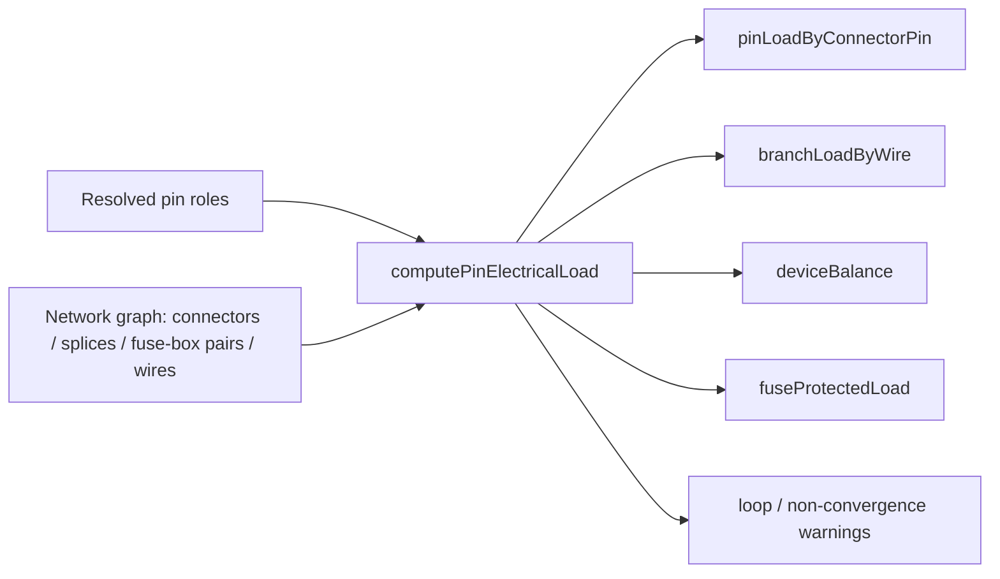

## item_610_in_network_pin_load_aggregation_engine - In-network pin load aggregation engine

> From version: 1.13.1
> Schema version: 1.0
> Status: Done
> Understanding: 100%
> Confidence: 95%
> Progress: 100%
> Complexity: Large
> Theme: Electrical analysis / Diagnostics
> Reminder: Update status/understanding/confidence/progress and linked request/task references when you edit this doc.

# Problem
With pin roles declared at the connector level, the application needs a pure aggregation engine that propagates declared currents through the network graph (splices, fuse-box pairs) and produces, per wire, per fuse, and per connector, the resolved continuous-current values used by every diagnostic and editing surface. The engine must be deterministic, cycle-safe, and parametrized by a scope so the multi-network variant can be added later (`item_614`) without rewriting the core.

# Scope
- In:
  - New pure module `src/core/pinElectricalLoad.ts` (or co-located equivalent) exposing `computePinElectricalLoad(network, scope, options)`.
  - Scope discriminated union: `{ kind: "currentNetwork" }` for this slice; the `assembly` variant is implemented in `item_614` but the type and dispatch live here.
  - Outputs:
    - `pinLoadByConnectorPin: Map<(connectorId, cavityIndex), ResolvedPinLoad>`;
    - `branchLoadByWire: Map<wireId, BranchLoad>` with continuous current and contributing source / consumer references;
    - `deviceBalance: Map<connectorId, { totalSourceA, totalConsumerA, supplyPins, sourcePins }>`;
    - `fuseProtectedLoad: Map<fuseRef, number>` for wires with `protection.kind = "fuse"` and per fuse-box pair (`Connector.fusePairOverrides` / `Connector.fusePairRatings`).
  - Propagation rules:
    - splice as current-conserving pass-through;
    - fuse-box pair as current-conserving pass-through, exposing the protected side downstream load;
    - bidirectional pins contribute to both source and consumer aggregates but are excluded from "no source on branch" detection;
    - cycle-safe traversal: each connector pin visited at most once; loops emit a single `warning` entry in the engine output (consumed by `item_611` / `item_614`).
  - Unit tests: linear chain, multi-branch splice fan-out, fuse-box pair, ECU asymmetric device, loop detection, empty / passive-only network.
- Out:
  - Multi-network propagation (`item_614`).
  - Diagnostic emission (`item_611`).
  - UI consumption (`item_612`, `item_613`).

# Acceptance criteria
- AC1: `computePinElectricalLoad(network, { kind: "currentNetwork" })` on a network without `pinElectricalRoles` returns empty maps and zero balances; no warning is emitted.
- AC2: Linear chain `[source 10 A] -- wire -- [consumer 10 A]` produces `branchLoadByWire[wire] = 10 A` and a balanced `deviceBalance` on each side.
- AC3: Splice fan-out `[source 10 A] -- splice -- (consumer 4 A, consumer 6 A)` produces 10 A on the inbound wire and 4 / 6 A on the outbound wires.
- AC4: Fuse-box pair `[source 30 A] -- pinA == pinB -- [3 consumers totaling 25 A]` produces `fuseProtectedLoad[pair] = 25 A` and 25 A on the protected-side outbound aggregate.
- AC5: ECU device `consumer 40 A` on supply pin and `source 2.5 A` on three output pins yields `deviceBalance = { totalSourceA: 7.5, totalConsumerA: 40, supplyPins: [...], sourcePins: [...] }`.
- AC6: A loop in the graph emits exactly one warning entry with the participating connector pins listed; the engine returns without throwing and without infinite recursion.
- AC7: Bidirectional pins contribute to both `totalSourceA` and `totalConsumerA` of their device and are excluded from no-source detection.
- AC8: The engine is referentially transparent: two calls on the same network return deeply equal outputs.
- AC9: `scope.kind = "assembly"` is accepted by the function signature but throws `NotImplemented` until `item_614` lands. The test asserts the throw.
- AC10: Tests cover AC1–AC9, plus a regression fixture using `src/store/sampleNetwork.ts` (no pin roles declared, no output).

# AC Traceability
- request-AC4 -> This backlog slice. Proof: AC5 (ECU device balance).
- request-AC8 -> This backlog slice. Proof: AC1 (empty network silent).
- request-AC12 -> This backlog slice. Proof: AC1, AC2, AC3, AC4 (currentNetwork scope inputs/outputs).
- request-AC11 -> This backlog slice. Evidence needed: The validation center groups all new issues under the **Electrical dimensioning** category. Disabling the category hides every D-issue.
- request-AC13 -> This backlog slice. Evidence needed: The functional schematic overlay prints declared pin currents and propagated wire currents and is **on by default** once the feature ships. A canvas toggle can disable it.
- request-AC14 -> This backlog slice. Evidence needed: The 2D modeling canvas is unchanged by this release.
- request-AC15 -> This backlog slice. Evidence needed: Bulk "Apply role X to selected pins" on the connector inspector and on the cross-connector mass edit view updates only the selected pins and records a single history entry per bulk operation.
- request-AC16 -> This backlog slice. Evidence needed: The cross-connector mass edit view lists every pin of every connector of the current network with editable role / currentA / label, supports filtering by role and by declared / not declared / over-loaded, and supports CSV-style paste of a `(connector, pin, role, currentA, label)` block.
- request-AC17 -> This backlog slice. Evidence needed: The multi-network functional analysis view lets the user pick a single network or several networks of the active `HarnessAssembly`. The view runs aggregation in `assembly` scope on the selected union, renders inter-network bridges explicitly, and lists D1–D4 + L1 findings for the selected scope.
- request-AC18 -> This backlog slice. Evidence needed: With two networks A and B in the active assembly, linked by an `InterHarnessConnectorLink` between `CA.pin3` and `CB.pin1`, a `consumer` declared on `CB.pin1` at 8 A is folded into the branch aggregate of A in the multi-network view and used by its D1 and D2 on the A-side wire reaching `CA.pin3`.
- request-AC19 -> This backlog slice. Evidence needed: A master connector referenced by two member networks of the same `HarnessAssembly` behaves as a bridge in the multi-network view with the same semantics as `InterHarnessConnectorLink`.
- request-AC20 -> This backlog slice. Evidence needed: In the multi-network view, a branch fed by a `source` in A and consumed in B through a bridge does not emit a D4 issue.
- request-AC21 -> This backlog slice. Evidence needed: Networks outside the active `HarnessAssembly` are never aggregated by the multi-network view, even if they declare a link. When the user picks "single network" or when no assembly is active, the view aggregates only the chosen network.
- request-AC22 -> This backlog slice. Evidence needed: A loop in the linked-networks graph does not crash the multi-network view; the engine emits a single `warning` "Inter-network aggregation did not converge" with the loop participants listed.
- request-AC23 -> This backlog slice. Evidence needed: L1 — two pins of the same `InterHarnessConnectorLink` declaring incompatible roles or currents (e.g. `source 10 A` ↔ `source 8 A`, `source` ↔ `source`, or `source 10 A` ↔ `consumer 8 A`) emit a single L1 `warning` in the multi-network view. Aggregation continues by taking the maximum declared `currentA` for cable / fuse checks.
- request-AC24 -> This backlog slice. Evidence needed: The shipped ampacity table is overridable per project under Settings → Electrical and the override is persisted with the network. Without an override, the shipped defaults are used.
- request-AC25 -> This backlog slice. Evidence needed: The release ships with no AI Agent integration. No new agent permission, no new agent context section, no new agent operation. Future agent integration is explicitly deferred.
- request-AC26 -> This backlog slice. Evidence needed: Test coverage adds: pin-role normalization unit tests, aggregation engine unit tests for both scopes (linear chain, splice fan-out, fuse-box pair, ECU asymmetric device, two-network link, three-network harness assembly, loop), D1–D4 issue emission tests, L1 mismatch test, multi-network view component tests, cross-connector mass edit view test (including CSV paste), schematic overlay snapshot test (on by default), and ampacity-override persistence test.

# Decision framing
- Product framing: Captured in `docs/pin-level-source-consumer-currents-product-brief.md` (Aggregation engine section).
- Architecture framing:
  - Pure module, no store dependency. Inputs are normalized data, outputs are plain maps.
  - Scope discriminated union lets `item_614` extend without rewriting the API surface.
  - Loop detection: BFS / DFS with visited set keyed by `(connectorId, cavityIndex)`.
  - Reuse existing graph helpers (`src/app/lib/app-utils-networking.ts` for endpoint resolution).
- Architecture follow-up: Consider a small ADR if the engine ends up exposing more than five public symbols; otherwise document in the task plan.

# Links
- Product brief(s): `docs/pin-level-source-consumer-currents-product-brief.md`
- Architecture decision(s): `adr_010_inter_network_current_bridge_semantics`
- Request: `logics/request/req_133_pin_level_source_consumer_currents_and_harness_dimensioning_diagnostics.md`
- Primary task(s): `task_118_in_network_pin_load_aggregation_engine`

# Delivery Status
- Delivered in 1.14.0 through `task_118_in_network_pin_load_aggregation_engine`.
- Implementation evidence: `src/core/pinElectricalLoad.ts` implements the current-network scope with pin, branch, device, fuse, loop-warning, bidirectional, and deterministic outputs; the assembly view scope remains separate in `item_614`.
- Validation evidence: `src/tests/core.pin-electrical-load.spec.ts`; recorded in `changelogs/CHANGELOGS_1_14_0.md` under `item_610` / `task_118`.

# AI Context
- Summary: Pure aggregation engine that takes the network graph + resolved pin roles and produces per-wire / per-fuse / per-device loads. Cycle-safe. Scope-aware (currentNetwork only in this slice).
- Keywords: aggregation, propagation, pin load, branch load, fuse protected load, splice pass-through, fuse-box pass-through, cycle-safe, scope, currentNetwork
- Use when: Implementing or reviewing the load computation pipeline or its integration with diagnostics.
- Skip when: The change targets UI surfaces, validation issue emission, or multi-network propagation.

# Priority
- Impact: High; blocking for `item_611`, `item_612`, `item_613`.
- Urgency: High; on the critical path.

# Notes
- Created by hand; regenerate signatures with `python3 -m logics_manager lint --require-status` before commit when the tool becomes available.

# Tasks
- `task_118_in_network_pin_load_aggregation_engine`
