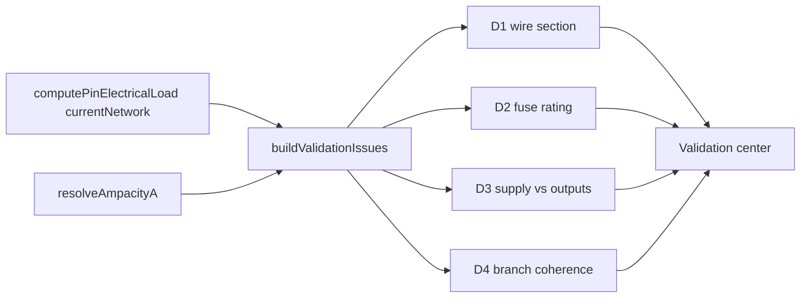

## item_611_electrical_dimensioning_validation_category - Electrical dimensioning validation category (D1–D4)

> From version: 1.14.0
> Schema version: 1.0
> Status: Done
> Understanding: 100%
> Confidence: 95%
> Progress: 100% (delivered)
> Complexity: Medium
> Theme: Electrical analysis / Diagnostics
> Reminder: Update status/understanding/confidence/progress and linked request/task references when you edit this doc.

# Problem
The aggregation engine produces resolved per-wire / per-fuse / per-device loads but no diagnostic surface today. The validation center needs a new **Electrical dimensioning** category emitting four families (D1 wire section, D2 fuse rating, D3 device supply, D4 source/consumer coherence) with the permissiveness contract baked in: missing data is never an error, only declared contradictions are flagged.

# Scope
- In:
  - Extend `buildValidationIssues.ts` with the **Electrical dimensioning** category and four issue families.
  - All issues computed against `scope = "currentNetwork"`.
  - D1 — wire section vs. carried current (`error` > 100%, `warning` > 90%, `info` 80–90%). Uses the engine's `branchLoadByWire`; falls back to manual `Wire.currentA` if higher.
  - D2 — fuse rating vs. downstream sum:
    - `error` when downstream load > rating;
    - `warning` between 80% and 100%;
    - `warning` when rating is missing and load is non-zero.
  - D3 — device supply pin vs. declared output sum: `warning` (non-blocking) quoting required vs. declared.
  - D4 — branch coherence: `info` for consumer-only branch, `warning` for facing sources; never `error`.
  - Each D-issue exposes a `Go to` action (connector+pin, wire, or branch entry).
  - Disabling the category from the validation center hides every D-issue.
  - Unit tests per family, including the permissive baselines (passive network, partial declarations).
- Out:
  - L1 link mismatch (`item_614`, scoped to the multi-network view).
  - Aggregation engine itself (`item_610`).
  - Ampacity table (`item_609`).
  - BOM "Computed downstream load (A)" column (`item_612` covers BOM tweak; can also move here — see Decision framing).

# Acceptance criteria
- AC1: A wire with derived 12 A on 1.0 mm² copper emits a D1 `error` against the shipped ampacity table.
- AC2: A wire with derived 5 A on 1.0 mm² copper emits no D1 issue.
- AC3: A wire with derived 18 A on 1.0 mm² copper emits a D1 `warning` (between 90% and 100%) — using the shipped 19 A ampacity.
- AC4: A 10 A fuse protecting a 12 A downstream sum emits a D2 `error`.
- AC5: A 10 A fuse protecting an 8.5 A downstream sum emits a D2 `warning`.
- AC6: A `protection.kind = "fuse"` wire with a non-zero downstream sum and no rating emits a D2 `warning`.
- AC7: ECU with supply consumer 5 A and three source outputs 2.5 A each emits a D3 `warning` (required 7.5 A, declared 5 A). ECU with supply consumer 40 A on the same outputs emits no D3.
- AC8: A branch with consumers but no source emits one D4 `info` per branch entry.
- AC9: Two facing source pins on the same branch emit one D4 `warning`.
- AC10: A fully-passive or undeclared network emits zero D-issues.
- AC11: Disabling the **Electrical dimensioning** category hides every D-issue; re-enabling restores them.
- AC12: Each D-issue exposes a `Go to` action that resolves to a valid connector / pin / wire / branch in the current network.
- AC13: A manual `Wire.currentA` higher than the engine-derived current overrides the derived value for D1 only. D2 always uses the engine sum.
- AC14: Tests cover AC1–AC13 plus regression fixtures from `sampleNetwork.ts` (no issue) and a new pin-roles fixture under `src/tests/fixtures/`.

# AC Traceability
- request-AC5 -> This backlog slice. Proof: AC7 (D3 warning).
- request-AC6 -> This backlog slice. Proof: AC1, AC2 (D1 thresholds).
- request-AC7 -> This backlog slice. Proof: AC4, AC5, AC6 (D2 thresholds and missing rating).
- request-AC8 -> This backlog slice. Proof: AC10 (passive network silent).
- request-AC9 -> This backlog slice. Proof: AC8 (D4 info).
- request-AC10 -> This backlog slice. Proof: AC9 (D4 facing sources warning).
- request-AC11 -> This backlog slice. Proof: AC11 (category mute).
- request-AC12 -> This backlog slice. Proof: AC10 (currentNetwork scope; no foreign contribution).

# Decision framing
- Product framing: Captured in `docs/pin-level-source-consumer-currents-product-brief.md` (Diagnostic surfacing section).
- Product signals: D3 is `warning` only, D4 never blocks. The category is mute-able.
- Architecture framing:
  - All four families live in `buildValidationIssues.ts` next to the existing categories, but the heavy lifting (load computation) stays in `item_610`'s engine.
  - Decide where `resolveAmpacityA` is invoked — inside the builder or pre-resolved by the controller. Capture in the task plan.
  - BOM column for "Computed downstream load (A)" is non-blocking for this slice — implement it in `item_612` once the engine output shape is settled.
- Architecture follow-up: No ADR required.

# Delivery outcome
- Electrical dimensioning validation category delivered through `task_119_electrical_dimensioning_validation_category`.
- D1-D4 issue families, current-network scoping, category muting, Go to targets, and regression coverage are tracked in the linked task DoD.

# Links
- Product brief(s): `docs/pin-level-source-consumer-currents-product-brief.md`
- Architecture decision(s): (none)
- Request: `logics/request/req_133_pin_level_source_consumer_currents_and_harness_dimensioning_diagnostics.md`
- Primary task(s): `logics/tasks/task_119_electrical_dimensioning_validation_category.md`

# AI Context
- Summary: Adds the Electrical dimensioning validation category with D1, D2, D3, D4 families, computed against the current-network scope, all permissive (D3/D4 never block).
- Keywords: validation, dimensioning, D1, D2, D3, D4, wire section, fuse rating, supply, source consumer coherence, permissive
- Use when: Implementing or reviewing diagnostic emission for pin-level electrical loads.
- Skip when: The change targets the aggregation engine itself, UI editing surfaces, or multi-network propagation.

# Priority
- Impact: High; this is the main user-visible payoff of the release.
- Urgency: High; downstream of `item_610` but blocking for release-gate sign-off.

# Notes
- Created by hand; regenerate signatures with `python3 -m logics_manager lint --require-status` before commit when the tool becomes available.

# Tasks
- `logics/tasks/task_119_electrical_dimensioning_validation_category.md`
