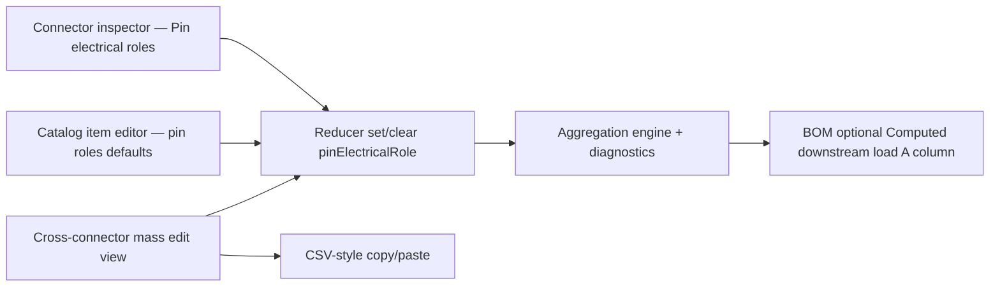

## item_612_pin_role_inspector_and_cross_connector_mass_edit_view - Pin role inspector section and cross-connector mass edit view

> From version: 1.13.1
> Schema version: 1.0
> Status: Ready
> Understanding: 75%
> Confidence: 70%
> Progress: 0%
> Complexity: Medium
> Theme: Electrical analysis / Diagnostics
> Reminder: Update status/understanding/confidence/progress and linked request/task references when you edit this doc.

# Problem
With the data model and aggregation engine landed, the user needs ergonomic surfaces to declare pin roles. Two editing surfaces are needed: an inspector section per connector (single-connector editing), and a cross-connector mass edit view (spreadsheet-style for engineers populating a full harness). Both must keep the permissiveness contract — partial data must save and validate.

# Scope
- In:
  - Connector inspector: new collapsible **Pin electrical roles** section listing pins 1..N with editable `role`, `currentA`, `label`. Per-pin catalog-vs-override badge. Bulk actions: "Apply role X to selected pins", "Reset to catalog default" (clears the per-connector entry for the selected pins).
  - Same table inside the catalog item editor (editing `CatalogItem.connectorDefaults.pinElectricalRoles`).
  - New cross-connector mass edit view accessible from Modeling:
    - lists every pin of every connector of the current network as one row;
    - editable role / currentA / label inline;
    - filters: by connector, by role, by declared / not declared, by over-loaded (rows where the resolved branch load exceeds the ampacity);
    - bulk apply by selection;
    - CSV-style copy / paste of a `(connector, pin, role, currentA, label)` block (header optional);
    - one history entry per bulk operation, both in the inspector and the mass-edit view.
  - BOM export: new optional column "Computed downstream load (A)" on fuse rows, off by default (gated by a toggle in BOM export preferences).
  - Component tests for the inspector section, the mass-edit view (including CSV paste), and the BOM column.
- Out:
  - Functional schematic overlay (`item_613`).
  - Multi-network analysis view (`item_614`).
  - Any change to the 2D modeling canvas.

# Acceptance criteria
- AC1: The connector inspector shows a collapsible **Pin electrical roles** section. Editing a pin updates the connector entry without touching the catalog.
- AC2: A "Reset to catalog default" button on a pin row clears the per-connector entry; the resolved value falls back to the catalog default afterwards.
- AC3: Bulk "Apply role X to selected pins" updates only the selected pins and records a single history entry.
- AC4: The catalog item editor exposes the same table for `CatalogItem.connectorDefaults.pinElectricalRoles`; saving propagates the new defaults to every consuming connector through the merge logic.
- AC5: The cross-connector mass edit view lists every pin of every connector of the current network with editable role / currentA / label.
- AC6: The mass-edit view supports filtering by connector, role, declared / not declared, and over-loaded.
- AC7: The mass-edit view accepts a CSV paste of a `(connector, pin, role, currentA, label)` block: invalid rows are reported in an inline error panel; valid rows are applied as a single history entry.
- AC8: The catalog-vs-override badge on a pin row reflects the resolved source of the displayed value (override / catalog / default-passive).
- AC9: The BOM export gains an optional column "Computed downstream load (A)" on fuse rows, off by default; toggling it on adds the column to the next export.
- AC10: Tests cover AC1–AC9, including a regression test asserting the modeling canvas is unchanged when only pin roles are edited.

# AC Traceability
- request-AC2 -> This backlog slice. Proof: AC4 (catalog editor surface).
- request-AC15 -> This backlog slice. Proof: AC3 (single history entry for bulk apply).
- request-AC16 -> This backlog slice. Proof: AC5, AC6, AC7 (mass-edit features).

# Decision framing
- Product framing: Captured in `docs/pin-level-source-consumer-currents-product-brief.md` (Editing surfaces section).
- Product signals: Two complementary surfaces (per-connector vs. cross-connector). Permissiveness: empty fields allowed.
- Architecture framing:
  - The inspector section reuses existing `Connector` inspector controllers / hooks.
  - The cross-connector view follows the existing list-ergonomics patterns documented in `item_013` (search / filter / action consistency).
  - CSV paste: keep parsing strict but errors visible; do not silently drop rows.
  - History entries: piggyback on the existing store transaction helper used by the AI Agent grouped sessions.
- Architecture follow-up: No ADR required.

# Links
- Product brief(s): `docs/pin-level-source-consumer-currents-product-brief.md`
- Architecture decision(s): (none)
- Request: `logics/request/req_133_pin_level_source_consumer_currents_and_harness_dimensioning_diagnostics.md`
- Primary task(s): TBD on promotion

# AI Context
- Summary: Editing surfaces — pin-role inspector section, catalog-defaults table, cross-connector mass edit view with CSV paste, and an optional BOM fuse column.
- Keywords: inspector, catalog editor, mass edit, CSV paste, bulk apply, history entry, BOM, downstream load
- Use when: Implementing or reviewing the pin-role editing UI or the BOM column.
- Skip when: The change targets aggregation, validation, or multi-network surfaces.

# Priority
- Impact: High; without ergonomic editing the data model is hard to populate.
- Urgency: Medium; can land in parallel with `item_611` once `item_608` and `item_610` are merged.

# Notes
- Created by hand; regenerate signatures with `python3 -m logics_manager lint --require-status` before commit when the tool becomes available.

# Tasks
- TBD on promotion.
