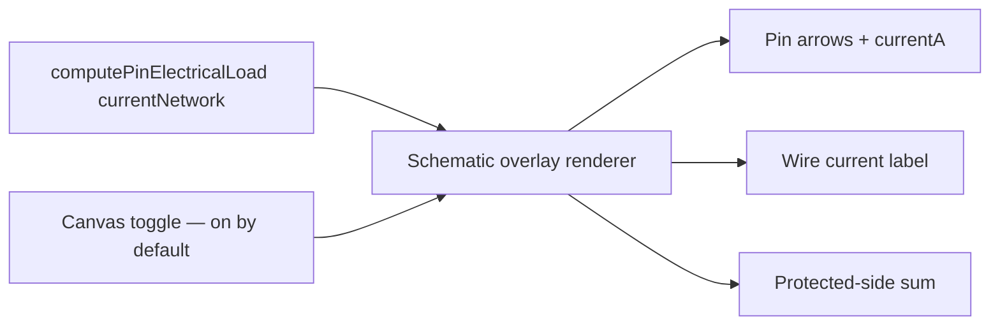

## item_613_functional_schematic_electrical_overlay - Functional schematic electrical overlay

> From version: 1.15.2
> Schema version: 1.0
> Status: Done
> Understanding: 95%
> Confidence: 95%
> Progress: 100%
> Complexity: Small
> Theme: Electrical analysis / Diagnostics
> Reminder: Update status/understanding/confidence/progress and linked request/task references when you edit this doc.

# Problem
The functional schematic already renders connectors, splices, fuse-box pairs, and wires, but does not show electrical direction or current values. Once pin roles and the aggregation engine are in place, the schematic gains a high-value overlay annotating declared pin currents (with direction) and propagated wire currents. This overlay is on by default to make the diagnostic surface immediately visible without an opt-in step.

# Scope
- In:
  - New rendering overlay on the functional schematic that prints, per pin: a directional marker (`→` for source, `←` for consumer) and the declared `currentA` when set.
  - Per wire: the engine-derived continuous current next to the wire label.
  - Per fuse-box pair: the resolved protected-side downstream sum next to the fuse symbol.
  - Canvas toggle "Show electrical roles" — **on by default** for new and existing workspaces (preference defaults to `true`; users can flip it off).
  - The overlay uses the same `currentNetwork` scope as the validation center.
  - Visual styling consistent with existing fuse / splice symbols (color and typography from the current theme tokens).
  - Snapshot tests for the schematic with the overlay on, the overlay off, and on a network without pin roles (no overlay artifacts).
- Out:
  - 2D modeling canvas changes (none in this release).
  - Multi-network analysis view (`item_614`).
  - Editing affordances on the schematic.

# Acceptance criteria
- AC1: The functional schematic prints `→ 2.5 A` next to each pin declared as `source` with a non-null `currentA`, and `← 40 A` next to each pin declared as `consumer` with a non-null `currentA`.
- AC2: Wires with a non-null engine-derived current show the value next to the wire label; wires with a zero or undefined current show nothing extra.
- AC3: Fuse-box pairs show the protected-side downstream sum next to the fuse symbol when non-zero.
- AC4: The canvas toggle "Show electrical roles" defaults to **on** for new workspaces and for existing workspaces after the release lands. Toggling it off removes the overlay; toggling it on restores it.
- AC5: A network without any declared pin roles renders the schematic without any overlay artifacts (no orphan arrows, no zero-A labels).
- AC6: The overlay uses the current theme tokens for color and typography; no inline color literals.
- AC7: Snapshot tests cover overlay on (with pin roles), overlay off, and no-pin-roles networks.
- AC8: Toggling the overlay does not mutate the underlying network.

# AC Traceability
- request-AC13 -> This backlog slice. Proof: AC1, AC2, AC4 (overlay content + on-by-default).
- request-AC9 -> This backlog slice. Evidence needed: A branch with at least one `consumer` pin and no `source` pin emits a single D4 `info` per branch entry; never an `error`.
- request-AC10 -> This backlog slice. Evidence needed: Two `source` pins facing each other on the same branch emit a single D4 `warning`; the network still saves, exports, and renders.
- request-AC11 -> This backlog slice. Evidence needed: The validation center groups all new issues under the **Electrical dimensioning** category. Disabling the category hides every D-issue.
- request-AC12 -> This backlog slice. Evidence needed: The validation center, the connector inspector, the BOM, and the functional schematic overlay all use `scope = "currentNetwork"`. Inter-network bridges are not traversed and a linked consumer in another network contributes nothing to D1/D2/D3/D4.
- request-AC14 -> This backlog slice. Evidence needed: The 2D modeling canvas is unchanged by this release.
- request-AC15 -> This backlog slice. Evidence needed: Bulk "Apply role X to selected pins" on the connector inspector and on the cross-connector mass edit view updates only the selected pins and records a single history entry per bulk operation.
- request-AC16 -> This backlog slice. Evidence needed: The cross-connector mass edit view lists every pin of every connector of the current network with editable role / currentA / label, supports filtering by role and by declared / not declared / over-loaded, and supports CSV-style paste of a `(connector, pin, role, currentA, label)` block.
- request-AC17 -> This backlog slice. Evidence needed: The multi-network functional analysis view lets the user pick a single network or several networks of the active `HarnessAssembly`. The view runs aggregation in `assembly` scope on the selected union, renders inter-network bridges explicitly, and lists D1–D4 + L1 findings for the selected scope.
- request-AC18 -> This backlog slice. Evidence needed: With two networks A and B in the active assembly, linked by an `InterHarnessConnectorLink` between `CA.pin3` and `CB.pin1`, a `consumer` declared on `CB.pin1` at 8 A is folded into the branch aggregate of A in the multi-network view and used by its D1 and D2 on the A-side wire reaching `CA.pin3`.
- request-AC19 -> This backlog slice. Evidence needed: A master connector referenced by two member networks of the same `HarnessAssembly` behaves as a bridge in the multi-network view with the same semantics as `InterHarnessConnectorLink`.
- request-AC20 -> This backlog slice. Evidence needed: In the multi-network view, a branch fed by a `source` in A and consumed in B through a bridge does not emit a D4 issue.
- request-AC21 -> This backlog slice. Evidence needed: Networks outside the active `HarnessAssembly` are never aggregated by the multi-network view, even if they declare a link. When the user picks "single network" or when no assembly is active, the view aggregates only the chosen network.
- request-AC22 -> This backlog slice. Evidence needed: A loop in the linked-networks graph does not crash the multi-network view; the engine emits a single `warning` "Inter-network aggregation did not converge" with the loop participants listed.
- request-AC23 -> This backlog slice. Evidence needed: L1 — two pins of the same `InterHarnessConnectorLink` declaring incompatible roles or currents (e.g. `source 10 A` ↔ `source 8 A`, `source` ↔ `source`, or `source 10 A` ↔ `consumer 8 A`) emit a single L1 `warning` in the multi-network view. Aggregation continues by taking the maximum declared `currentA` for cable / fuse checks.
- request-AC24 -> This backlog slice. Evidence needed: The shipped ampacity table is overridable per project under Settings → Electrical and the override is persisted with the network. Without an override, the shipped defaults are used.
- request-AC25 -> This backlog slice. Evidence needed: The release ships with no AI Agent integration. No new agent permission, no new agent context section, no new agent operation. Future agent integration is explicitly deferred.
- request-AC26 -> This backlog slice. Evidence needed: Test coverage adds: pin-role normalization unit tests, aggregation engine unit tests for both scopes (linear chain, splice fan-out, fuse-box pair, ECU asymmetric device, two-network link, three-network harness assembly, loop), D1–D4 issue emission tests, L1 mismatch test, multi-network view component tests, cross-connector mass edit view test (including CSV paste), schematic overlay snapshot test (on by default), and ampacity-override persistence test.

# Decision framing
- Product framing: Captured in `logics/product/prod_011_pin_level_current_dimensioning.md` (Editing surfaces section — overlay).
- Product signals: Overlay on by default; minimal visual clutter when data is absent.
- Architecture framing:
  - Rendering lives next to the existing functional schematic renderer (`src/core/functionalSchematic.ts` for data, app-layer for SVG/Canvas painting).
  - Preference stored next to existing canvas preferences (themes, sub-network filters).
  - For migration: an existing workspace without the preference defaults to `true` on read.
- Architecture follow-up: No ADR required.

# Links
- Product brief(s): `logics/product/prod_011_pin_level_current_dimensioning.md`
- Architecture decision(s): (none)
- Request: `logics/request/req_133_pin_level_source_consumer_currents_and_harness_dimensioning_diagnostics.md`
- Primary task(s): `task_121_functional_schematic_electrical_overlay`

# Delivery Status
- Delivered on 2026-06-09.
- Evidence:
  - AC1: `FunctionalSchematicPanel` renders `→` and `←` pin-current markers from current-network pin roles.
  - AC2: non-zero engine-derived branch current is rendered as an additional wire-label line.
  - AC3: non-zero fuse protected load is rendered next to fuse symbols, including current-network fuse-box pair keys and inline fuse keys.
  - AC4: the "Electrical roles" toggle defaults on and persists explicit user changes.
  - AC5: no-pin-role networks produce no overlay marker layer.
  - AC6: overlay styles use functional schematic CSS classes and theme tokens; no inline color literals were added for the overlay.
  - AC7: overlay on/off/no-role snapshots live in `src/tests/__snapshots__/app.ui.functional-schematic-electrical-overlay.spec.tsx.snap`.
  - AC8: the toggle test verifies connector pin-role objects are not mutated.
- Validation:
  - `npm run -s typecheck`
  - `npm run -s lint`
  - `npm run -s test -- src/tests/app.ui.functional-schematic-electrical-overlay.spec.tsx src/tests/app.ui.network-summary-workflow-polish.spec.tsx`

# AI Context
- Summary: Adds a functional schematic overlay showing pin directions, pin currents, wire-derived currents, and fuse-protected sums. On by default with a canvas toggle.
- Keywords: functional schematic, overlay, pin direction, source arrow, consumer arrow, wire current, fuse protected load, canvas toggle
- Use when: Implementing or reviewing the schematic overlay or its preference.
- Skip when: The change targets aggregation logic, editing surfaces, or multi-network analysis.

# Priority
- Impact: Medium; high readability win, low blocking risk.
- Urgency: Medium; downstream of `item_610`.

# Notes
- Created by hand; regenerate signatures with `python3 -m logics_manager lint --require-status` before commit when the tool becomes available.

# Tasks
- `task_121_functional_schematic_electrical_overlay`
