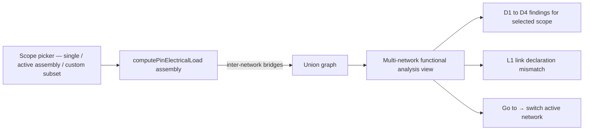

## item_614_multi_network_functional_analysis_view_and_assembly_scope - Multi-network functional analysis view and assembly-scope aggregation

> From version: 1.13.1
> Schema version: 1.0
> Status: Done
> Understanding: 100%
> Confidence: 92%
> Progress: 100%
> Complexity: Large
> Theme: Electrical analysis / Diagnostics
> Reminder: Update status/understanding/confidence/progress and linked request/task references when you edit this doc.

# Problem
The in-network engine ignores inter-network bridges by design. A user with a multi-harness assembly needs a dedicated read-only view that propagates declared currents across `InterHarnessConnectorLink`s and shared master connector references, lists D1–D4 findings for the chosen scope, and surfaces a new L1 finding when the two ends of a bridge disagree.

# Scope
- In:
  - Extend `computePinElectricalLoad` (from `item_610`) with `scope = { kind: "assembly"; networkIds: NetworkId[] }`. The scope must be a subset of the active `HarnessAssembly`'s members.
  - Treat `InterHarnessConnectorLink` and shared master connector references as current-conserving pass-through nodes for current propagation.
  - Same cycle-safety as in `item_610`; a non-convergent loop emits a single warning and that branch aggregation aborts.
  - New top-level **Multi-network functional analysis** view, read-only:
    - scope picker: "current network only", "active assembly", "custom" (multi-select among assembly members);
    - renders the union functional schematic, drawing bridges explicitly;
    - lists D1–D4 + L1 findings for the selected scope;
    - exposes a `Go to` action per finding that switches the active network and focuses the entity.
  - **L1 link declaration mismatch** family — emitted only by this view:
    - the two pins of an inter-network bridge declare incompatible roles or currents (e.g. `source 10 A` ↔ `source 8 A`, `source` ↔ `source`, or `source 10 A` ↔ `consumer 8 A`);
    - `warning`;
    - aggregation continues by taking `max(currentA)` of the two declarations for downstream D1 / D2 checks.
  - When no `HarnessAssembly` is active, the view restricts the scope picker to "current network only".
  - Unit tests for `assembly` scope propagation (two-network link, three-network assembly, loop, L1 mismatch).
  - Component tests for the view (scope picker, schematic rendering, finding list, navigation).
- Out:
  - In-network validation surfaces (`item_611`) — unchanged.
  - 2D modeling canvas changes.
  - Editing affordances on the multi-network view (read-only).

# Acceptance criteria
- AC1: `computePinElectricalLoad(networks, { kind: "assembly", networkIds })` returns aggregated outputs across the union graph of the requested networks, traversing `InterHarnessConnectorLink`s and shared master connector references.
- AC2: With two networks A and B linked by `CA.pin3 ↔ CB.pin1`, a `consumer 8 A` on `CB.pin1` contributes 8 A to the A-side branch reaching `CA.pin3`.
- AC3: A master connector referenced by two member networks of the same assembly behaves as a bridge with the same semantics.
- AC4: Networks not included in `networkIds` are never aggregated, even if they declare a link to an included network.
- AC5: A loop in the linked-networks graph emits a single `warning` "Inter-network aggregation did not converge" with the loop participants listed; the engine returns without throwing.
- AC6: A branch fed by a source in A and consumed in B through a bridge emits no D4 finding in the multi-network view.
- AC7: L1 fires with severity `warning` when the two ends of a bridge declare:
  - the same role on both sides (e.g. `source ↔ source`); or
  - opposing roles with different `currentA`; or
  - `source` ↔ `consumer` with different `currentA`.
- AC8: L1 does not fire when both sides are undeclared, when only one side is declared, or when both sides declare a `passive` role.
- AC9: When L1 fires, aggregation continues with `max(declared currentA, declared currentA)` for downstream D1 / D2 checks.
- AC10: The view exposes a scope picker with three modes — "current network only", "active assembly", "custom" — and the "custom" mode lets the user check / uncheck assembly members.
- AC11: When no `HarnessAssembly` is active, the scope picker offers only "current network only" and the view's findings match the validation center's D1–D4 output (no L1).
- AC12: Each finding's `Go to` action switches the active network before focusing the entity.
- AC13: The multi-network view is read-only; no edit operation can be triggered from it.
- AC14: Tests cover AC1–AC13 plus a regression where editing a pin role in one network re-runs the engine on the next view open.

# AC Traceability
- request-AC17 -> This backlog slice. Proof: AC10, AC11 (scope picker + assembly bounding).
- request-AC18 -> This backlog slice. Proof: AC2 (consumer in B folded into A-side aggregate).
- request-AC19 -> This backlog slice. Proof: AC3 (master connector bridge).
- request-AC20 -> This backlog slice. Proof: AC6 (no D4 across bridges).
- request-AC21 -> This backlog slice. Proof: AC4, AC11 (outside-assembly exclusion + no-assembly fallback).
- request-AC22 -> This backlog slice. Proof: AC5 (loop warning, no crash).
- request-AC23 -> This backlog slice. Proof: AC7, AC9 (L1 mismatch + max(currentA)).
- request-AC15 -> This backlog slice. Evidence needed: Bulk "Apply role X to selected pins" on the connector inspector and on the cross-connector mass edit view updates only the selected pins and records a single history entry per bulk operation.
- request-AC16 -> This backlog slice. Evidence needed: The cross-connector mass edit view lists every pin of every connector of the current network with editable role / currentA / label, supports filtering by role and by declared / not declared / over-loaded, and supports CSV-style paste of a `(connector, pin, role, currentA, label)` block.
- request-AC24 -> This backlog slice. Evidence needed: The shipped ampacity table is overridable per project under Settings → Electrical and the override is persisted with the network. Without an override, the shipped defaults are used.
- request-AC25 -> This backlog slice. Evidence needed: The release ships with no AI Agent integration. No new agent permission, no new agent context section, no new agent operation. Future agent integration is explicitly deferred.
- request-AC26 -> This backlog slice. Evidence needed: Test coverage adds: pin-role normalization unit tests, aggregation engine unit tests for both scopes (linear chain, splice fan-out, fuse-box pair, ECU asymmetric device, two-network link, three-network harness assembly, loop), D1–D4 issue emission tests, L1 mismatch test, multi-network view component tests, cross-connector mass edit view test (including CSV paste), schematic overlay snapshot test (on by default), and ampacity-override persistence test.

# Decision framing
- Product framing: Captured in `docs/pin-level-source-consumer-currents-product-brief.md` (Inter-network analysis section).
- Product signals: Read-only view; opt-in; cross-network propagation never leaks into the in-network surfaces.
- Architecture framing:
  - Engine extension: keep the public API surface; the `scope` discriminated union absorbs the new case.
  - Bridge enumeration sources from `HarnessAssembly.connectorLinks` and `HarnessAssembly.masterConnectorRefs`.
  - Loop detection must be tight: keys must be `(networkId, connectorId, cavityIndex)` because the same connectorId may exist in two networks.
  - View routing: integrate with the existing top-level views (`Modeling`, `Analysis`, `Harness`, `Settings`). Consider adding under `Analysis` or as a new sibling — capture the chosen location in the task plan.
- Architecture follow-up: Consider a small ADR for the bridge-traversal semantics if the merge with `item_610` produces a non-trivial generic dispatch; otherwise document in the task plan.

# Links
- Product brief(s): `docs/pin-level-source-consumer-currents-product-brief.md`
- Architecture decision(s): `adr_010_inter_network_current_bridge_semantics`
- Request: `logics/request/req_133_pin_level_source_consumer_currents_and_harness_dimensioning_diagnostics.md`
- Primary task(s): `task_122_multi_network_functional_analysis_view_and_assembly_scope`

# Delivery Status
- Done on 2026-06-09.
- Delivered: assembly-scope aggregation core in `src/core/pinElectricalLoadAssembly.ts` for `InterHarnessConnectorLink` and shared master connector refs, inter-harness traversal, skipped-bridge diagnostics, L1 mismatch computation, loop warnings, read-only Analysis panel, current-network / active-assembly / custom subset scope picker, union functional schematic preview, assembly-grade D1-D4 findings computed from the selected union graph, active-network-switching `Go to`, and focused model/component/core coverage.
- Validation: `rtk npm run -s lint`, `rtk npm run -s typecheck`, and `rtk npm run -s test -- src/tests/core.pin-electrical-load-assembly.spec.ts src/tests/app.lib.multi-network-functional-analysis.spec.ts src/tests/app.ui.multi-network-functional-analysis.spec.tsx --run` passed on 2026-06-09.

# AI Context
- Summary: Adds the multi-network analysis view (read-only, scope picker) and the assembly-scope aggregation that traverses inter-network bridges. New L1 link mismatch warning lives here.
- Keywords: multi-network, assembly scope, harness assembly, inter-harness connector link, master connector reference, L1 link mismatch, union graph, cycle-safe
- Use when: Implementing or reviewing the multi-network view, the assembly-scope engine extension, or L1 emission.
- Skip when: The change targets the in-network engine, validation center, editing surfaces, or schematic overlay.

# Priority
- Impact: High; uniquely enables cross-harness dimensioning workflows.
- Urgency: Medium; can land after `item_611` ships in-network value.

# Notes
- Created by hand; regenerate signatures with `python3 -m logics_manager lint --require-status` before commit when the tool becomes available.

# Tasks
- `task_122_multi_network_functional_analysis_view_and_assembly_scope`
