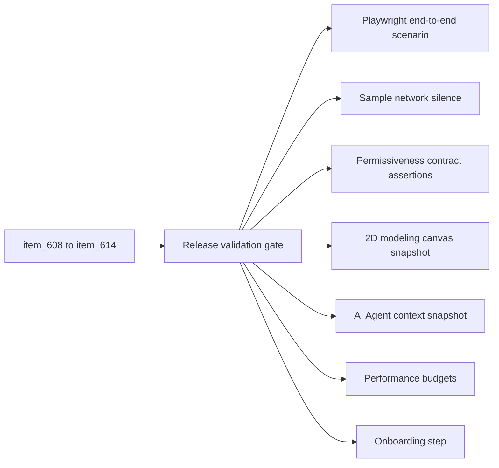

## item_615_pin_role_release_validation_and_permissiveness_gate - Pin role release validation and permissiveness gate

> From version: 1.13.1
> Schema version: 1.0
> Status: Ready
> Understanding: 70%
> Confidence: 70%
> Progress: 0%
> Complexity: Medium
> Theme: Electrical analysis / Diagnostics
> Reminder: Update status/understanding/confidence/progress and linked request/task references when you edit this doc.

# Problem
The release ships eight intertwined behaviors: data model, ampacity table, in-network engine, diagnostics, two editing surfaces, the schematic overlay, and the multi-network view. The combined surface needs an explicit validation pass that proves the permissiveness contract is honored end-to-end, that pre-existing fixtures stay silent, and that the 2D modeling canvas is unchanged. This slice ships the release-gate coverage and the integration scenarios.

# Scope
- In:
  - End-to-end Playwright scenario "Pin roles full flow": declare pin roles via the inspector and via the mass-edit view, observe D1–D4 findings update live, toggle the overlay, open the multi-network view on a two-network assembly, observe L1 firing on a contrived mismatch.
  - Regression suite asserting:
    - every shipped sample network (`sampleNetwork.ts`, `sampleNetworkAdditionalDemos.ts`, `sampleNetworkAdvancedDemos.ts`) loads with zero new validation issues from the **Electrical dimensioning** category;
    - exporting and re-importing a network preserves declared pin roles and ampacity overrides;
    - editing pin roles never modifies entities on the 2D modeling canvas (snapshot-based assertion).
  - Permissiveness gate test: a workspace with declared pin roles in network A and undeclared in network B emits zero error-level findings in B; a partial declaration (role declared without `currentA`) emits zero error-level findings anywhere.
  - AI-Agent regression: the agent context and proposal flow are unchanged by this release. A snapshot test asserts the agent context shape does not gain new sections.
  - Performance budget: in-network aggregation on the largest sample network completes within the existing validation-build budget (capture the baseline and assert ratio ≤ 1.3).
  - Multi-network view performance budget: scope = active assembly on the largest demo assembly completes within the existing analysis-view open budget (baseline + ratio ≤ 1.3).
  - Onboarding update: add a one-screen onboarding step "Declare pin roles" reachable from the existing onboarding flow.
- Out:
  - Any feature work belonging to `item_608` through `item_614`.
  - Bundling derating, voltage-drop revisions, AI Agent extension, 2D canvas changes.
  - Release version bump, changelog, Logics workflow tooling.

# Acceptance criteria
- AC1: A Playwright scenario walks through inspector declaration, mass-edit declaration, overlay toggle, multi-network view scoping, and L1 firing on a seeded mismatch, all passing.
- AC2: Every shipped sample network loads with zero **Electrical dimensioning** issues.
- AC3: Export → import round-trip preserves `Connector.pinElectricalRoles`, `CatalogItem.connectorDefaults.pinElectricalRoles`, and `Network.ampacityOverrides`.
- AC4: A snapshot test asserts the 2D modeling canvas rendering is byte-for-byte unchanged when only pin roles or ampacity overrides are edited.
- AC5: Permissiveness gate: a network with partial declarations emits zero `error`-level findings in the **Electrical dimensioning** category.
- AC6: The AI Agent context shape snapshot is unchanged from the previous release; no `electricalRoles` section is emitted.
- AC7: Performance budgets are captured for in-network aggregation and for the multi-network view open; assertions assert the post-release ratio ≤ 1.3 against the pre-release baseline.
- AC8: Onboarding gains a "Declare pin roles" step accessible from the existing onboarding entry.
- AC9: A single failing assertion in this slice blocks the release, surfaced through the existing CI quality gates.

# AC Traceability
- request-AC3 -> This backlog slice. Proof: AC2 (sample networks silent).
- request-AC14 -> This backlog slice. Proof: AC4 (2D canvas unchanged).
- request-AC25 -> This backlog slice. Proof: AC6 (no AI Agent integration).
- request-AC26 -> This backlog slice. Proof: AC1, AC2, AC3, AC4, AC5, AC6, AC7, AC8 (cross-cutting coverage).

# Decision framing
- Product framing: Captured in `docs/pin-level-source-consumer-currents-product-brief.md` (Permissiveness Contract + Acceptance Criteria sections).
- Product signals: Permissiveness must be measurable; modeling canvas must be untouched; AI Agent surface untouched.
- Architecture framing:
  - Performance baselines captured by an existing benchmark hook if available; otherwise add a small benchmark utility under `scripts/`.
  - Snapshot tests use the existing Playwright + Vitest infrastructure.
- Architecture follow-up: No ADR required.

# Links
- Product brief(s): `docs/pin-level-source-consumer-currents-product-brief.md`
- Architecture decision(s): (none)
- Request: `logics/request/req_133_pin_level_source_consumer_currents_and_harness_dimensioning_diagnostics.md`
- Primary task(s): TBD on promotion

# AI Context
- Summary: Release-gate slice for the pin-level source/consumer release. End-to-end Playwright, permissiveness assertions, modeling-canvas-unchanged snapshot, AI-Agent-untouched snapshot, performance budgets, onboarding step.
- Keywords: release validation, regression, permissiveness, modeling canvas unchanged, AI Agent untouched, performance budget, onboarding
- Use when: Wiring the final release gates or chasing a regression specific to the cross-cutting contract.
- Skip when: The change targets a single slice's feature work.

# Priority
- Impact: High; this is the release gate.
- Urgency: Medium; lands last in the slice sequence.

# Notes
- Created by hand; regenerate signatures with `python3 -m logics_manager lint --require-status` before commit when the tool becomes available.

# Tasks
- TBD on promotion.
