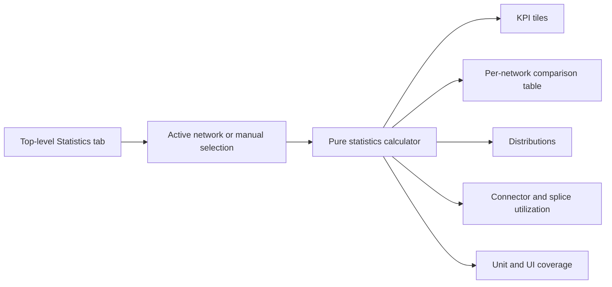

## item_616_network_statistics_dashboard_for_one_or_multiple_networks - Network statistics dashboard for one or multiple networks

> From version: 1.14.3
> Schema version: 1.0
> Status: Done
> Understanding: 86%
> Confidence: 82%
> Progress: 100%
> Complexity: Medium
> Theme: Statistics / Reporting
> Reminder: Update status/understanding/confidence/progress and linked request/task references when you edit this doc.

# Problem
Users need a fast way to understand the quantitative shape of a network without manually reading multiple entity tables or exporting data to a spreadsheet. The first release should add a read-only **Statistics** workspace tab between **Modeling** and **Validation**, covering the active network by default and allowing manual selection of one or more networks for comparison.

The dashboard must focus on physical and engineering statistics only: entity counts, physical wire lengths, route coverage, wire distributions, connector/splice utilization, and catalog linkage. It must explicitly defer charts, pricing, and CSV export so the first implementation stays focused and testable.

# Scope
- In:
  - Add a top-level **Statistics** tab between **Modeling** and **Validation**.
  - Create a pure statistics calculator that can derive metrics from the active root slices and from selected entries in `state.networkStates`.
  - Support two scopes:
    - active network;
    - manual network selection with one or more workspace networks.
  - Show aggregate totals and a per-network comparison table for manual multi-network selections.
  - Compute core counts: connectors, splices, routing nodes by kind, segments, wires, and catalog items.
  - Compute physical wire-length metrics:
    - total, average, min, max, median;
    - top 10 longest wires;
    - routed wire count included in length calculations;
    - route-locked wire count and percentage.
  - Resolve wire length by preferring finite positive `Wire.lengthMm`, then falling back to summed `Segment.lengthMm` from `Wire.routeSegmentIds`.
  - Ignore wires with no physical route or explicit physical length in length metrics; never treat them as `0 m`.
  - Compute wire section, material, color, electrical metadata, fuse-protection, and pin-role coverage distributions.
  - Compute connector way utilization and top unused-way connectors.
  - Compute finite splice port utilization for bounded/directional splices while keeping unbounded splices separate.
  - Compute catalog-linked vs. unlinked connector/splice counts and manufacturer reference distribution.
  - Present the dashboard with KPI tiles and tables only, using existing UI conventions and English labels.
  - Add focused unit tests for the calculator and UI tests for navigation, scope switching, empty state, and comparison behavior.
- Out:
  - Editing any entity from the Statistics tab.
  - Charts or charting libraries.
  - Statistics CSV export.
  - Pricing or cost rollups.
  - Dedicated all-networks shortcut.
  - Dedicated harness-assembly shortcut.
  - Persistence schema fields or migrations.
  - Changes to existing export schemas.
  - AI Agent workflows.
  - Release versioning, changelog, or Logics workflow tooling.

# Acceptance criteria
- AC1: `WorkspaceNavigation` renders a **Statistics** top-level tab between **Modeling** and **Validation**.
- AC2: The app has a `statistics` screen state, or equivalent typed navigation path, that is distinct from `modeling`, `analysis`, and `validation`.
- AC3: Opening **Statistics** with an active network selected shows active-network statistics by default.
- AC4: Opening **Statistics** without an active network shows a non-crashing empty state.
- AC5: The user can switch between active-network scope and manual network selection scope.
- AC6: Manual network selection supports one or more workspace networks and reads non-active networks from `state.networkStates`.
- AC7: Manual multi-network scope displays aggregate totals and a per-network comparison table.
- AC8: Core counts include connectors, splices, routing nodes by kind, segments, wires, and catalog items.
- AC9: Wire length metrics include total, average, min, max, median, routed wire count included in length calculations, route-lock count/percentage, and top 10 longest wires.
- AC10: Wire length resolution prefers finite positive `Wire.lengthMm`, falls back to summed route segment length, and ignores wires with no physical route or explicit physical length.
- AC11: Ignored wires are never counted as `0 m` in length totals, averages, min, max, median, or longest-wire lists.
- AC12: Wire section distribution shows count and total physical length per section.
- AC13: Wire material and color distributions include explicit unspecified buckets.
- AC14: Electrical metadata coverage shows count of wires with `currentA`, maximum declared current, and fuse-protected wire count.
- AC15: Pin-role coverage appears when connector or catalog pin roles exist and groups declared pins by role.
- AC16: Connector utilization shows total way capacity, occupied ways, occupancy percentage, and top unused-way connectors.
- AC17: Splice utilization counts bounded/directional finite capacity separately from unbounded splices and reports directional splice count.
- AC18: Catalog indicators show linked vs. unlinked connectors/splices and manufacturer reference distribution.
- AC19: The Statistics tab is read-only and does not dispatch domain mutation actions.
- AC20: Empty and incomplete networks render clear empty states and never render `NaN`, `Infinity`, or misleading totals.
- AC21: The first release does not add statistics CSV export, pricing rollup, charts, or new persistence fields.
- AC22: Existing BOM CSV, wire CSV, SVG, PNG, and network import/export schemas remain unchanged.
- AC23: Unit tests cover active-network, manual multi-network, route-length fallback, ignored-unrouted-wire, occupancy, distribution, and catalog-linkage calculator cases.
- AC24: UI tests cover tab navigation, scope switching, multi-network comparison, and empty state.

# AC Traceability
- request-AC1 -> This backlog slice. Proof: AC1 (Statistics tab rendered).
- request-AC2 -> This backlog slice. Proof: AC1 (tab order).
- request-AC3 -> This backlog slice. Proof: AC3 (active-network default).
- request-AC4 -> This backlog slice. Proof: AC4 (no-active-network empty state).
- request-AC5 -> This backlog slice. Proof: AC5 (scope switch).
- request-AC6 -> This backlog slice. Proof: AC6 (manual selection supports one or more networks).
- request-AC7 -> This backlog slice. Proof: AC7 (aggregate + per-network comparison).
- request-AC8 -> This backlog slice. Proof: AC8 (core counts).
- request-AC9 -> This backlog slice. Proof: AC9 (wire length metrics).
- request-AC10 -> This backlog slice. Proof: AC10 (length resolution).
- request-AC11 -> This backlog slice. Proof: AC11 (ignored wires not counted as zero).
- request-AC12 -> This backlog slice. Proof: AC12 (section distribution).
- request-AC13 -> This backlog slice. Proof: AC13 (material/color unspecified buckets).
- request-AC14 -> This backlog slice. Proof: AC14 (electrical metadata coverage).
- request-AC15 -> This backlog slice. Proof: AC15 (pin-role coverage).
- request-AC16 -> This backlog slice. Proof: AC16 (connector utilization).
- request-AC17 -> This backlog slice. Proof: AC17 (splice utilization).
- request-AC18 -> This backlog slice. Proof: AC18 (catalog indicators).
- request-AC19 -> This backlog slice. Proof: AC19 (read-only).
- request-AC20 -> This backlog slice. Proof: AC20 (empty/incomplete safety).
- request-AC21 -> This backlog slice. Proof: AC21 (deferred surfaces).
- request-AC22 -> This backlog slice. Proof: AC22 (existing exports unchanged).
- request-AC23 -> This backlog slice. Proof: AC23 (calculator tests).
- request-AC24 -> This backlog slice. Proof: AC24 (UI tests).

# Decision framing
- Product framing: Captured in `docs/network-statistics-dashboard-product-brief.md`.
- Product signals:
  - **Statistics** is a top-level workspace tab, not an Analysis sub-tab.
  - First release is read-only and English-labeled.
  - Multi-network scope is manual selection only.
  - Physical length metrics ignore non-routed/non-physical wires.
  - Charts, CSV export, pricing, all-networks shortcuts, and harness-assembly shortcuts are deferred.
- Architecture framing:
  - Prefer a pure calculator with deterministic inputs so most coverage can be unit-level.
  - Keep UI state local to the Statistics workspace unless a cross-session preference is deliberately added later.
  - Read active-network data from root slices and non-active network data from `state.networkStates`, preserving the store's root-vs-network-map invariant.
  - Do not introduce a charting dependency.
- Architecture follow-up: No ADR expected for this slice.

# Links
- Product brief(s): `docs/network-statistics-dashboard-product-brief.md`
- Architecture decision(s): (none)
- Request: `logics/request/req_135_network_statistics_dashboard_for_one_or_multiple_networks.md`
- Primary task(s):
  - `task_124_network_statistics_calculator_and_scope_contract`
  - `task_125_statistics_workspace_tab_ui_design_and_validation`

# AI Context
- Summary: Single-slice backlog item for the first read-only Statistics tab, positioned between Modeling and Validation, with active-network and manual multi-network scopes, KPI tiles, comparison tables, distributions, utilization metrics, and focused tests.
- Keywords: backlog-groom, request, statistics tab, network statistics, manual multi-network, wire length, connector count, splice count, occupancy, catalog linkage, KPI tiles
- Use when: Implementing or reviewing the Statistics tab, statistics calculator, navigation integration, or manual multi-network comparison.
- Skip when: The change targets charts, pricing, CSV export, harness assembly scope shortcuts, validation diagnostics, or mutating network entities.

# Priority
- Impact: Medium; gives users immediate network complexity and completeness visibility without leaving the app.
- Urgency: Medium; useful planning/reporting feature, but no current data-loss or blocking workflow issue.

# Notes
- Source request: `logics/request/req_135_network_statistics_dashboard_for_one_or_multiple_networks.md`.
- Product brief: `docs/network-statistics-dashboard-product-brief.md`.
- Created by hand because `python3 -m logics_manager` is not installed in the current shell; local `logics-manager` wrapper is available for lint/audit.
- Implemented on 2026-06-03 via `task_124` and `task_125`.
- Validation passed: lint, typecheck, focused calculator/UI tests, UI segmentation contract, UI/store/hooks modularization, UI timeout governance, and ExcelJS boundary.

# Tasks
- `task_124_network_statistics_calculator_and_scope_contract`
- `task_125_statistics_workspace_tab_ui_design_and_validation`
