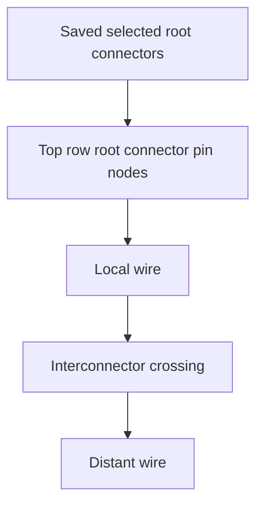

## item_617_harness_assembly_functional_root_connector_visual_fidelity - Harness Assembly Functional Root Connector Visual Fidelity

> From version: 1.14.0
> Schema version: 1.0
> Status: Done
> Understanding: 88%
> Confidence: 86%
> Progress: 100%
> Complexity: Medium
> Theme: Functional schematic / Harness assembly
> Reminder: Update status/understanding/confidence/progress and linked request/task references when you edit this doc.

# Problem
The harness assembly functional schematic can replace a selected master connector root with an interconnector block when that root connector participates in an inter-harness link. This hides the operator's selected anchor and makes the first row of the schematic appear to start from interconnectors rather than from the checked connector roots.

Operators need selected root connector pins to remain visible at the top of the graph. Interconnectors should appear after the selected root connector and after the local wire segment, not as a substitute for the selected connector.

# Scope
- In:
  - Keep selected saved master connector pins as connector nodes in the top/root graph layer.
  - Ensure the first visual row contains only selected saved root connector pin nodes.
  - Render one root node per connected pin, preserving the existing per-pin model.
  - Render immediate interconnector crossings after the root connector and local wire segment.
  - Preserve network-qualified node identities and source IDs for root connector pins.
  - Add regression coverage for selected root connector visual retention.
- Out:
  - Live draft root rendering before `Save assembly`.
  - Fuse-box traversal.
  - Strict unrelated branch suppression beyond root-row ordering.
  - Non-symmetric interconnector mappings.

# Acceptance criteria
- AC1: Selected saved master connector roots render as connector nodes in the top/root layer.
- AC2: The first visual row contains only selected saved root connector pin nodes.
- AC3: Root connectors remain represented as one node per connected pin.
- AC4: Interconnector nodes no longer replace selected root connector nodes.
- AC5: A selected root pin that crosses an interconnector renders in the intended order: selected connector pin, local wire, interconnector, distant wire.
- AC6: Root connector node source IDs preserve network ID, connector ID, and pin/cavity index.
- AC7: Existing non-root interconnector blocks remain visible for valid cross-harness transitions.
- AC8: Automated tests cover a selected root connector that is also part of an interconnector link.

# AC Traceability
- request-AC1 -> This backlog slice. Proof: AC1, AC3.
- request-AC2 -> This backlog slice. Proof: AC4, AC5.
- request-AC3 -> This backlog slice. Proof: AC2.
- request-AC9 -> This backlog slice. Proof: AC6.
- request-AC10 -> This backlog slice. Proof: AC7.
- request-AC12 -> This backlog slice. Proof: AC8.
- request-AC11 -> This backlog slice. Evidence needed: Existing single-network functional schematic behavior remains unchanged except for shared helper extraction with equivalent behavior.

# Decision framing
- Product framing: Captured in `prod_006_trustworthy_functional_schematic_review`.
- Product signals: The selected connector root is the operator's anchor and must stay visible at the top.
- Architecture framing: Needed in the derived graph boundary because current node substitution happens during assembly endpoint resolution and root node ID generation.
- Architecture follow-up: No ADR expected unless the derived graph needs a larger root-layer model abstraction.

# Links
- Product brief(s): `logics/product/prod_006_trustworthy_functional_schematic_review.md`
- Architecture decision(s): `logics/architecture/adr_007_harness_assembly_and_physical_interconnector_contract.md`
- Request: `logics/request/req_136_harness_assembly_functional_schematic_root_fidelity_fuse_box_and_strict_scope.md`
- Primary task(s): `logics/tasks/task_126_harness_assembly_functional_root_connector_visual_fidelity.md`

# AI Context
- Summary: Ensure selected harness assembly root connector pins stay visible as the top row of the functional schematic, with interconnectors rendered after the root and local wire.
- Keywords: backlog-groom, root connector, harness assembly, functional schematic, interconnector, top row, CT8
- Use when: Implementing or reviewing root connector visual fidelity in assembly functional schematics.
- Skip when: Work targets fuse traversal, PDF export, wire color selector UX, or current-network functional graphs.

# Priority
- Impact: High; fixes a misleading review anchor in the assembly schematic.
- Urgency: High; required for trusted use of selected connector traces.

# Notes
- Source request: `req_136_harness_assembly_functional_schematic_root_fidelity_fuse_box_and_strict_scope`.

# Tasks
- `logics/tasks/task_126_harness_assembly_functional_root_connector_visual_fidelity.md`
