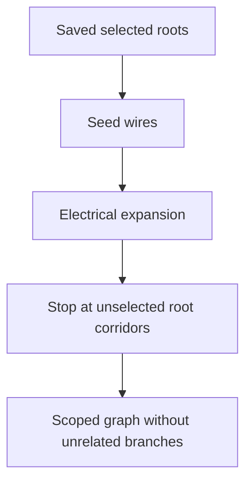

## item_618_harness_assembly_functional_strict_saved_root_scope - Harness Assembly Functional Strict Saved Root Scope

> From version: 1.14.0
> Schema version: 1.0
> Status: Done
> Understanding: 88%
> Confidence: 84%
> Progress: 100%
> Complexity: High
> Theme: Functional schematic / Harness assembly
> Reminder: Update status/understanding/confidence/progress and linked request/task references when you edit this doc.

# Problem
The assembly functional graph can include wires from root corridors that the operator did not intend to review. In the debug workspace, branches such as `Reveil batterie` through `CT11.A` / `Interco lateral A` and `Capteur vitre D` from `CT8.A` can appear when the operator expects only `CT8.B BCM 40V` with the `Signal` filter.

The graph should continue to use saved assembly roots for now, but those saved roots must define the selected-root scope strictly. Unselected root corridors must not seed or pull unrelated branches into a graph rendered for a narrower saved selection.

# Scope
- In:
  - Keep the current saved-assembly root contract; no live draft root rendering.
  - Make the graph source clear when unsaved root checkbox edits are present.
  - Tighten assembly BFS/continuity expansion so unselected root corridors do not become secondary seeds.
  - Preserve valid traversal through ordinary connectors, splices, local wires, and interconnectors when reached from selected roots.
  - Preserve existing terminal connector stop behavior.
  - Add debug-workspace regression coverage where feasible.
- Out:
  - Root connector visual ordering, covered by `item_617`.
  - Fuse-box traversal, covered by `item_619`.
  - Arbitrary temporary per-root selection UI.
  - Current-network functional tab changes.

# Acceptance criteria
- AC1: The assembly graph continues to render from saved assembly roots after `Save assembly`.
- AC2: Unsaved root checkbox edits are communicated clearly as not reflected in the graph until save.
- AC3: Unselected root corridors do not become secondary seeds during assembly traversal.
- AC4: In the debug workspace, `CT8.B BCM 40V` with `Signal` does not include `Reveil batterie` branches that originate through `CT11.A` / `Interco lateral A`.
- AC5: In the debug workspace, `CT8.B BCM 40V` with `Signal` does not include `Capteur vitre D` when that trace originates from `CT8.A`.
- AC6: Valid cross-harness traversal through interconnectors still works when it is reached from selected saved roots.
- AC7: Existing terminal-connector stop behavior remains intact.
- AC8: Automated tests cover selected-root retention, unselected-root leakage prevention, interconnector traversal preservation, and terminal stop composition.

# AC Traceability
- request-AC4 -> This backlog slice. Proof: AC1, AC2.
- request-AC5 -> This backlog slice. Proof: AC4.
- request-AC6 -> This backlog slice. Proof: AC5.
- request-AC10 -> This backlog slice. Proof: AC6.
- request-AC12 -> This backlog slice. Proof: AC8.
- prior trace-scope AC1 -> This backlog slice. Proof: AC3, AC4, AC5.
- prior trace-scope AC5 -> This backlog slice. Proof: AC7.
- request-AC9 -> This backlog slice. Evidence needed: Assembly graph node and edge IDs remain network-qualified and collision-safe across harnesses.
- request-AC11 -> This backlog slice. Evidence needed: Existing single-network functional schematic behavior remains unchanged except for shared helper extraction with equivalent behavior.

# Decision framing
- Product framing: Captured in `prod_006_trustworthy_functional_schematic_review` and the prior trace-scope request.
- Product signals: The saved checked roots are the operator's scope; unrelated root corridors should not appear.
- Architecture framing: Required because this changes graph traversal semantics in `buildHarnessAssemblyFunctionalSchematicGraph`.
- Architecture follow-up: Revisit ADR only if this changes the accepted physical-only interconnector contract, which is not expected.

# Links
- Product brief(s): `logics/product/prod_006_trustworthy_functional_schematic_review.md`
- Architecture decision(s): `logics/architecture/adr_007_harness_assembly_and_physical_interconnector_contract.md`
- Request: `logics/request/req_136_harness_assembly_functional_schematic_root_fidelity_fuse_box_and_strict_scope.md`
- Prior related request: request 134, harness assembly functional trace scope boundaries.
- Primary task(s): `logics/tasks/task_127_harness_assembly_functional_strict_saved_root_scope.md`

# AI Context
- Summary: Tighten harness assembly functional traversal so saved selected roots define the graph scope and unrelated branches from unselected root corridors do not leak into filtered traces.
- Keywords: backlog-groom, selected root, strict scope, BFS, CT8.B, CT11.A, interconnector, trace leakage
- Use when: Implementing or reviewing selected-root assembly traversal semantics.
- Skip when: Work targets root visual ordering, fuse-box rendering, PDF export, or wire color selector UX.

# Priority
- Impact: High; prevents misleading branches in user-facing functional review.
- Urgency: High; directly blocks trusted use of selected connector traces.

# Notes
- Source request: `req_136`; incorporates prior trace-scope findings.

# Tasks
- `logics/tasks/task_127_harness_assembly_functional_strict_saved_root_scope.md`
