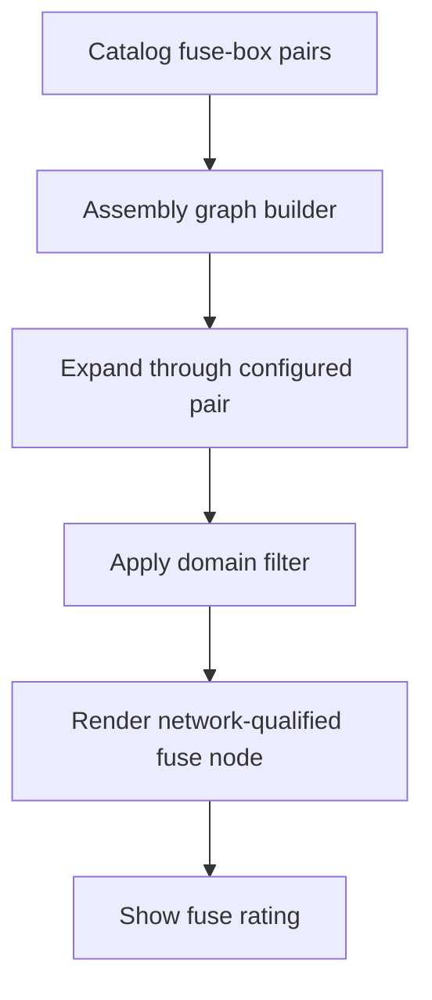

## item_619_harness_assembly_functional_fuse_box_pair_traversal - Harness Assembly Functional Fuse Box Pair Traversal

> From version: 1.14.0
> Schema version: 1.0
> Status: Done
> Understanding: 86%
> Confidence: 84%
> Progress: 100%
> Complexity: Medium
> Theme: Functional schematic / Harness assembly
> Reminder: Update status/understanding/confidence/progress and linked request/task references when you edit this doc.

# Problem
The single-network functional schematic traverses configured fuse-box pairs and renders fuse nodes with ratings. The harness assembly functional graph does not apply the same fuse-box logic, so traces can stop at `CT4 Fuse Box` connector pins instead of showing the fuse crossing and protected continuity.

Assembly-level functional review needs fuse boxes to behave as electrical continuity elements, using only configured catalog fuse pairs and preserving fuse rating display.

# Scope
- In:
  - Share or reuse single-network fuse-box pair metadata derivation in assembly graph building.
  - Traverse only configured catalog fuse-box pairs.
  - Render assembly fuse nodes with network-qualified IDs.
  - Display `fusePairRatings` where available and missing-rating markers where not.
  - Expand electrically through fuse-box pairs before applying domain filters.
  - Keep fuse nodes visible when they connect retained visible wires.
  - Add tests for assembly fuse traversal and rating labels.
- Out:
  - Inferring fuse pairs from adjacent pin numbers without catalog config.
  - Fuse-box UI/catalog editing changes.
  - Current-network functional schematic behavior changes beyond shared helper extraction with equivalent behavior.
  - PDF export.

# Acceptance criteria
- AC1: Assembly graph derivation traverses configured fuse-box pairs.
- AC2: Assembly fuse traversal uses only configured catalog pairs and does not infer missing pairs.
- AC3: Electrical expansion through fuse-box pairs happens before domain filtering.
- AC4: In the debug workspace, `CT8.A BCM 81V` with `12V power` shows fuse-box pair traversal for `CT4 Fuse Box` where configured pair data and matching wires exist.
- AC5: Fuse nodes in assembly graphs display ratings from connector `fusePairRatings` where available.
- AC6: Fuse nodes use network-qualified IDs and do not collide across harnesses.
- AC7: Existing single-network functional schematic fuse behavior remains unchanged.
- AC8: Automated tests cover configured pair traversal, missing config non-inference, rating display, filtering, and ID qualification.

# AC Traceability
- request-AC7 -> This backlog slice. Proof: AC1, AC4.
- request-AC8 -> This backlog slice. Proof: AC5.
- request-AC9 -> This backlog slice. Proof: AC6.
- request-AC11 -> This backlog slice. Proof: AC7.
- request-AC12 -> This backlog slice. Proof: AC8.

# Decision framing
- Product framing: Captured in `prod_006_trustworthy_functional_schematic_review`.
- Product signals: Fuse boxes are electrical continuity elements in functional review.
- Architecture framing: Required in `src/core/functionalSchematic.ts` to avoid diverging single-network and assembly fuse logic.
- Architecture follow-up: No ADR expected if implementation only shares derived helper logic.

# Links
- Product brief(s): `logics/product/prod_006_trustworthy_functional_schematic_review.md`
- Architecture decision(s): `logics/architecture/adr_007_harness_assembly_and_physical_interconnector_contract.md`
- Request: `logics/request/req_136_harness_assembly_functional_schematic_root_fidelity_fuse_box_and_strict_scope.md`
- Primary task(s): `logics/tasks/task_128_harness_assembly_functional_fuse_box_pair_traversal.md`

# AI Context
- Summary: Add configured fuse-box pair traversal and fuse node rendering to harness assembly functional graphs, matching single-network behavior with network-qualified IDs.
- Keywords: backlog-groom, fuse box, fuse pair, CT4, assembly functional schematic, fusePairRatings, domain filter
- Use when: Implementing or reviewing fuse-box continuity in assembly functional schematics.
- Skip when: Work targets root visual order, selected-root scope, PDF export, or wire color selector UX.

# Priority
- Impact: High; restores an important electrical element in assembly-level functional review.
- Urgency: High; requested for current CT8.A / 12V review.

# Notes
- Source request: `req_136_harness_assembly_functional_schematic_root_fidelity_fuse_box_and_strict_scope`.

# Tasks
- `logics/tasks/task_128_harness_assembly_functional_fuse_box_pair_traversal.md`
