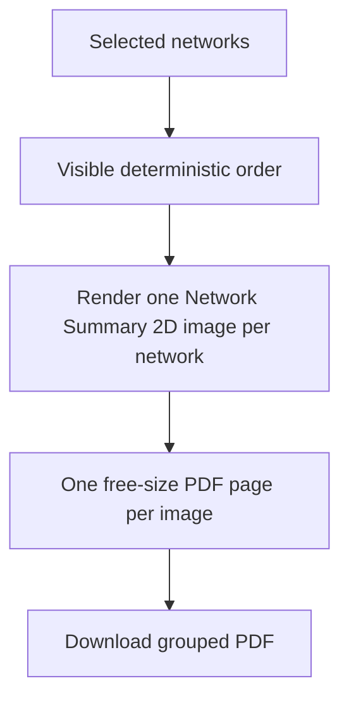

## item_621_network_summary_2d_grouped_selected_networks_pdf_export - Network Summary 2D Grouped Selected Networks PDF Export

> From version: 1.14.0
> Schema version: 1.0
> Status: Done
> Understanding: 80%
> Confidence: 78%
> Progress: 100%
> Complexity: Medium
> Theme: Export / Documentation
> Reminder: Update status/understanding/confidence/progress and linked request/task references when you edit this doc.

# Problem
Operators need to export several Network Summary 2D plans into one PDF packet, with one rendered plan per page and one page per selected network. This should reuse app-rendered images rather than importing arbitrary external images.

# Scope
- In:
  - Add a grouped PDF export action for selected networks.
  - Render each selected network's Network Summary 2D plan as one PDF page.
  - Use free-size pages derived from each rendered plan.
  - Preserve deterministic and visible page ordering.
  - Preserve existing frame/cartouche/background export options where applicable.
  - Add loading feedback for multi-page generation.
  - Add tests for page selection/order and page count behavior at the available abstraction level.
- Out:
  - Single current-plan PDF export, covered by `item_620`.
  - Functional schematic grouped export.
  - External image upload/import to PDF.
  - Cover page or table of contents.
  - Server-side export.

# Acceptance criteria
- AC1: A grouped PDF export action is available for selected networks.
- AC2: Each selected network contributes exactly one Network Summary 2D plan page.
- AC3: Page order is deterministic and visible before final export.
- AC4: Each page is free-size from the rendered Network Summary 2D plan and is not cropped by default.
- AC5: Existing background, frame, and cartouche options apply consistently where enabled.
- AC6: Multi-page PDF generation shows loading feedback and exits cleanly on failure.
- AC7: The implementation does not accept arbitrary external images in the MVP.
- AC8: Existing SVG and PNG export behavior remains unchanged.
- AC9: Automated tests cover grouped option availability, deterministic ordering, page count, and failure handling at the available abstraction level.

# AC Traceability
- request-AC5 -> This backlog slice. Proof: AC1, AC2.
- request-AC6 -> This backlog slice. Proof: AC3.
- request-AC7 -> This backlog slice. Proof: AC4.
- request-AC8 -> This backlog slice. Proof: browser-side/offline implementation scope.
- request-AC9 -> This backlog slice. Proof: AC8.
- request-AC10 -> This backlog slice. Proof: AC9.

# Decision framing
- Product framing: Request-level framing is sufficient.
- Product signals: grouped export is a documentation packet, not a generic image import tool.
- Architecture framing: Needs careful export orchestration for non-active networks without mutating workspace state unexpectedly.
- Architecture follow-up: No ADR expected unless multi-network rendering requires a new export service abstraction.

# Links
- Product brief(s): (none)
- Architecture decision(s): (none)
- Request: `logics/request/req_137_pdf_export_for_2d_plans_and_grouped_image_pdf_export.md`
- Primary task(s): `logics/tasks/task_130_network_summary_2d_grouped_selected_networks_pdf_export.md`

# AI Context
- Summary: Add grouped PDF export for selected networks, producing one Network Summary 2D rendered image per free-size PDF page.
- Keywords: backlog-groom, grouped PDF, selected networks, one page per network, Network Summary 2D, export packet
- Use when: Implementing or reviewing multi-page PDF export from selected app-rendered network plans.
- Skip when: Work targets single-plan PDF only, functional schematic export, external image import, or wire color UX.

# Priority
- Impact: Medium; supports multi-network documentation packets.
- Urgency: Medium; follows the single PDF export foundation.

# Notes
- Source request: `req_137_pdf_export_for_2d_plans_and_grouped_image_pdf_export`.

# Tasks
- `logics/tasks/task_130_network_summary_2d_grouped_selected_networks_pdf_export.md`
