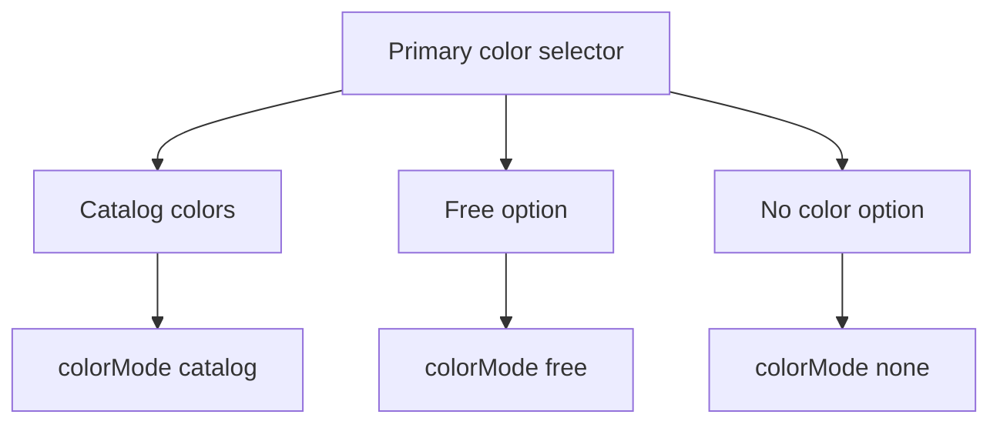

## item_622_wire_color_primary_selector_catalog_with_free_option - Wire Color Primary Selector Catalog With Free Option

> From version: 1.14.0
> Schema version: 1.0
> Status: Done
> Understanding: 86%
> Confidence: 86%
> Progress: 100%
> Complexity: Small
> Theme: Modeling UX / Wire color
> Reminder: Update status/understanding/confidence/progress and linked request/task references when you edit this doc.

# Problem
The current wire color form requires choosing between unspecified/no-color, free color, and catalog color before accessing catalog colors. This regresses the faster workflow where the first color selector directly exposed the catalog.

The desired UX is to list catalog colors directly in the primary color selector and add `Free` as an option in that same menu, while preserving existing `colorMode` semantics.

# Scope
- In:
  - Update the wire create/edit primary color selector to list catalog colors directly.
  - Add a `Free` option to the primary color selector.
  - Preserve a no-color/unspecified option for existing no-color behavior.
  - Selecting a catalog color sets catalog mode and primary color.
  - Selecting `Free` sets free mode and clears catalog color IDs.
  - Secondary color remains available only when primary selection is a catalog color.
  - Edit mode hydrates existing no-color, catalog, bi-color, and free states correctly.
  - Add focused UI regression coverage.
- Out:
  - Changing wire color persistence shape.
  - Adding user-defined catalog colors.
  - Adding a custom hex color picker.
  - Reworking read-only color display beyond selector regressions.

# Acceptance criteria
- AC1: Wire create/edit form primary color selector shows catalog colors directly.
- AC2: The same primary selector includes a `Free` option.
- AC3: Selecting `Free` switches to free color mode and clears catalog color IDs.
- AC4: Selecting a catalog color switches to catalog mode and clears free color semantics as currently required.
- AC5: Selecting no-color/unspecified remains possible and preserves existing no-color behavior.
- AC6: Secondary color is available only for catalog primary colors.
- AC7: Existing persisted wire color states load into the corrected controls without losing data.
- AC8: Automated UI tests cover catalog direct selection, Free option selection, no-color selection, and edit-mode hydration.

# AC Traceability
- request-AC1 -> This backlog slice. Proof: AC1.
- request-AC2 -> This backlog slice. Proof: AC2.
- request-AC3 -> This backlog slice. Proof: AC3.
- request-AC4 -> This backlog slice. Proof: AC4.
- request-AC5 -> This backlog slice. Proof: AC5.
- request-AC6 -> This backlog slice. Proof: AC6.
- request-AC7 -> This backlog slice. Proof: AC7.
- request-AC8 -> This backlog slice. Proof: AC8.

# Decision framing
- Product framing: Request-level framing is sufficient.
- Product signals: Catalog color selection is the common path and should be direct.
- Architecture framing: Not required; preserve existing data model and reducer normalization.
- Architecture follow-up: None expected.

# Links
- Product brief(s): (none)
- Architecture decision(s): (none)
- Request: `logics/request/req_138_wire_color_primary_selector_catalog_with_free_option.md`
- Prior related request: request 039, wire color catalog two-character codes and bicolor primary/secondary support.
- Prior related request: request 045, wire/cable free color label support beyond catalog and no-color states.
- Prior related request: request 046, wire free color mode without label as deliberate unspecified color placeholder.
- Primary task(s): `logics/tasks/task_131_wire_color_primary_selector_catalog_with_free_option.md`

# AI Context
- Summary: Restore direct catalog access in the wire primary color selector and add Free as an option while preserving no-color/catalog/free colorMode semantics.
- Keywords: backlog-groom, wire color, primary selector, catalog color, Free, colorMode, modeling form
- Use when: Implementing or reviewing wire color form UX.
- Skip when: Work targets functional schematic root rendering, PDF export, or read-only color displays unrelated to the selector.

# Priority
- Impact: Medium; removes friction from frequent wire creation/editing.
- Urgency: Medium; corrects a recent UX regression.

# Notes
- Source request: `req_138_wire_color_primary_selector_catalog_with_free_option`.

# Tasks
- `logics/tasks/task_131_wire_color_primary_selector_catalog_with_free_option.md`
