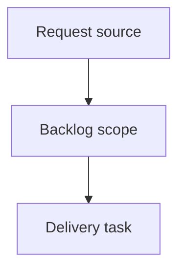

## item_623_harness_assembly_functional_trace_scope_boundaries_for_selected_master_connectors - Harness Assembly Functional Trace Scope Boundaries For Selected Master Connectors
> From version: 1.14.0
> Schema version: 1.0
> Status: Ready
> Understanding: 90%
> Confidence: 85%
> Progress: 0%
> Complexity: High
> Theme: Operator workflow and runtime integration
> Reminder: Update status/understanding/confidence/progress and linked request/task references when you edit this doc.

# Problem
Prevent the harness assembly functional schematic from displaying unrelated connected branches when the operator intentionally selected only a subset of master connectors as trace roots.
Make the selected master connectors act as an explicit visualization scope boundary, not only as traversal seeds.
Preserve the existing ability to cross valid inter-harness links and continue through the intended trace, while suppressing branches that are only reachable through another unselected master-connector corridor.

# Scope
- In:
  - one coherent delivery slice from the source request
- Out:
  - unrelated sibling slices that should stay in separate backlog items instead of widening this doc

# Acceptance criteria
- AC1: In an assembly with multiple saved master connectors, selecting only a subset no longer displays branches that are reachable solely by traversing through another unselected master-connector corridor.
- AC2: A selected master connector still seeds the trace exactly as before.
- AC3: An unselected master connector acts as a traversal boundary for the assembly graph and does not become a secondary seed.
- AC4: Cross-harness traversal through valid interconnector links still works when the resulting path remains inside the selected-root scope.
- AC5: Existing terminal-connector stop behavior remains intact and composes correctly with the new unselected-master boundary rule.
- AC6: Assemblies with only one selected root behave the same as before unless the previous graph relied on leaking through another unselected saved root.
- AC7: The current-network functional tab remains unchanged.
- AC8: Automated tests cover:
- selected-root trace retained;
- leakage through an unselected master connector prevented;
- converging traces from two selected roots preserved;
- interconnector crossing preserved inside scope;
- terminal connector stop still respected.
- AC9: The field scenario using `CT8 A` and `CT8 B` no longer shows the unrelated lateral-interconnector / battery-wake branch when that branch is outside the selected-root scope.

# AC Traceability
- request-AC1 -> This backlog slice. Proof: AC1: In an assembly with multiple saved master connectors, selecting only a subset no longer displays branches that are reachable solely by traversing through another unselected master-connector corridor.
- request-AC2 -> This backlog slice. Proof: AC2: A selected master connector still seeds the trace exactly as before.
- request-AC3 -> This backlog slice. Proof: AC3: An unselected master connector acts as a traversal boundary for the assembly graph and does not become a secondary seed.
- request-AC4 -> This backlog slice. Proof: AC4: Cross-harness traversal through valid interconnector links still works when the resulting path remains inside the selected-root scope.
- request-AC5 -> This backlog slice. Proof: AC5: Existing terminal-connector stop behavior remains intact and composes correctly with the new unselected-master boundary rule.
- request-AC6 -> This backlog slice. Proof: AC6: Assemblies with only one selected root behave the same as before unless the previous graph relied on leaking through another unselected saved root.
- request-AC7 -> This backlog slice. Proof: AC7: The current-network functional tab remains unchanged.
- request-AC8 -> This backlog slice. Proof: AC8: Automated tests cover:
- request-AC9 -> This backlog slice. Proof: selected-root trace retained;
- request-AC10 -> This backlog slice. Proof: leakage through an unselected master connector prevented;
- request-AC11 -> This backlog slice. Proof: converging traces from two selected roots preserved;
- request-AC12 -> This backlog slice. Proof: interconnector crossing preserved inside scope;
- request-AC13 -> This backlog slice. Proof: terminal connector stop still respected.
- request-AC14 -> This backlog slice. Proof: AC9: The field scenario using `CT8 A` and `CT8 B` no longer shows the unrelated lateral-interconnector / battery-wake branch when that branch is outside the selected-root scope.

# Decision framing
- Product framing: Not needed
- Product signals: (none detected)
- Product follow-up: No product brief follow-up is expected based on current signals.
- Architecture framing: Not needed
- Architecture signals: (none detected)
- Architecture follow-up: No architecture decision follow-up is expected based on current signals.

# Links
- Product brief(s): (none yet)
- Architecture decision(s): (none yet)
- Request: `logics/request/req_134_harness_assembly_functional_trace_scope_boundaries_for_selected_master_connectors.md`
- Primary task(s): (none yet)

# AI Context
- Summary: Harness Assembly Functional Trace Scope Boundaries For Selected Master Connectors
- Keywords: backlog-groom, request, harness assembly functional trace scope boundaries for selected master connectors, bounded slice
- Use when: Use when implementing or reviewing the delivery slice for Harness Assembly Functional Trace Scope Boundaries For Selected Master Connectors.
- Skip when: Skip when the change is unrelated to this delivery slice or its linked request.

# Priority
- Impact:
- Urgency:

# Notes
- Hybrid rationale: Derived from request `req_134_harness_assembly_functional_trace_scope_boundaries_for_selected_master_connectors` and kept bounded to one coherent delivery slice.
- Source file: `logics/request/req_134_harness_assembly_functional_trace_scope_boundaries_for_selected_master_connectors.md`.
- Generated locally by logics-manager.

# Tasks
- `task_132_harness_assembly_functional_trace_scope_boundaries_for_selected_master_connectors`
