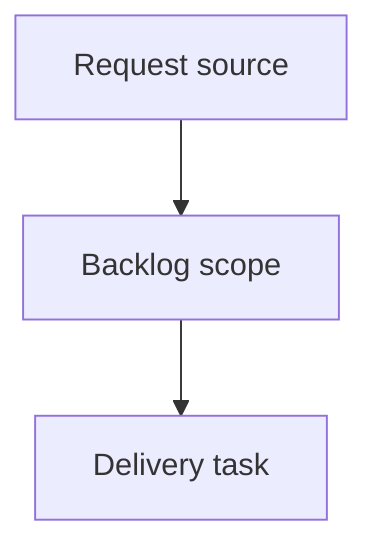

## item_624_ai_agent_follow_up_memory_persistence_and_workflow_polish - AI Agent Follow-up Memory, Persistence, and Workflow Polish
> From version: 1.11.0
> Schema version: 1.0
> Status: Done
> Understanding: 99%
> Confidence: 94%
> Progress: 100%
> Complexity: High
> Theme: Operator workflow and runtime integration
> Reminder: Update status/understanding/confidence/progress and linked request/task references when you edit this doc.

# Problem
Capture the post-`1.11.0` AI Agent follow-ups that improve repeated use without expanding the first release scope retroactively.
Persist the AI Agent panel preferences so users do not reselect the same target scope, mode, and permissions every session.
Add a local instruction history so users can reuse or adapt previous AI modeling instructions.
Improve AI session review, discoverability, and recovery ergonomics after assisted proposals are applied, rejected, or rolled back.
Keep all persistence local, explicit, and redaction-safe.

# Scope
- In:
  - one coherent delivery slice from the source request
- Out:
  - unrelated sibling slices that should stay in separate backlog items instead of widening this doc

# Acceptance criteria
- AC1: The AI Agent panel persists and restores target scope, agent mode, and permission toggles across navigation and page reloads.
- AC2: Persisted experimental mode is ignored or downgraded when the Settings experimental gate is disabled.
- AC3: Delete permission remains opt-in and does not become enabled by default for fresh users or reset local storage.
- AC4: Submitted non-empty instructions are saved to a bounded local history after a proposal preparation attempt.
- AC5: Duplicate instruction history entries are de-duplicated or moved to the top instead of stored repeatedly.
- AC6: Users can load a previous instruction into the instruction field and edit it before preparing a new proposal.
- AC7: Users can clear AI instruction history without affecting provider configuration or project data.
- AC8: An unsent instruction draft survives switching away from and back to the AI Agent section during the same app session.
- AC9: AI Agent local persistence is excluded from network import/export payloads.
- AC10: Tests cover preference persistence, experimental-gate fallback, instruction history save/load/clear, duplicate handling, and reset behavior.

# AC Traceability
- request-AC1 -> This backlog slice. Proof: AC1: The AI Agent panel persists and restores target scope, agent mode, and permission toggles across navigation and page reloads.
- request-AC2 -> This backlog slice. Proof: AC2: Persisted experimental mode is ignored or downgraded when the Settings experimental gate is disabled.
- request-AC3 -> This backlog slice. Proof: AC3: Delete permission remains opt-in and does not become enabled by default for fresh users or reset local storage.
- request-AC4 -> This backlog slice. Proof: AC4: Submitted non-empty instructions are saved to a bounded local history after a proposal preparation attempt.
- request-AC5 -> This backlog slice. Proof: AC5: Duplicate instruction history entries are de-duplicated or moved to the top instead of stored repeatedly.
- request-AC6 -> This backlog slice. Proof: AC6: Users can load a previous instruction into the instruction field and edit it before preparing a new proposal.
- request-AC7 -> This backlog slice. Proof: AC7: Users can clear AI instruction history without affecting provider configuration or project data.
- request-AC8 -> This backlog slice. Proof: AC8: An unsent instruction draft survives switching away from and back to the AI Agent section during the same app session.
- request-AC9 -> This backlog slice. Proof: AC9: AI Agent local persistence is excluded from network import/export payloads.
- request-AC10 -> This backlog slice. Proof: AC10: Tests cover preference persistence, experimental-gate fallback, instruction history save/load/clear, duplicate handling, and reset behavior.

# Decision framing
- Product framing: Not needed
- Product signals: (none detected)
- Product follow-up: No product brief follow-up is expected based on current signals.
- Architecture framing: Not needed
- Architecture signals: (none detected)
- Architecture follow-up: No architecture decision follow-up is expected based on current signals.

# Links
- Product brief(s): (none yet)
- Architecture decision(s): (none yet)
- Request: `logics/request/req_130_ai_agent_follow_up_memory_persistence_and_workflow_polish.md`
- Primary task(s): `logics/tasks/task_134_ai_agent_follow_up_memory_persistence_and_workflow_polish.md`

# AI Context
- Summary: AI Agent Follow-up Memory, Persistence, and Workflow Polish
- Keywords: backlog-groom, request, ai agent follow-up memory, persistence, and workflow polish, bounded slice
- Use when: Use when implementing or reviewing the delivery slice for AI Agent Follow-up Memory, Persistence, and Workflow Polish.
- Skip when: Skip when the change is unrelated to this delivery slice or its linked request.

# Priority
- Impact: Medium
- Urgency: Medium

# Delivery Status
- Delivered after `1.15.0` workspace state.
- Preferences for target scope, agent mode, instruction draft, and permissions persist locally and restore across navigation/remounts.
- Persisted direct mode is downgraded when Settings disables experimental direct execution.
- Instruction history is local, bounded, whitespace-normalized, de-duplicated, loadable, clearable, and resettable.
- Resetting AI Agent local data restores default panel choices, keeps delete disabled, clears instruction history, and does not change AI provider configuration or project data.
- AI Agent local data is UI preference storage only and is not included in network/modeling exports.
- Validation evidence: `npm run -s test -- src/tests/app.ui.settings-ai-agent.spec.tsx src/tests/ai-agent-panel-preferences.spec.ts --run` passed.

# Notes
- Hybrid rationale: Derived from request `req_130_ai_agent_follow_up_memory_persistence_and_workflow_polish` and kept bounded to one coherent delivery slice.
- Source file: `logics/request/req_130_ai_agent_follow_up_memory_persistence_and_workflow_polish.md`.
- Generated locally by logics-manager.

# Tasks
- `task_134_ai_agent_follow_up_memory_persistence_and_workflow_polish`
